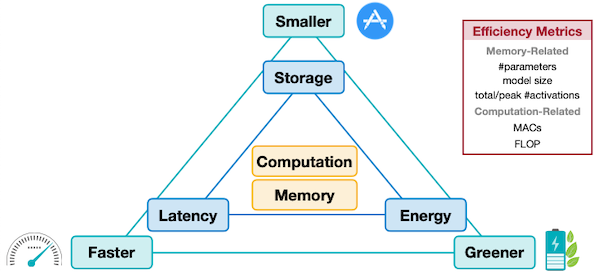

# Lec02 深度学习基础 + 效率指标

> 📺 [课程视频](https://www.youtube.com/watch?v=5HpLyZd1h0I) | 📄 [Slides](https://hanlab.mit.edu/courses/2024-fall-65940)

---

## 核心概念

### 2.1 模型参数量 (Parameter Count)

参数量衡量模型的"重量"——需要存储多少个数字。它决定了模型文件大小，是推理内存占用的基础部分。

#### Linear 层

$$\text{params}_{Linear} = C_{in} \times C_{out} + C_{out} \text{ (bias)}$$

例如：一个 `Linear(768, 3072)` 层有 $768 \times 3072 + 3072 = 2{,}362{,}368$ 个参数。

#### Conv2d 层

$$\text{params}_{Conv} = C_{out} \times C_{in} \times K_H \times K_W + C_{out} \text{ (bias)}$$

例如：`Conv2d(in_channels=64, out_channels=128, kernel_size=3)` 有 $128 \times 64 \times 3 \times 3 + 128 = 73{,}856$ 个参数。

关键直觉：卷积层的参数量**与空间分辨率无关**，只与 channel 数和 kernel 大小有关。这是 CNN 的核心优势（权重共享）。

#### Transformer 中的 Attention

Multi-Head Attention 的参数量：
- $W_Q, W_K, W_V$ 各为 $d_{model} \times d_{model}$
- $W_O$ 为 $d_{model} \times d_{model}$
- 总计：$4 \times d_{model}^2$（忽略 bias）

GPT-2 (117M) 中：$d_{model} = 768$，12 层，每层 attention 参数 $= 4 \times 768^2 = 2{,}359{,}296$。

---

### 2.2 FLOPs（浮点运算次数）

FLOPs 衡量"做了多少计算"，与硬件无关。注意区分：
- **FLOPs**（大写）= Floating Point Operations，总运算次数
- **FLOPS**（带 S）= FLOPs per Second，硬件吞吐指标

#### Linear 层的 FLOPs

$$\text{FLOPs}_{Linear} = 2 \times B \times C_{in} \times C_{out}$$

其中 $B$ 是 batch size，系数 2 来自"一次乘法 + 一次加法"（multiply-accumulate, MAC）。有时也写作 $\text{MACs} = B \times C_{in} \times C_{out}$，注意 $1 \text{ MAC} = 2 \text{ FLOPs}$。

#### Conv2d 层的 FLOPs

$$\text{FLOPs}_{Conv} = 2 \times B \times C_{in} \times C_{out} \times K_H \times K_W \times H_{out} \times W_{out}$$

注意这里 **FLOPs 与空间分辨率成正比**——这是 Conv 层的计算瓶颈所在。高分辨率特征图代价极高。

#### Self-Attention 的 FLOPs

设序列长度 $N$，模型维度 $d$：

$$\text{FLOPs}_{Attn} \approx 4 \times N \times d^2 + 2 \times N^2 \times d$$

- 前一项：$QKV$ 投影 + 输出投影，$O(Nd^2)$
- 后一项：$QK^T$ 矩阵乘法 + softmax + $AV$ 乘法，$O(N^2 d)$

当 $N \gg d$ 时（长序列），$N^2 d$ 项主导，这就是 long-context 优化的动机。

---

### 2.3 内存占用 (Memory Footprint)

内存 $\neq$ 参数量。实际占用由三部分组成：

$$\text{Memory}_{train} = \underbrace{\text{Params}}_{\text{权重}} + \underbrace{\text{Gradients}}_{\text{反向传播}} + \underbrace{\text{Activations}}_{\text{前向缓存}} + \underbrace{\text{Optimizer States}}_{\text{如 Adam 的 m, v}}$$

| 组成部分 | FP32 Adam 训练 | 推理 |
|---------|--------------|------|
| 权重 | $4P$ bytes | $4P$ bytes |
| 梯度 | $4P$ bytes | 0 |
| Adam 状态 (m, v) | $8P$ bytes | 0 |
| Activations | 与 batch size 正比 | 小（可重算） |

对于 7B 参数模型用 FP32 Adam 训练：$\approx (4+4+8) \times 7 \times 10^9 = 112 \text{ GB}$ 仅是参数相关，还不算 activations！这就是为什么需要混合精度训练和 gradient checkpointing。

**推理时的内存带宽瓶颈**：对于 LLM 的 decode 阶段（batch=1），每个 token 都要把所有权重从 HBM 读一遍。7B FP16 模型 = 14 GB 数据需要传输，而 A100 的 HBM 带宽约 2 TB/s，所以每个 token 约需 $14\text{GB} / 2\text{TB/s} = 7\text{ms}$。

---

### 2.4 数值精度格式

#### FP32 (IEEE 754 Single Precision)

$$v = (-1)^s \times 2^{e-127} \times (1 + \sum_{i=1}^{23} b_{23-i} \times 2^{-i})$$

- 1 bit 符号，8 bit 指数（偏置 127），23 bit 尾数
- 范围：$\approx \pm 3.4 \times 10^{38}$，精度：约 7 位十进制

#### FP16 (Half Precision)

- 1 bit 符号，**5 bit 指数**（偏置 15），10 bit 尾数
- 范围：$\pm 65504$，精度：约 3-4 位十进制
- **问题**：动态范围小，容易 overflow（如 loss scaling 时）

#### BF16 (Brain Float 16)

- 1 bit 符号，**8 bit 指数**（与 FP32 相同！），7 bit 尾数
- 范围：与 FP32 相同（$\approx \pm 3.4 \times 10^{38}$），精度低于 FP16
- **核心优势**：可以直接截断 FP32 的低 16 bit 得到 BF16，转换几乎免费
- Google TPU 和 A100+ 原生支持 BF16

#### FP16 vs BF16 对比

| 格式 | 指数位 | 尾数位 | 动态范围 | 精度 | 溢出风险 |
|------|--------|--------|---------|------|--------|
| FP32 | 8 | 23 | $$\pm 3.4 \times 10^{38}$$ | 高 | 低 |
| FP16 | 5 | 10 | $$\pm 6.5 \times 10^4$$ | 中 | 高 |
| BF16 | 8 | 7 | $$\pm 3.4 \times 10^{38}$$ | 低 | 低 |

**实践建议**：现代 LLM 训练几乎全用 BF16（NVIDIA A100/H100 原生支持）。FP16 需要 loss scaling 防溢出，BF16 不需要。

#### INT8 / INT4

- INT8：1 byte，范围 $[-128, 127]$（有符号）或 $[0, 255]$（无符号）
- INT4：4 bit，范围 $[-8, 7]$ 或 $[0, 15]$
- 整数运算不涉及指数/尾数处理，电路简单，能效高
- **关键限制**：无法直接做矩阵乘法（精度不足），需要量化/反量化配合

#### 各格式能效对比

根据 Horowitz 2014 的估算，45nm 工艺下：

| 运算 | 能耗 (pJ) | 相对 FP32 |
|------|----------|---------|
| FP32 ADD | 0.9 | 1× |
| FP32 MUL | 4.6 | 5× |
| INT32 ADD | 0.1 | 0.1× |
| INT8 ADD | 0.03 | 0.03× |

INT8 矩阵乘法比 FP32 节省约 **18-20×** 能耗，这是量化的根本动机。

---

### 2.5 效率指标体系



#### Latency（延迟）

单次推理的时间，端到端测量：

$$\text{Latency} = \text{preprocessing} + \text{inference} + \text{postprocessing}$$

- **TTFT** (Time To First Token)：LLM prefill 阶段延迟，与 prompt 长度成比
- **TPOT** (Time Per Output Token)：decode 阶段每 token 延迟，决定"打字速度"
- **P99 Latency**：第 99 百分位延迟，SLA 通常用这个

#### Throughput（吞吐量）

单位时间内处理的样本数或 token 数：

$$\text{Throughput} = \frac{\text{batch\_size}}{\text{latency}}$$

Latency 和 Throughput 之间存在 trade-off：增大 batch size 提高吞吐，但增加单请求延迟。

#### Memory Bandwidth Utilization (MBU)

$$\text{MBU} = \frac{\text{实际内存带宽使用}}{\text{硬件峰值内存带宽}}$$

decode 阶段是**内存带宽受限**（memory-bound），MBU 是关键指标。

#### Arithmetic Intensity（算术强度）

$$\text{AI} = \frac{\text{FLOPs}}{\text{Bytes of Memory Access}}$$

- AI 高：计算受限（compute-bound），如大 batch matmul
- AI 低：带宽受限（memory-bound），如 LLM decode、element-wise ops
- **Roofline 模型**：$\text{Performance} = \min(\text{Peak FLOPS}, \text{Peak BW} \times \text{AI})$

---

## 数学推导

### ResNet-50 参数量和 FLOPs 推导

ResNet-50 第一层：`Conv2d(3, 64, kernel_size=7, stride=2, padding=3)`，输入 $224 \times 224$

**参数量**：
$$P_1 = 64 \times 3 \times 7 \times 7 = 9{,}408$$

**输出特征图尺寸**：
$$H_{out} = \lfloor \frac{224 + 2\times3 - 7}{2} + 1 \rfloor = 112$$

**FLOPs**：
$$\text{FLOPs}_1 = 2 \times 64 \times 3 \times 7 \times 7 \times 112 \times 112 = 235{,}929{,}600 \approx 236 \text{ MFLOPs}$$

这一层就贡献了约 236M FLOPs，占 ResNet-50 总 FLOPs (4.1G) 的约 5.7%。

### Transformer FFN 参数量

GPT-2 的 FFN 用 4× 扩张：$d_{ff} = 4 \times d_{model} = 4 \times 768 = 3072$

$$P_{FFN} = d_{model} \times d_{ff} + d_{ff} \times d_{model} = 2 \times 768 \times 3072 = 4{,}718{,}592$$

加上 attention 的 $4 \times 768^2 = 2{,}359{,}296$，每层总计约 7M 参数。12 层 GPT-2：$\approx 84 \text{M}$（加上 embedding 约 117M）。

### 混合精度训练的内存分析

训练 1B 参数模型，FP16/BF16 参数 + FP32 optimizer states（混合精度标准做法）：

| 组件 | 精度 | 内存 |
|------|------|------|
| 模型参数 (forward/backward) | FP16 | $2 \times 10^9 \times 2 = 4 \text{ GB}$ |
| 梯度 | FP16 | $4 \text{ GB}$ |
| 参数 master copy | FP32 | $4 \times 10^9 \times 4 = 4 \text{ GB}$ |
| Adam 动量 $m$ | FP32 | $4 \text{ GB}$ |
| Adam 方差 $v$ | FP32 | $4 \text{ GB}$ |
| **合计** | | **20 GB** |

Activations 未计入，实际需要更多。ZeRO 优化通过切分 optimizer states 来降低单卡内存。

---

## 代码示例

```python
import torch
import torch.nn as nn
from typing import Tuple


def count_parameters(model: nn.Module) -> Tuple[int, int]:
    """
    统计模型可训练参数量和总参数量。
    返回 (trainable_params, total_params)
    """
    trainable = sum(p.numel() for p in model.parameters() if p.requires_grad)
    total = sum(p.numel() for p in model.parameters())
    return trainable, total


def estimate_flops_linear(in_features: int, out_features: int, batch_size: int = 1) -> int:
    """
    估算 Linear 层的 FLOPs。
    1 MAC (multiply-accumulate) = 2 FLOPs
    """
    macs = batch_size * in_features * out_features
    return 2 * macs


def estimate_flops_conv2d(
    in_channels: int,
    out_channels: int,
    kernel_size: int,
    output_h: int,
    output_w: int,
    batch_size: int = 1,
) -> int:
    """
    估算 Conv2d 层的 FLOPs。
    注意：FLOPs 与输出特征图的空间分辨率正相关！
    """
    macs = batch_size * out_channels * in_channels * kernel_size * kernel_size * output_h * output_w
    return 2 * macs


def model_memory_mb(model: nn.Module, dtype: torch.dtype = torch.float32) -> float:
    """
    估算模型推理时的参数内存占用 (MB)。
    训练时还需加上梯度和 optimizer states。
    """
    bytes_per_param = {
        torch.float32: 4,
        torch.float16: 2,
        torch.bfloat16: 2,
        torch.int8: 1,
    }.get(dtype, 4)

    total_params = sum(p.numel() for p in model.parameters())
    return total_params * bytes_per_param / (1024 ** 2)


# ──── 实际测试 ────

# 构建一个类 GPT-2 的小模型
class SmallTransformerBlock(nn.Module):
    def __init__(self, d_model: int = 256, n_heads: int = 4, d_ff: int = 1024):
        super().__init__()
        self.attn_q = nn.Linear(d_model, d_model)
        self.attn_k = nn.Linear(d_model, d_model)
        self.attn_v = nn.Linear(d_model, d_model)
        self.attn_out = nn.Linear(d_model, d_model)
        self.ffn = nn.Sequential(
            nn.Linear(d_model, d_ff),
            nn.GELU(),
            nn.Linear(d_ff, d_model),
        )
        self.ln1 = nn.LayerNorm(d_model)
        self.ln2 = nn.LayerNorm(d_model)
        self.n_heads = n_heads
        self.d_model = d_model

    def forward(self, x: torch.Tensor) -> torch.Tensor:
        # 简化版，不含 mask
        B, N, D = x.shape
        # Self-attention (简化，不做多头分割)
        q = self.attn_q(x)
        k = self.attn_k(x)
        v = self.attn_v(x)
        scale = (D // self.n_heads) ** -0.5
        attn = torch.softmax(q @ k.transpose(-2, -1) * scale, dim=-1)
        out = attn @ v
        out = self.attn_out(out)
        x = self.ln1(x + out)
        x = self.ln2(x + self.ffn(x))
        return x


if __name__ == "__main__":
    # 测试参数量
    model = SmallTransformerBlock(d_model=256, n_heads=4, d_ff=1024)
    trainable, total = count_parameters(model)
    print(f"可训练参数: {trainable:,}")
    print(f"总参数量:   {total:,}")

    # 手动验证 attention 参数
    # 4 个 Linear(256, 256) = 4 * 256 * 256 + 4 * 256 = 266,240
    attn_expected = 4 * (256 * 256 + 256)
    # FFN: Linear(256, 1024) + Linear(1024, 256)
    ffn_expected = (256 * 1024 + 1024) + (1024 * 256 + 256)
    # LayerNorm: 2 * (256 * 2) weights
    ln_expected = 2 * (256 + 256)
    print(f"\n手动估算: {attn_expected + ffn_expected + ln_expected:,}")

    # 内存占用
    for dtype_name, dtype in [("FP32", torch.float32), ("FP16", torch.float16), ("BF16", torch.bfloat16)]:
        mem = model_memory_mb(model, dtype)
        print(f"{dtype_name} 内存: {mem:.3f} MB")

    # FLOPs 估算（一个 Linear(256, 1024) 层，batch=32, seq=128）
    flops = estimate_flops_linear(256, 1024, batch_size=32 * 128)
    print(f"\nFFN 第一层 FLOPs (batch=32, seq=128): {flops / 1e6:.2f} MFLOPs")

    # 用 torchinfo 可以更准确地统计 FLOPs (如果已安装)
    try:
        from torchinfo import summary
        x = torch.randn(4, 64, 256)  # batch=4, seq=64, d_model=256
        summary(model, input_data=x, col_names=["input_size", "output_size", "num_params", "mult_adds"])
    except ImportError:
        print("\n提示: pip install torchinfo 可获得更详细的 FLOPs 统计")

    # 数值精度对比
    print("\n=== 数值精度实验 ===")
    x_fp32 = torch.tensor([0.1, 0.2, 0.3], dtype=torch.float32)
    x_fp16 = x_fp32.to(torch.float16)
    x_bf16 = x_fp32.to(torch.bfloat16)

    print(f"FP32: {x_fp32}")
    print(f"FP16: {x_fp16.to(torch.float32)} (精度损失: {(x_fp32 - x_fp16.float()).abs().max():.6f})")
    print(f"BF16: {x_bf16.to(torch.float32)} (精度损失: {(x_fp32 - x_bf16.float()).abs().max():.6f})")

    # 演示 FP16 overflow 风险
    large_val = torch.tensor(65505.0, dtype=torch.float32)
    print(f"\nFP16 overflow: {large_val} -> {large_val.half()} (max FP16 = 65504)")
    print(f"BF16 no overflow: {large_val} -> {large_val.bfloat16()}")
```

---

## Infra 实战映射

### vLLM

vLLM 在内存管理上的核心设计直接来自本讲的 KV cache 内存分析：

- **PagedAttention**：将 KV cache 分割为固定大小的"页"（默认 16 tokens/页），类比操作系统的虚拟内存管理。解决了连续内存分配导致的碎片问题。
- **FLOPs 感知调度**：vLLM 的 continuous batching 根据当前 GPU 算术强度动态决定 prefill/decode 比例，在 compute-bound 和 memory-bound 之间切换。
- **数值精度**：默认使用 BF16（`dtype=torch.bfloat16`），在 `LLMEngine` 初始化时通过 `model_config.dtype` 指定。FP8 支持在 H100 上通过 `quantization="fp8"` 开启。

```python
# vLLM 中查看模型的实际内存占用
from vllm import LLM
llm = LLM(model="meta-llama/Llama-2-7b-hf", dtype="bfloat16")
# 内部会调用 model.get_num_params() 并根据 dtype 估算 GPU 内存需求
```

### TensorRT-LLM

NVIDIA 的做法更激进地将 FLOPs 分析内化到编译器中：

- **Layer Fusion**：通过 profiling 每层的算术强度，自动决定是否 fuse（融合 element-wise ops 到 matmul kernel 减少内存读写）。
- **Plugin 系统**：`GEMM` plugin 根据矩阵尺寸自动选择最优的 tiling/blocking 方案，最大化 Tensor Core 利用率。
- **Mixed Precision**：`--weight_dtype float16 --kv_cache_dtype int8` 分别控制权重和 KV cache 的精度，权衡 memory vs 精度。

### 沐曦 MACA

国产 GPU（如沐曦 CH 系列）的特殊考虑：

- **BF16 支持**：早期国产 GPU 可能只支持 FP16，不支持 BF16，需要在模型加载时 fallback 到 FP16 并启用 loss scaling。
- **内存带宽差异**：国产 HBM 的带宽通常低于 A100（2 TB/s），同等参数量的模型 decode 延迟会更高，优化 MBU 更为重要。
- **MACA 框架**：沐曦提供类 CUDA 的 MACA API，FLOPs/参数量的计算方法相同，但 Roofline 拐点不同，需要重新 profile。

---

## 跨 Lecture 关联

- 前置知识 ← Lec01（课程概述，效率需求的动机）
- 后续延伸 → Lec03/04（剪枝：直接减少参数量和 FLOPs）
- 后续延伸 → Lec05/06（量化：降低每个参数的 bit 数，减少内存和带宽）
- 后续延伸 → Lec11（Tiny Engine：在 MCU 上如何极限压缩内存）
- 后续延伸 → Lec12/13（Transformer 和 LLM 部署：本讲公式的大规模应用）

---

## 面试高频题

**Q: 一个 Linear(1024, 4096) 层有多少参数？推理时占多少内存（FP16）？**
→ A: 参数量 = $1024 \times 4096 + 4096 = 4{,}198{,}400 \approx 4.2 \text{M}$。FP16 内存 = $4.2 \times 10^6 \times 2 \text{ bytes} = 8.4 \text{ MB}$。

**Q: FLOPs 和参数量有什么区别？能否 FLOPs 多但参数少？**
→ A: FLOPs 是运算次数，参数量是存储量。完全可以 FLOPs 多参数少：比如一个 `Conv2d(3, 3, 3)` 只有 $3 \times 3 \times 3 \times 3 = 81$ 个参数，但在 $1000 \times 1000$ 的图像上 FLOPs 约 $2 \times 3 \times 3 \times 3 \times 3 \times 998 \times 998 \approx 162 \text{M}$。参数共享的核心就是：**同一组参数在不同位置重复使用**。

**Q: 为什么 BF16 比 FP16 更适合 LLM 训练？**
→ A: 两个原因。1) 动态范围：BF16 有 8 bit 指数（与 FP32 相同），最大值约 $3.4 \times 10^{38}$，而 FP16 最大只有 65504，在 attention score 或 loss 较大时容易溢出，需要 loss scaling。2) 转换成本：BF16 可以直接截断 FP32 的低 16 位，几乎零开销。缺点是 BF16 精度（7 bit 尾数）低于 FP16（10 bit 尾数）。

**Q: LLM decode 阶段为什么是 memory-bound 而不是 compute-bound？**
→ A: Decode 阶段 batch_size=1，每次只生成一个 token，需要做的矩阵乘法实际上是 **矩阵-向量乘法**（维度很小）。算术强度极低（每个参数只做 2 次 FLOPs 却要从 HBM 读一次），远低于 GPU 的计算/带宽比值，因此是带宽受限。增大 batch size 是提高 decode 吞吐的有效手段（Continuous Batching）。

**Q: 模型推理时的内存比参数量大还是小？**
→ A: 推理时主要是参数 + KV cache + activations。对于小 batch，activations 可忽略，内存 ≈ 参数量 × dtype_bytes。但 KV cache 随序列长度和 batch size 线性增长，长序列时 KV cache 甚至超过参数内存（这是 vLLM PagedAttention 要解决的问题）。
