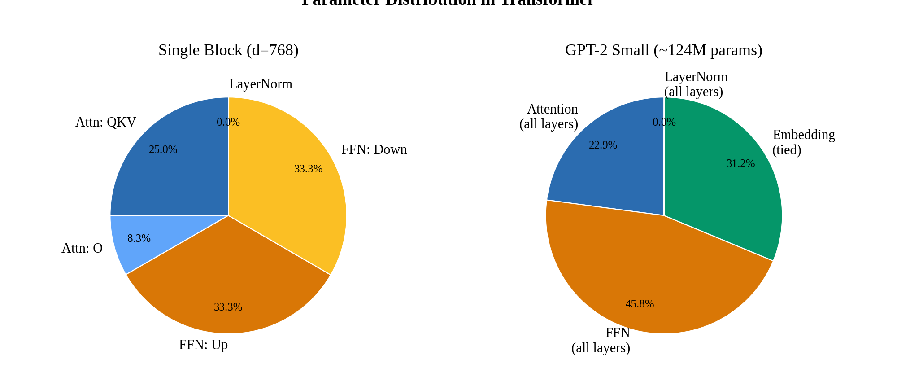
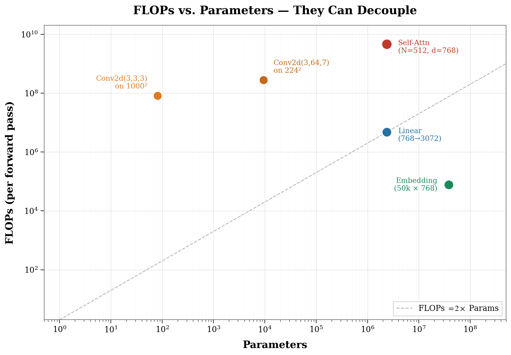
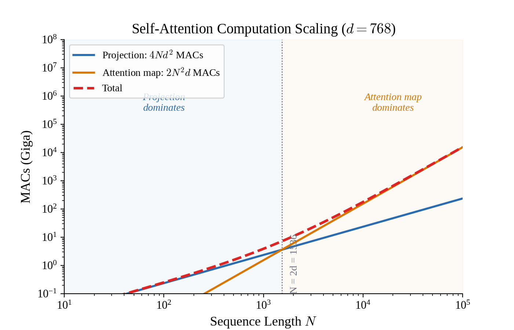
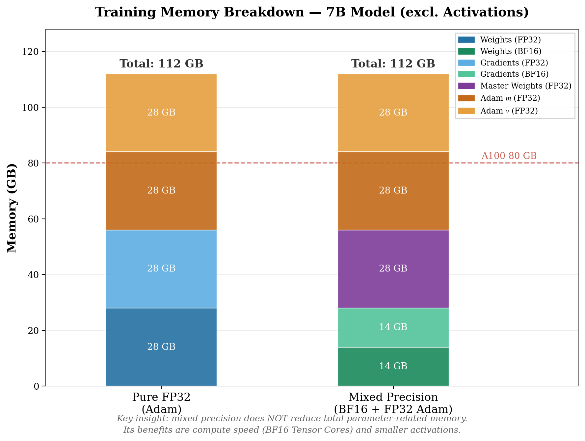
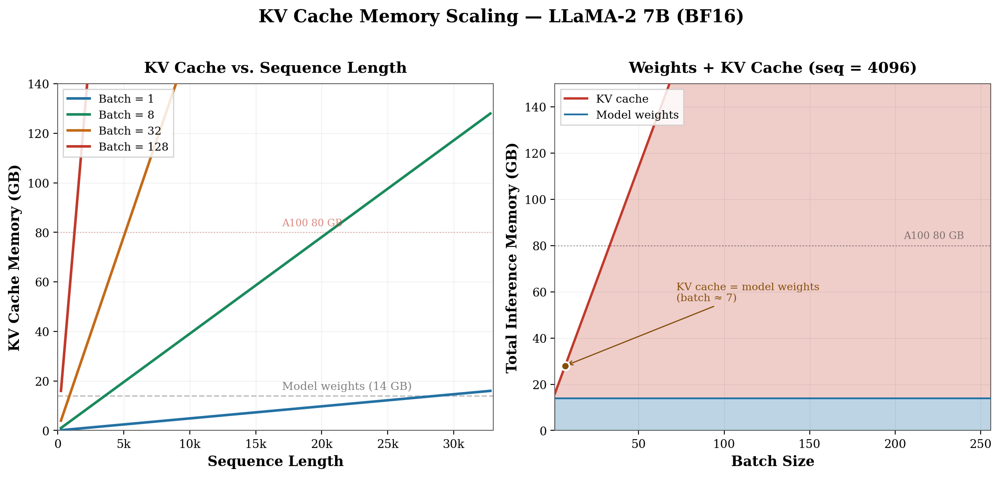
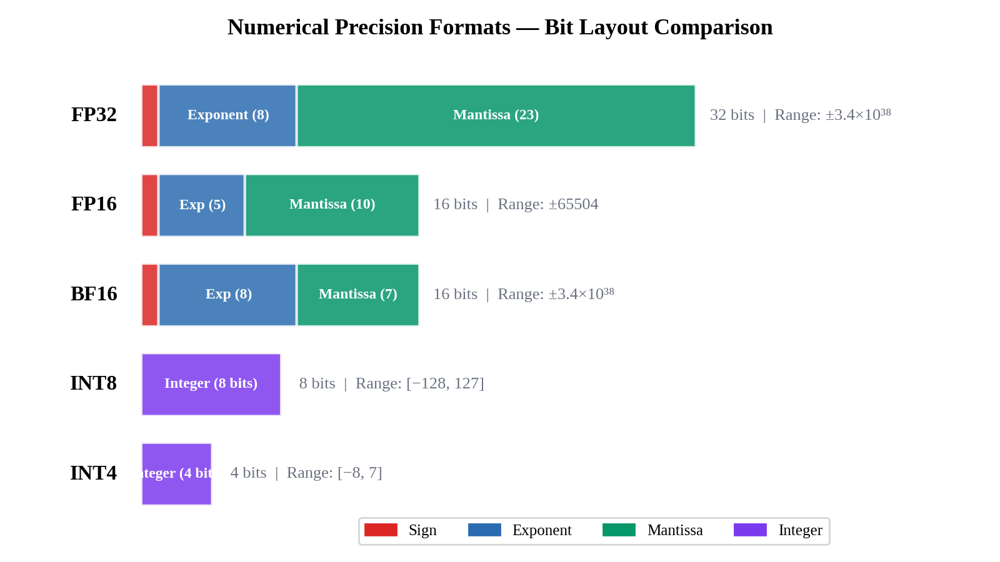
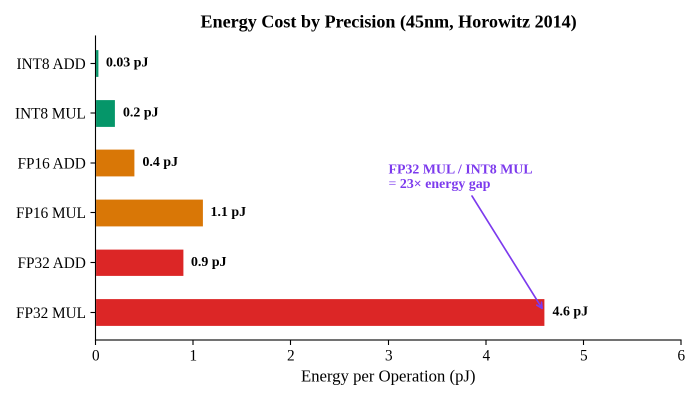
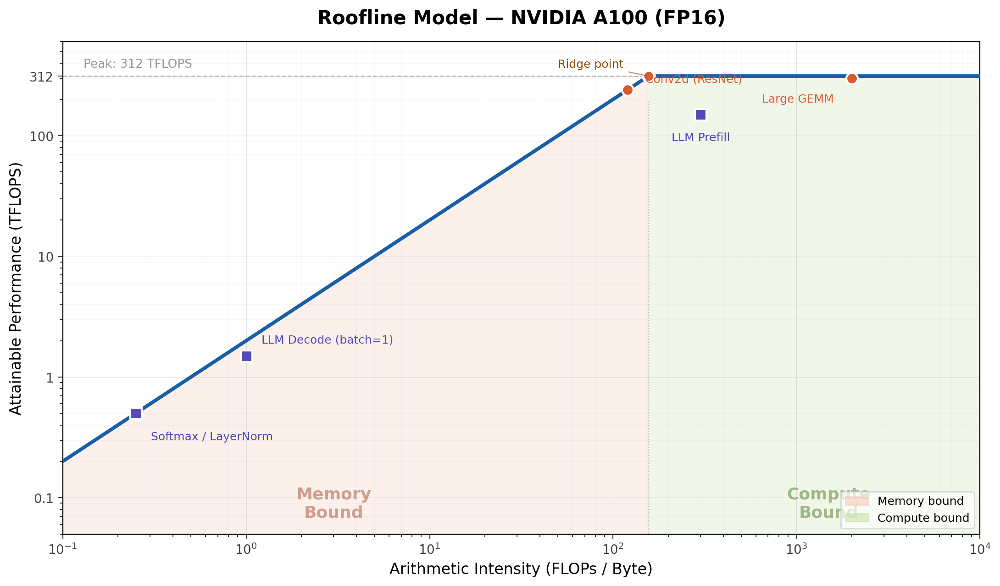
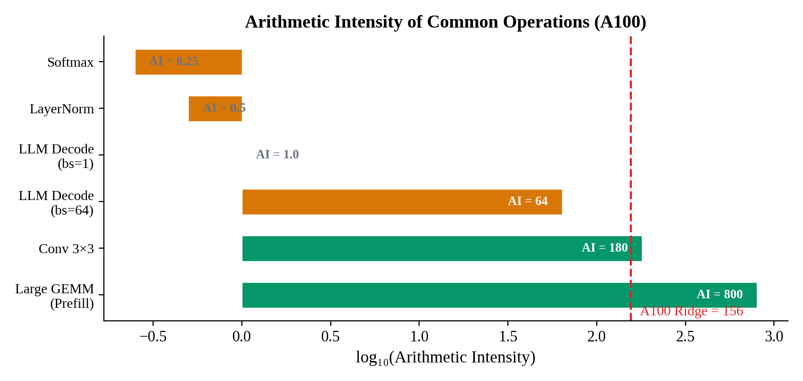

# Lec02 深度学习基础与效率指标

> 📺 [课程视频](https://www.youtube.com/watch?v=I0nKjPpZmMU&feature=youtu.be) &nbsp;|&nbsp; 📄 [Slides](https://www.dropbox.com/scl/fi/pxvvqyq2yu6mwgk79bq5x/Lec02-Basics.pdf?rlkey=tsumfkhrglic55jnjs4yu66ni&e=1&st=cmwnvuvn&dl=0)
>
> 基于 MIT 6.5940 EfficientML 课程整理，加入个人理解与工程补充。

---

## 目录

- [2.1 模型参数量](#21-模型参数量)
- [2.2 计算量：FLOPs 与 MACs](#22-计算量flops-与-macs)
- [2.3 内存占用](#23-内存占用)
- [2.4 数值精度格式](#24-数值精度格式)
- [2.5 效率指标体系](#25-效率指标体系)
- [数学推导](#数学推导)
- [代码：从手写到工业实践](#代码实践)
- [Infra 实战映射](#infra-实战映射)
- [跨 Lecture 关联](#跨-lecture-关联)
- [面试高频题](#面试高频题)

---

## 2.1 模型参数量

参数量决定了模型的存储开销和搬运代价。一个 7B 模型有 70 亿个浮点数需要保存、搬运和参与运算。效率优化的起点，永远是搞清楚参数在哪里、有多少。

### Linear 层

全连接层就是矩阵乘加偏置：$y = xW^T + b$

$$
\text{params} = C_{\text{in}} \times C_{\text{out}} + C_{\text{out}} \quad (\text{bias})
$$

例如 `Linear(768, 3072)` → $768 \times 3072 + 3072 = 2{,}362{,}368$。

这个数字在 Transformer 中反复出现——FFN 的 up projection 就是这个规模。

### Conv2d 层

$$
\text{params} = C_{\text{out}} \times C_{\text{in}} \times K_H \times K_W + C_{\text{out}} \quad (\text{bias})
$$

`Conv2d(64, 128, kernel_size=3)` → $128 \times 64 \times 3 \times 3 + 128 = 73{,}856$。

卷积参数量与输入空间分辨率无关。无论输入是 $224 \times 224$ 还是 $1024 \times 1024$，参数量不变——因为同一组 kernel 在所有空间位置滑动复用（weight sharing）。这个性质是后面理解 FLOPs 和参数量"脱钩"的关键。

### Transformer 中的 Multi-Head Attention

MHA 包含四组线性投影：Q、K、V、O。

| 投影 | 形状 |
|------|------|
| $W_Q, W_K, W_V$ | $d_{\text{model}} \times d_{\text{model}}$ |
| $W_O$ | $d_{\text{model}} \times d_{\text{model}}$ |

忽略 bias 时总参数量：$4 \times d_{\text{model}}^2$。

GPT-2 small（$d_{\text{model}} = 768$）单层 attention 参数 $= 4 \times 768^2 \approx 2.36\text{M}$。但还有 FFN（通常参数比 attention 更多），下文会拆解。

<p align="center">
  
</p>
<p align="center"><b>图 1</b>：Transformer block 参数分布。FFN 占比约 2/3，attention 约 1/3。</p>

---

## 2.2 计算量：FLOPs 与 MACs

先把几个容易混淆的术语对齐：

| 缩写 | 含义 | 举例 |
|------|------|------|
| **MACs** | Multiply-Accumulate 次数 | 1 MAC = 一次乘法 + 一次累加 |
| **FLOPs** | 浮点运算总次数（大写 O，复数 s） | 1 MAC = 2 FLOPs |
| **FLOPS** | 每秒运算次数（吞吐能力） | "A100 FP16 峰值 312 TFLOPS" |

很多论文和工具（如 `thop`、`fvcore`）报告的是 MACs 而非 FLOPs，两者差 2 倍。读数据时务必看清单位。

> **本文约定：** 后续公式统一以 MACs 为单位给出（这是多数工程论文的惯例）。如需换算成 FLOPs，乘以 2 即可。注意力机制的公式同理——给出的就是实际的乘-加操作次数，不再额外乘 2。

### Linear 层

$$
\text{MACs} = B \times C_{\text{in}} \times C_{\text{out}}
$$

每个输出元素需要 $C_{\text{in}}$ 次 multiply-accumulate。

### Conv2d 层

$$
\text{MACs} = B \times C_{\text{in}} \times C_{\text{out}} \times K_H \times K_W \times H_{\text{out}} \times W_{\text{out}}
$$

与参数量相比，多出 $H_{\text{out}} \times W_{\text{out}}$。这就是参数量与计算量能"脱钩"的原因——$3 \times 3$ 卷积可能只有 81 个参数，但在 $1000 \times 1000$ 的 feature map 上做一次 forward，MACs 就有约 81M。

<p align="center">
  
</p>
<p align="center"><b>图 2</b>：参数量与计算量可以显著脱钩。Embedding 参数量大但计算近乎为零（查表）；Conv 参数少但因 weight sharing 而计算密集。</p>

### Self-Attention

设序列长度 $N$，模型维度 $d$，单层 self-attention 的 MACs：

$$
\underbrace{4Nd^2}_{\text{QKV + O 投影}} + \underbrace{2N^2 d}_{\text{注意力矩阵 (}QK^T + \text{score} \cdot V\text{)}}
$$

两项分别对应 $O(Nd^2)$ 和 $O(N^2 d)$。谁占主导取决于 $N$ 和 $d$ 的相对大小：

- 当 $N < 2d$ 时，投影项主导（如 $N=512, d=768$，典型的短序列场景）
- 当 $N > 2d$ 时，注意力矩阵项主导（如 $N=32768, d=768$，长序列场景）

长上下文优化（FlashAttention、Ring Attention、Sparse Attention）本质上都是在压缩 $N^2 d$ 这一项。

<p align="center">
  
</p>
<p align="center"><b>图 3</b>：Self-Attention 计算量随序列长度的变化。交叉点在 $N = 2d$，之后注意力矩阵的二次项成为瓶颈。</p>

> **关于公式中的系数约定：** 这里写 $4Nd^2$ 而非 $8Nd^2$，是因为以 MAC 计数。每个线性投影对矩阵 $(N, d) \times (d, d)$ 做乘-累加，MACs $= N \cdot d \cdot d$。四个投影（Q/K/V/O）共 $4Nd^2$ MACs。注意力矩阵部分，$QK^T$ 是 $(N, d) \times (d, N)$，MACs $= N^2 d$；score $\times V$ 是 $(N, N) \times (N, d)$，MACs $= N^2 d$；合计 $2N^2 d$ MACs。如果要转换成 FLOPs，整个公式乘 2 得到 $8Nd^2 + 4N^2 d$，这与部分文献（如 Megatron-LM 论文）的写法一致。

---

## 2.3 内存占用

常见的误解："7B 模型 FP16 就是 14 GB，显卡装得下就能训。"实际差得远。

训练时的内存由四部分构成：

$$
\text{Memory}_{\text{train}} = \text{权重} + \text{梯度} + \text{Optimizer States} + \text{Activations}
$$

| 组成 | FP32 Adam | 说明 |
|------|-----------|------|
| 权重 | 4P bytes | 参与前向和反向 |
| 梯度 | 4P bytes | 反向传播产生，与权重等大 |
| Adam $m$（一阶矩） | 4P bytes | 梯度的指数移动平均 |
| Adam $v$（二阶矩） | 4P bytes | 梯度平方的指数移动平均 |
| **仅参数相关合计** | **16P bytes** | 未包含 activations |

7B 模型纯 FP32 Adam 训练：$16 \times 7 \times 10^9 = 112 \text{ GB}$——一张 A100 80GB 连参数相关内存都放不下，还没算 activations。

<p align="center">
  
</p>
<p align="center"><b>图 4</b>：7B 模型的训练内存拆解。混合精度并不能显著节省 optimizer states（仍为 FP32），其主要收益在于计算加速和 activation 内存的缩减。</p>

实践中必须组合使用多种技术：

1. **混合精度** —— 权重和梯度存 FP16/BF16，optimizer states 存 FP32
2. **ZeRO / FSDP** —— 把 optimizer states 切分到多张卡
3. **Gradient checkpointing** —— 用重计算换 activation 内存

### 推理内存与 memory-bandwidth 瓶颈

推理时不需要梯度和 optimizer states，但有另一个大户：**KV cache**。

LLM decode 阶段（自回归生成）每生成一个 token 的过程：
1. 把全部模型权重从 HBM 读一遍
2. 做一次矩阵-向量乘（batch=1 时新 token 只有一个）
3. 更新 KV cache

```
7B FP16 → 14 GB 权重
A100 HBM 带宽 ≈ 2 TB/s
光搬权重的延迟 ≈ 14 / 2000 = 7 ms/token ≈ ~143 tokens/s 上限
```

这是 decode 阶段 memory-bound 的根本原因：算力大量空闲，瓶颈在数据搬运。

<p align="center">
  
</p>
<p align="center"><b>图 5</b>：KV cache 随序列长度线性增长，随 batch size 线性放大。大 batch + 长序列下 KV cache 内存可远超模型权重本身。</p>

---

## 2.4 数值精度格式

### 浮点数结构

IEEE 754 浮点数由三部分构成：符号位 + 指数 + 尾数。

$$
\text{value} = (-1)^{\text{sign}} \times 2^{(\text{exponent} - \text{bias})} \times (1 + \text{mantissa})
$$

指数位决定动态范围（能表示多大/多小的数），尾数位决定精度（相邻两个可表示值的间距）。

<p align="center">
  
</p>
<p align="center"><b>图 6</b>：常用数值格式的位宽分配。BF16 和 FP32 共享相同的 8-bit 指数，因而动态范围一致；FP16 的 5-bit 指数使其最大值仅为 65504。</p>

### FP16 vs BF16：为什么 LLM 训练选 BF16

FP16 的问题在 5-bit 指数：最大可表示值仅 65504。LLM 训练中 attention score（尤其是 pre-softmax logits）或 loss 值略大就会溢出为 `inf`，导致训练崩溃。因此 FP16 训练必须搭配 loss scaling：先把 loss 乘一个大常数（如 1024）抬高梯度数值范围以避免 underflow，反向传播后再除回来。这套流程可行但增加了工程复杂度，scale factor 选取不当仍会出问题。

BF16 的 8-bit 指数与 FP32 一致，动态范围不受限，不需要 loss scaling。代价是尾数只有 7 bit（FP16 有 10 bit），精度更低。但实际训练中这点精度损失对收敛的影响可以忽略。

工程上还有一个好处：FP32 转 BF16 只需截断低 16 位，无需额外的 rounding 逻辑。

当前 A100 / H100 上的大模型训练几乎统一使用 BF16。

### 整数格式的能效优势

量化的核心收益不仅在于省内存，更在于**节能**。整数运算电路比浮点简单得多。

<p align="center">
  
</p>
<p align="center"><b>图 7</b>：不同精度下单次运算的能耗（Horowitz 2014, 45nm）。INT8 乘法相比 FP32 乘法约省 23 倍能耗。</p>

在移动端和边缘设备上，能耗往往是比计算量更严格的约束。

---

## 2.5 效率指标体系

### Latency

LLM 场景的延迟指标需要拆分为两个阶段：

| 指标 | 含义 | 主要影响因素 |
|------|------|-------------|
| TTFT | Time To First Token，首 token 延迟 | prompt 长度 → prefill 阶段是 compute-bound |
| TPOT | Time Per Output Token | 模型大小 × 带宽 → decode 阶段是 memory-bound |
| P99 | 第 99 百分位延迟 | 线上 SLA 通常看 P99 而非平均 |

TTFT 和 TPOT 由不同因素主导，优化手段也不同。这正是 vLLM continuous batching 需要平衡的核心 trade-off。

### Throughput

$$
\text{Throughput} = \text{batch\_size} / \text{latency}
$$

增大 batch 可提升吞吐（GPU 利用率上升），但单条请求的延迟会增加。生产环境的核心问题是在 latency SLA 约束下最大化 throughput。

### Arithmetic Intensity 与 Roofline 模型

$$
\text{Arithmetic Intensity (AI)} = \frac{\text{FLOPs}}{\text{Bytes\_accessed}}
$$

AI 衡量一个 kernel 每搬运一个 byte 做多少次计算。

| 场景 | AI | 瓶颈 |
|------|-----|------|
| LLM decode (batch=1) | ~1 | Memory-bound |
| 大 batch matmul / prefill | 很高 | Compute-bound |
| Softmax / LayerNorm | 极低（element-wise） | Memory-bound |

**Roofline 模型**将这个关系可视化：

$$
\text{实际性能} = \min(\text{峰值算力},\;\text{峰值带宽} \times \text{AI})
$$

<p align="center">
  
</p>
<p align="center"><b>图 8</b>：Roofline 模型（A100 FP16）。Ridge point 约在 AI = 156。低于此值的 kernel 性能受限于带宽，高于此值才受限于算力。</p>

A100 的 ridge point $\approx 312 \text{ TFLOPS} / 2 \text{ TB/s} = 156$。对于 AI 低于 156 的 kernel，优化计算逻辑收效甚微，瓶颈在数据搬运。

<p align="center">
  
</p>
<p align="center"><b>图 9</b>：常见操作的 Arithmetic Intensity 在频谱上的位置。LLM decode（batch=1）的 AI 约为 1，远低于 A100 ridge point。</p>

### MBU（Memory Bandwidth Utilization）

$$
\text{MBU} = \frac{\text{实际带宽利用}}{\text{硬件峰值带宽}}
$$

Decode 阶段是纯 memory-bound 场景，MBU 直接反映工程实现效率。优秀的 LLM serving engine 在 decode 阶段 MBU 可达 70–80%+。

---

## 数学推导

### ResNet-50 第一层

`Conv2d(3, 64, kernel_size=7, stride=2, padding=3)`，输入 $224 \times 224$。

参数量：

$$
P = 64 \times 3 \times 7 \times 7 = 9{,}408 \quad (\text{无 bias})
$$

输出分辨率：

$$
H_{\text{out}} = \lfloor (224 + 2 \times 3 - 7) / 2 + 1 \rfloor = 112
$$

MACs：

$$
\text{MACs} = 64 \times 3 \times 7 \times 7 \times 112 \times 112 \approx 118\text{M}
$$

（如以 FLOPs 计则为 $\approx 236\text{M}$）

一个只有 9408 个参数的层，MACs 约 118M。这是 Conv 的典型特征：参数量小但计算密集（weight sharing 在空间维度上反复使用同一组参数）。

### GPT-2 (117M) 单层参数拆解

$d_{\text{model}} = 768$，$d_{\text{ff}} = 3072 = 4 \times d_{\text{model}}$。

| 模块 | 参数量 |
|------|--------|
| Attention: $4 \times (768^2 + 768)$ | 2,362,368 |
| FFN: $768 \times 3072 + 3072 + 3072 \times 768 + 768$ | 4,722,432 |
| $2 \times$ LayerNorm: $2 \times (768 + 768)$ | 3,072 |
| **单层合计** | **~7.09M** |

12 层 → ~85M。加上 token embedding（$50257 \times 768 \approx 38.6\text{M}$）约 124M。实际公开的 GPT-2 small 约 117M，差异来源于 token embedding 和 output head 权重共享（weight tying），避免了重复计算。

值得注意的比例：FFN 参数 / Attention 参数 $\approx 2 : 1$。Transformer 中参数的大头在 FFN，不在 attention。

### 混合精度训练内存（1B 模型）

| 组件 | 精度 | 内存 |
|------|------|------|
| 前向/反向用的参数 | BF16 | 2 GB |
| 梯度 | BF16 | 2 GB |
| Master weights（optimizer 维护） | FP32 | 4 GB |
| Adam $m$ | FP32 | 4 GB |
| Adam $v$ | FP32 | 4 GB |
| **合计（不含 activations）** | | **16 GB** |

跟纯 FP32 的 16 GB 一样？是的——混合精度的主要收益在于**计算速度**（BF16 matmul 在 Tensor Core 上快 2–4 倍）和 **activation 内存**（中间结果存 BF16），而不是 optimizer states。Optimizer states 始终占据 FP32 的大头，要削减它只能靠 ZeRO 或 FSDP 分片。

---

## 代码 

### 基础工具函数

日常 debug 和 profiling 的起点：

```python
import torch
import torch.nn as nn
from typing import Tuple


def count_parameters(model: nn.Module) -> Tuple[int, int]:
    """统计可训练 / 总参数量。"""
    trainable = sum(p.numel() for p in model.parameters() if p.requires_grad)
    total = sum(p.numel() for p in model.parameters())
    return trainable, total


def param_memory_mb(model: nn.Module, dtype_bytes: int = 2) -> float:
    """参数内存估算 (MB)。dtype_bytes: FP32=4, BF16/FP16=2, INT8=1"""
    total = sum(p.numel() for p in model.parameters())
    return total * dtype_bytes / (1024 ** 2)
```

### HuggingFace Transformers 的参数量统计

HuggingFace 不是简单的 `sum(p.numel())`。关键设计考量：

```python
# transformers/modeling_utils.py 中 num_parameters() 的核心逻辑（简化）

def num_parameters(self, only_trainable=False, exclude_embeddings=False):
    """
    两个工程细节：
    1. exclude_embeddings —— 论文常不算 embedding 参数
       （embedding 只做查表，不贡献实际计算）
    2. 去重 —— 用 data_ptr() 检测共享权重，避免重复统计
       典型场景：GPT-2 的 token embedding 和 lm_head 共享权重
    """
    if exclude_embeddings:
        embedding_params = sum(
            p.numel() for p in self.get_input_embeddings().parameters()
        )
    
    # 用 set(data_ptr) 去重共享参数
    seen = set()
    total = 0
    for name, p in self.named_parameters():
        if only_trainable and not p.requires_grad:
            continue
        ptr = p.data_ptr()
        if ptr in seen:
            continue
        seen.add(ptr)
        total += p.numel()
    
    if exclude_embeddings:
        total -= embedding_params
    return total
```

两个实战常见的坑：
- **Weight tying**：GPT-2、LLaMA 等模型的 input embedding 和 output head 共享权重，朴素的 `sum(p.numel())` 会重复计算。
- **Embedding 的特殊性**：Embedding 参数量可以很大（$\text{vocab\_size} \times d_{\text{model}}$），但"计算"只是一次 gather 操作，FLOPs 贡献微乎其微。

### 计算量估算：手写 vs 工具

手写（以 MACs 为单位）：

```python
def macs_linear(B: int, in_f: int, out_f: int) -> int:
    """Linear 层的 MACs。"""
    return B * in_f * out_f


def macs_attention(B: int, N: int, d: int) -> int:
    """Self-attention MACs 估算（单层）。
    
    4*N*d^2 : Q/K/V/O 四个 projection（每个 N*d*d MACs）
    2*N^2*d : QK^T + attn @ V（每个 N*N*d MACs）
    """
    proj = 4 * N * d * d
    attn = 2 * N * N * d
    return B * (proj + attn)
```

实际项目中常用 `calflops` 或 Meta 的 `fvcore` 自动计算：

```python
from calflops import calculate_flops

flops, macs, params = calculate_flops(
    model=model,
    input_shape=(1, 128),
    transformer_tokenizer=tokenizer,
)
print(f"FLOPs: {flops}  MACs: {macs}  Params: {params}")
```

但注意：**自动工具不一定准确**。涉及动态形状（attention mask、变长序列）时，自动 profiler 容易给出误导性数字。手动推导能力是基本功，不能完全依赖工具。

### 数值精度：实际验证

```python
import torch

# BF16 vs FP16 精度差异
x = torch.tensor([0.1, 0.2, 0.3], dtype=torch.float32)
print(f"FP16 最大误差: {(x - x.half().float()).abs().max():.2e}")
print(f"BF16 最大误差: {(x - x.bfloat16().float()).abs().max():.2e}")

# FP16 溢出
big = torch.tensor(65505.0)
print(f"65505 → FP16: {big.half()}")     # inf
print(f"65505 → BF16: {big.bfloat16()}")  # 65536.0，安全

# 模拟未归一化的 attention score
scores = torch.randn(1, 12, 2048, 2048) * 30
print(f"FP16 overflow count: {torch.isinf(scores.half()).sum()}")
print(f"BF16 overflow count: {torch.isinf(scores.bfloat16()).sum()}")
```

### Transformer Block 完整实现

```python
import torch
import torch.nn as nn
import torch.nn.functional as F


class TransformerBlock(nn.Module):
    """简化版 Transformer Block，展示参数分布和计算流程。
    
    结构对标 GPT-2 / LLaMA 的基本 pattern：
    - Pre-norm（LayerNorm 在 attention / FFN 之前）
    - GELU activation
    - 无 bias（现代 LLM 通常 bias=False）
    """
    
    def __init__(self, d_model=256, n_heads=4, d_ff=1024):
        super().__init__()
        assert d_model % n_heads == 0
        self.d_head = d_model // n_heads
        self.n_heads = n_heads
        
        # QKV 合并为一个 Linear（LLaMA、Mistral 均如此）
        self.qkv = nn.Linear(d_model, 3 * d_model, bias=False)
        self.o_proj = nn.Linear(d_model, d_model, bias=False)
        
        # FFN（LLaMA 用 SwiGLU，这里简化为 GELU）
        self.up = nn.Linear(d_model, d_ff, bias=False)
        self.down = nn.Linear(d_ff, d_model, bias=False)
        
        self.ln1 = nn.LayerNorm(d_model)
        self.ln2 = nn.LayerNorm(d_model)
    
    def forward(self, x):
        B, N, D = x.shape
        
        # Self-Attention
        h = self.ln1(x)
        qkv = self.qkv(h).reshape(B, N, 3, self.n_heads, self.d_head)
        qkv = qkv.permute(2, 0, 3, 1, 4)
        q, k, v = qkv.unbind(0)
        
        # PyTorch 2.0+ 会自动 dispatch 到 FlashAttention kernel
        attn_out = F.scaled_dot_product_attention(q, k, v)
        attn_out = attn_out.transpose(1, 2).reshape(B, N, D)
        x = x + self.o_proj(attn_out)
        
        # FFN
        h = self.ln2(x)
        x = x + self.down(F.gelu(self.up(h)))
        
        return x
```

### vLLM 中的 KV cache 内存估算

vLLM 启动时需要估算模型占多少显存、剩余空间能放多少 KV cache blocks：

```python
def estimate_kv_block_memory(
    num_layers: int,
    num_kv_heads: int,  # GQA 时 kv_heads < q_heads
    head_dim: int,
    block_size: int = 16,  # 每个 block 容纳的 token 数
    dtype_bytes: int = 2,  # BF16=2, FP8=1
) -> int:
    """单个 KV cache block 的内存 (bytes)。"""
    # K 和 V 各一份（×2），每层、每个 head、block_size 个 token
    return 2 * num_layers * num_kv_heads * head_dim * block_size * dtype_bytes

# LLaMA-2 7B: 32 layers, 32 kv_heads, head_dim=128, block_size=16, BF16
block_mem = estimate_kv_block_memory(32, 32, 128, 16, 2)
print(f"单个 KV block: {block_mem / 1024:.1f} KB")  # 4096 KB = 4 MB

# A100 80GB，模型 ~14GB (7B × 2B)
# 剩余 ~66GB 可用于 KV cache
# 可放 66 * 1024 / 4 ≈ 16896 个 blocks
# 每个 block 16 tokens → 最多缓存 ~270K tokens
```

实际 vLLM 的做法是先按公式粗估，再用一个 dummy forward pass 实测，取保守值。

### PyTorch 混合精度训练

```python
from torch.amp import autocast, GradScaler

model = model.cuda()
optimizer = torch.optim.AdamW(model.parameters(), lr=1e-4)
scaler = GradScaler()  # 仅 FP16 需要

for batch in dataloader:
    optimizer.zero_grad()
    
    # autocast 区域内 matmul 自动用 BF16
    # softmax、layernorm、loss 保持 FP32
    with autocast(device_type="cuda", dtype=torch.bfloat16):
        loss = model(batch)
    
    # BF16 可直接 backward，不需要 scaler
    loss.backward()
    torch.nn.utils.clip_grad_norm_(model.parameters(), max_norm=1.0)
    optimizer.step()
```

BF16 不需要 `GradScaler` 的原因：BF16 动态范围与 FP32 一致，梯度不会 underflow。FP16 动态范围小，微小梯度值会被 flush 为 0，因此必须用 loss scaling 抬高数值范围。

---

## Infra 实战映射

### vLLM

vLLM 的设计与本讲的分析一一对应：

**PagedAttention** —— 借鉴 OS 虚拟内存思想管理 KV cache。传统做法为每个序列按 `max_seq_len` 预分配连续内存，实际利用率低。PagedAttention 将 KV cache 切成固定大小的 block（默认 16 tokens/block），按需分配且无需连续。内存利用率从约 60% 提升到 95%+。

**Continuous Batching** —— 不等一个 batch 里所有序列生成完毕再处理下一个 batch，而是序列完成即填入新请求。本质是在 compute-bound（prefill）和 memory-bound（decode）之间动态调度。

### TensorRT-LLM

NVIDIA 的推理编译器从计算量和访存分析出发做优化：

**Layer Fusion** —— 将 element-wise ops（bias add、activation、residual add）融合进前序 matmul kernel，减少中间结果的 HBM 读写。每个被融合的 op 意味着少一次 HBM round trip，在 memory-bound 场景下收益显著。

**GEMM Plugin** —— 根据矩阵具体尺寸选择 tiling 策略，让数据搬运与计算 overlap。不同 shape 的最优策略不同，因此 TRT-LLM 在构建阶段做 auto-tuning。

---

## 跨 Lecture 关联

| 方向 | Lecture | 关联点 |
|------|---------|--------|
| ← 前置 | Lec01 | 效率优化的动机与全局视角 |
| → | Lec03/04 | 剪枝——直接减参数量和计算量，本讲公式是衡量标准 |
| → | Lec05/06 | 量化——降低每个参数的 bit 数，本讲的精度格式分析是基础 |
| → | Lec11 | Tiny Engine——MCU 上的极限内存约束，本讲的内存分析方法论直接沿用 |
| → | Lec12/13 | Transformer / LLM 部署——本讲所有公式的大规模实际应用 |

---

## 面试高频题

**Q1：Linear(1024, 4096) 有多少参数？FP16 推理占多少内存？**

参数量 $= 1024 \times 4096 + 4096 = 4{,}198{,}400 \approx 4.2\text{M}$。FP16 每参数 2 bytes → $4.2\text{M} \times 2 = 8.4 \text{ MB}$。

补充：现代模型多设 bias=False（LLaMA、Mistral 等），此时参数量 $= 4{,}194{,}304$，内存 $\approx 8.0 \text{ MB}$。

---

**Q2：参数量和计算量能脱钩吗？举例。**

可以，而且很常见。

- `Conv2d(3, 3, 3)` 只有 81 个参数，作用在 $1000 \times 1000$ 图像上 MACs $\approx 81\text{M}$。原因：weight sharing 在空间维度反复使用同一组参数。
- Embedding 层参数量巨大（$\text{vocab\_size} \times d_{\text{model}}$），但 MACs 几乎为零——仅做一次 gather 查表。

---

**Q3：BF16 vs FP16，为什么 LLM 训练选 BF16？**

两个原因：
1. **动态范围** —— BF16 指数 8 bit（与 FP32 一致），最大值 $\sim 3.4 \times 10^{38}$。FP16 指数 5 bit，最大值 65504。训练中 attention score 或 loss 超过 65504 即溢出。BF16 不需要 loss scaling，FP16 必须。
2. **转换简单** —— FP32 转 BF16 截断低 16 位即可，硬件几乎零开销。

代价是 BF16 尾数仅 7 bit（FP16 有 10 bit），精度更低，但对训练收敛影响可忽略。

---

**Q4：LLM decode 为什么是 memory-bound？怎么缓解？**

Decode 时每步只生成一个 token（或极少量），矩阵乘退化为矩阵-向量乘。每个参数读 2 bytes（FP16），做 2 FLOPs，arithmetic intensity $\approx 1$，远低于 A100 的 ridge point（约 156）。算力大量空闲。

缓解方法：
- **Continuous batching** —— 攒多请求一起 decode，提高 batch size 从而提升 AI
- **模型量化** —— INT8 / INT4 减少搬运量
- **Speculative decoding** —— 小模型快速草拟多个 token，大模型一次验证

---

**Q5：推理内存 = 参数 × dtype_bytes 吗？少了什么？**

少了 **KV cache**。自回归生成时必须保留已生成所有 token 的 K、V 向量：

$$
\text{KV\_cache} = 2 \times L \times n_{\text{kv\_heads}} \times d_{\text{head}} \times N \times B \times \text{dtype\_bytes}
$$

长序列 + 大 batch 下 KV cache 可远超模型权重。LLaMA-2 7B 在 batch=128、seq=4096 下 KV cache 约 64 GB，模型权重仅 14 GB。

这正是 PagedAttention、GQA（Grouped Query Attention）、MQA（Multi Query Attention）等技术的出发点——压缩 KV cache。
