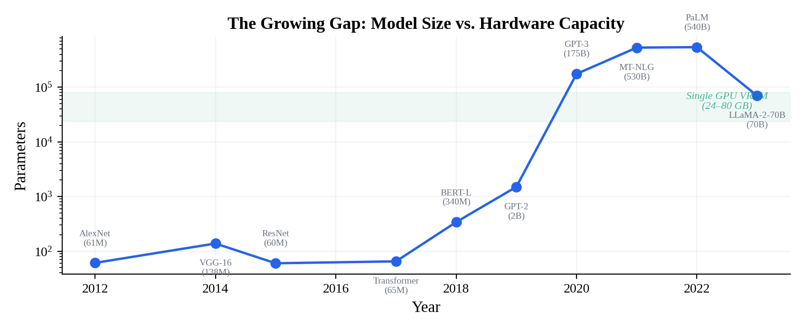
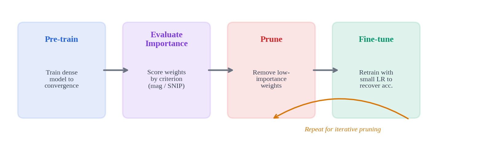

# Lec03 · Pruning & Sparsity (Part I)

> MIT 6.5940 EfficientML.ai · 基于 Song Han 课程讲义整理  
> 前置知识：Lec02（FLOPs、参数量、Memory Bandwidth）  
> 关联：Lec04（Lottery Ticket、自动剪枝率搜索）· Lec05-06（量化）· Lec09（蒸馏）

---

## 0 | 背景：模型越来越大，硬件追不上

2017 年 Transformer 论文发表时参数量 65M，到 GPT-3 已经 175B，MT-NLG 更是 530B。而同期 GPU 显存从 16GB 涨到 80GB，增速差了 **三个数量级**。



这个剪刀差就是模型压缩技术存在的意义。压缩手段里，剪枝（pruning）是最直觉的一种——训练的时候需要足够多参数让优化找到好解，推理的时候不需要那么多就能保住精度。

这件事在生物学上也有对应：人脑突触密度在 2-4 岁达到峰值（约 15000 个/神经元），之后大规模修剪，成年后只剩约一半，但认知能力反而更强。

Song Han 2015 年在 NeurIPS 发的 *Learning Both Weights and Connections* 是现代剪枝的里程碑。结果如下图：


AlexNet 从 61M 压到 6.7M（9×），VGG-16 从 138M 压到 10.3M（13×），精度几乎无损。此后剪枝论文数量从每年不足百篇飙到 2022 年的 3000+。

工业实践也印证了这一点。MLPerf Open Division 的 BERT Large 提交中，**剪枝 + 蒸馏 + 量化** 组合拳把模型从 607MB 压到 177MB，吞吐提升 4.5×，精度仍在 99% 以上。

---

## 1 | 为什么剪枝能 work？

三个经验观察：

**权重天然接近零。** 训练收敛后的权重分布通常是以 0 为中心的钟形，大量权重绝对值很小，对输出的贡献微乎其微。


**激活天然稀疏。** ReLU 把所有负值置零。实测 AlexNet 在 ImageNet 上激活稀疏度高达 62%——超过一半的神经元在任意输入下都是"沉默"的。

**特征冗余。** 不同 filter 经常学到高度相似的特征模式。

这三条叠起来就是说：网络内部有大量冗余，删掉它们对最终输出的影响远比你直觉上认为的小。

### 1.1 剪枝 vs 量化（别搞混）

|  | 剪枝 | 量化 |
|:---|:---|:---|
| 做了什么 | 删权重/结构 | 降数值精度 |
| 网络结构 | 变了（变稀疏或变小） | 不变 |
| 参数数量 | 减少 | 不变（每个参数位宽变小） |
| 核心矛盾 | 删多少 vs 精度 | 位宽多低 vs 精度 |

两者经常组合使用。MLPerf 的 BERT 提交就是先剪枝、再蒸馏、最后量化。

### 1.2 形式化

给定权重 $W$，剪枝等价于带 $\ell_0$ 约束的优化：

$$\arg\min_{W_P} \mathcal{L}(x; W_P) \quad \text{s.t.} \quad \|W_P\|_0 \leq N$$

$\|W_P\|_0$ 是非零权重数，$N$ 是参数预算。这是 NP-hard 问题，实际只能用启发式。

---

## 2 | 从哪个维度下刀？——剪枝粒度

粒度决定了"以什么 pattern 删权重"。本质是**精度**和**硬件加速**之间的 trade-off：粒度越细，自由度越高、精度越好；粒度越粗，GPU 越好利用。


### 2.1 非结构化剪枝（Unstructured）

最细粒度，逐个权重独立决定去留。对 $W \in \mathbb{R}^{m \times n}$，生成同形状的二值掩码：

$$\hat{W} = W \odot M, \quad M \in \{0, 1\}^{m \times n}$$

好处是自由度最高，AlexNet 可以剪掉 89% 参数而精度几乎不掉。

坏处是产生不规则稀疏矩阵。GPU 上的 cuBLAS 是给稠密矩阵优化的，面对随机稀疏 pattern 根本没法高效利用——你删了 90% 权重，实际可能只快 10%，甚至更慢（cache miss 增多）。

> **工程视角**：非结构化剪枝在通用 GPU 上几乎拿不到实际加速，需要专用稀疏硬件（比如 Cerebras WSE 的 sparse mode，或 EIE 这样的定制加速器）。国产 GPU 目前更不用想——稀疏计算库都还在早期阶段。

### 2.2 N:M 结构化稀疏（2:4 Pattern）

NVIDIA Ampere 架构（A100）引入的折中方案。规则很简单：**每连续 4 个权重中，恰好 2 个为零**，固定 50% 稀疏度。


A100 的 Sparse Tensor Core 原生支持这种 pattern，实现接近 2× 的 matmul 加速。而且精度损失极小——ResNet-50: 76.1→76.2（居然还涨了），BERT-Large SQuAD F1: 91.9→91.9。

存储上，只保留非零值 + 2-bit 索引，压缩约 62.5%。

这是目前工业界最务实的"带稀疏"剪枝方案。H100 同样支持。TensorRT-LLM 的 `ModelOpt` 工具链已集成 SparseGPT，可以一键对 LLM 做 2:4 剪枝。

> **国产芯片注意**：目前沐曦 MACA、摩尔线程 MUSA、海光 DCU 均未原生支持 N:M 稀疏。如果你在做国产替代适配，这个 feature 暂时用不上，优先考虑通道级剪枝或量化。

### 2.3 通道级剪枝（Channel Pruning）

最粗的实用粒度。直接删整个输出 channel（等价于删一个 filter 的所有权重）。

卷积层参数量 $C_{out} \times C_{in} \times k_H \times k_W$，剪掉 $p$ 个输出 channel 后：

$$\text{Params}' = (C_{out} - p) \times C_{in} \times k_H \times k_W$$

同时下一层输入 channel 也自动减少 $p$，产生级联减参效果。

**核心优势**：剪完就是一个更小的稠密网络，用普通 cuBLAS（或任何 BLAS 库）直接加速，不需要任何稀疏算子支持。对国产 GPU 来说，这是最安全的选择。

**主要劣势**：约束太强，同等压缩比下精度损失比非结构化大。

He et al. (ECCV 2018) 的 AMC 论文表明，**非均匀通道剪枝**（不同层分配不同剪枝率）显著优于等比缩小所有层。

### 2.4 工程选型总结

| 硬件平台 | 推荐方案 | 原因 |
|:---|:---|:---|
| NVIDIA Ampere/Hopper | 2:4 结构化稀疏 | 原生 Sparse Tensor Core，近 2× 加速 |
| 通用 GPU（无稀疏支持） | 通道级剪枝 | 直出更小稠密网络，零依赖 |
| 自研 ASIC / FPGA | 非结构化剪枝 | 可定制稀疏加速 datapath |
| 国产 GPU（沐曦/摩尔线程/海光） | 通道级剪枝 + 量化 | 稀疏库不成熟，量化工具链更完善 |

---

## 3 | 删谁？——剪枝准则

确定了"以什么粒度删"，下一个问题是"哪些权重该被删"。


### 3.1 幅度剪枝（Magnitude-based）

最简单最常用：**绝对值越小越不重要**。

逐权重：$\text{Importance}(w_i) = |w_i|$

结构化（按 filter）：$\|\mathbf{f}\|_1 = \sum_i |w_i|$ 或 $\|\mathbf{f}\|_2 = \sqrt{\sum_i w_i^2}$

举个例子：$W = \begin{bmatrix} 3 & -2 \\ 1 & -5 \end{bmatrix}$，保留 50%。绝对值排序为 5, 3, 2, 1，删最小的两个（2 和 1），得到 $\begin{bmatrix} 3 & 0 \\ 0 & -5 \end{bmatrix}$。

优点是不需要数据、不需要梯度，训练完直接用。缺点是完全忽略了权重对 loss 的实际敏感度——权重大不代表它对模型输出真的重要。

### 3.2 SNIP：一阶 Saliency

核心思想：不看权重本身大小，看**删掉它之后 loss 变多少**。

引入掩码 $c_j \in \{0,1\}$，用一阶 Taylor 展开近似 loss 变化。由链式法则推导出：

$$s_j = \left| \frac{\partial \mathcal{L}}{\partial w_j} \cdot w_j \right|$$

物理意义：**重要性 = 梯度 × 权重**。一个权重大但梯度接近零（loss 对它不敏感），saliency 也会小。同时考虑了两个因素，比纯 magnitude 更准。

只需一次前向 + 反向就能算完所有权重的 saliency，开销跟算一次梯度相同。

### 3.3 二阶方法：OBD 与 OBS

一阶不够精确，引入 Hessian 信息。

**OBD**（LeCun et al. 1989）对 loss 做二阶 Taylor 展开：

$$\Delta \mathcal{L} \approx \sum_i g_i \delta w_i + \frac{1}{2}\sum_i h_{ii} \delta w_i^2 + \frac{1}{2}\sum_{i \neq j} h_{ij}\delta w_i \delta w_j$$

三个简化假设：(1) 已收敛（一阶项 ≈ 0）；(2) 忽略高阶项；(3) Hessian 对角化。最终：

$$\text{Importance}(w_i) = \frac{1}{2} h_{ii} w_i^2$$

**OBS** 放松了对角假设，用完整 Hessian 逆，还能给出删除某个权重后其余权重的补偿调整量。理论更精确，但计算 Hessian 逆的 $O(n^2)$~$O(n^3)$ 对大模型不现实。

> **延伸**：后续 Lec04 会讲到 SparseGPT，它本质上是 OBS 思路在 LLM 上的高效实现——把逐列求解 Hessian 逆转化成了分块 Cholesky，让 175B 模型的 one-shot 剪枝变得可行。

### 3.4 APoZ（基于激活）

视角从权重转向激活。对一批数据做前向传播，统计每个 channel 激活为零的比例：

$$\text{APoZ}(c) = \frac{1}{N \cdot H \cdot W} \sum_{n,h,w} \mathbb{1}[\text{ReLU}(z_{n,c,h,w}) = 0]$$

APoZ 越高 → 这个 channel 大部分时间都在"睡觉" → 安全删除。需要数据（至少一个 batch），特别适合 channel pruning。

### 3.5 重建误差准则

不从全局 loss 出发，而是**逐层最小化特征重建误差**。设第 $l$ 层输出 $Z = XW^T$，引入选择向量 $\beta$：

$$\arg\min_{W, \beta} \left\| Z - \sum_{c=0}^{C_{in}-1} \beta_c X_c W_c^T \right\|_F^2, \quad \text{s.t.} \quad \|\beta\|_0 \leq N_c$$

通过交替优化找到对下游特征影响最小的剪枝方案。

### 3.6 对比一览

| 准则 | 核心公式 | 需要数据 | 需要梯度 | 计算开销 | 典型场景 |
|:---|:---|:---:|:---:|:---|:---|
| Magnitude | $\|w\|_p$ | ✗ | ✗ | 极低 | 快速基线、资源受限 |
| SNIP | $\|g \cdot w\|$ | 1 batch | 1次反向 | 低 | 训练前剪枝 |
| OBD | $\frac{1}{2}h_{ii}w_i^2$ | ✓ | 二阶 | 高 | 小模型精剪 |
| APoZ | 零激活比例 | ✓ | ✗ | 中 | Channel pruning |
| Reconstruction | $\min\|Z-\hat{Z}\|_F^2$ | ✓ | ✗ | 中 | 逐层精细剪枝 |

---

## 4 | 剪枝流程与策略

### 4.1 标准三步走



微调是必不可少的——剪枝打破了层间协作关系，剩余权重需要重新适应。学习率通常设为原始训练的 1/10~1/100，微调 10-20% 的原始 epoch 数。

### 4.2 一次剪 vs 迭代剪


三种策略的差异很清楚：

**One-shot（不微调）**：稀疏度一高，精度断崖式下跌。只适合对精度要求不高或稀疏度很低的场景。

**One-shot + Fine-tune**：精度恢复明显，但高稀疏度（>80%）下仍有不小损失。

**Iterative Prune + Fine-tune**：每次剪一点、每次都微调。模型有时间重新分配权重重要性，后续轮次的剪枝决策更准。精度保持最好，代价是训练时间 ×N。

> **工程经验**：对 70B+ 的 LLM，迭代剪枝的计算开销很难接受。实际中更多用 SparseGPT / Wanda 这类 one-shot 方案，靠 Hessian 信息或激活感知来补偿精度，避免任何微调。

### 4.3 全局 vs 逐层


**逐层（Local）**：每层固定一个剪枝率，比如全部 50%。简单粗暴，但忽略了不同层的敏感度差异——第一层和最后一层通常更敏感，中间层冗余更多。

**全局（Global）**：所有层权重统一排序，设全局阈值：

$$\tau = \text{quantile}_{1-s}(\{|w| : w \in W\})$$

效果是敏感层自动少剪、冗余层自动多剪，精度通常好得多。

---

## 5 | 硬件视角：数据搬运比计算贵

聊完算法，讲一个很多算法研究者忽视的硬件事实。


Horowitz (ISSCC 2014) 的经典数据：45nm 工艺下，一次 32-bit DRAM 读取消耗 640pJ，是一次 INT8 加法（0.03pJ）的**两万倍以上**。

这意味着什么？**模型压缩的真正收益不在于省计算，而在于省内存搬运。** 剪枝把模型体积压小 → DRAM 访问次数减少 → 这才是在边缘设备上的核心价值。

对于做国产 GPU 适配的同学，这一点尤其重要：国产芯片的内存带宽相比 A100/H100 通常有明显差距（HBM 堆叠工艺限制），所以模型压缩带来的带宽节省效果反而更显著。

---

## 6 | 硬件与推理框架适配

### NVIDIA 生态

A100/H100 的 2:4 稀疏通过 `cusparseLt` 库实现。TensorRT-LLM 的 `nvidia-modelopt` 已集成 SparseGPT，支持一键 2:4 剪枝 + 量化。

### vLLM

可以加载剪枝后的 HuggingFace 模型。非结构化稀疏目前仍用稠密计算（没有实际加速）。结构化剪枝后如果改了 `hidden_dim` 保存为新 config，vLLM 能直接受益。

### 国产 GPU

沐曦 MACA / 摩尔线程 MUSA / 海光 DCU：稀疏加速库均不成熟。**结构化剪枝是最务实的选择**——channel pruning 后模型变小，标准 GEMM 即可。量化工具链（INT8/FP16）相对更成熟，优先组合使用。

---

## 7 | 代码速览

### PyTorch 内置剪枝

```python
import torch.nn as nn
import torch.nn.utils.prune as prune

model = nn.Sequential(
    nn.Conv2d(1, 32, 3, padding=1), nn.ReLU(), nn.MaxPool2d(2),
    nn.Conv2d(32, 64, 3, padding=1), nn.ReLU(), nn.MaxPool2d(2),
    nn.Flatten(),
    nn.Linear(64*7*7, 128), nn.ReLU(),
    nn.Linear(128, 10)
)

# 非结构化 L1 剪枝：删 50% 权重
for name, m in model.named_modules():
    if isinstance(m, (nn.Conv2d, nn.Linear)):
        prune.l1_unstructured(m, 'weight', amount=0.5)

# 结构化 filter 剪枝：删 30% 的 filter
for name, m in model.named_modules():
    if isinstance(m, nn.Conv2d):
        prune.ln_structured(m, 'weight', amount=0.3, n=2, dim=0)

# 全局剪枝：所有层统一阈值，删 70%
params = [(m, 'weight') for m in model.modules()
          if isinstance(m, (nn.Conv2d, nn.Linear))]
prune.global_unstructured(params, pruning_method=prune.L1Unstructured, amount=0.7)
```

### 手写 Magnitude Pruning（3 行核心）

```python
def magnitude_prune(weight, sparsity):
    threshold = torch.quantile(weight.abs().float(), sparsity)
    mask = (weight.abs() >= threshold).float()
    return weight * mask
```

### SNIP Saliency 计算

```python
def snip_saliency(model, dataloader, criterion):
    images, labels = next(iter(dataloader))
    model.zero_grad()
    loss = criterion(model(images), labels)
    loss.backward()
    return {
        name: (p.grad * p.data).abs()
        for name, p in model.named_parameters()
        if p.grad is not None and 'weight' in name
    }
```

---

## 8 | 面试高频问题

**Q: 非结构化 vs 结构化的本质区别？**  
非结构化逐权重删除，产生不规则稀疏矩阵，精度好但需专用硬件加速；结构化删整个 channel/filter，保持矩阵规则性，普通 GPU 直接加速但精度损失更大。

**Q: Magnitude pruning 为什么不是最优？**  
只看绝对值大小，忽略了 loss 对权重的敏感度。SNIP 的 $|g \cdot w|$ 同时考虑梯度和权重两个因素。

**Q: 迭代剪枝为什么好？代价呢？**  
每次只剪一小部分，微调后权重重新分布，后续决策更准。代价是总训练时间 ×N。

**Q: 实际部署 LLM 怎么做剪枝？**  
首选 SparseGPT 或 Wanda（激活感知），配合 2:4 稀疏在 Ampere+ 上拿硬件加速。70B+ 模型用 one-shot 避免微调开销。

**Q: 国产 GPU 上怎么选剪枝方案？**  
通道级剪枝 + 量化。稀疏库不成熟时别碰非结构化剪枝，拿不到实际加速。模型变小后用标准 GEMM 即可。

---

## 参考文献

- Han et al., *Learning Both Weights and Connections for Efficient Neural Networks*, NeurIPS 2015
- Lee et al., *SNIP: Single-shot Network Pruning based on Connection Sensitivity*, ICLR 2019
- LeCun et al., *Optimal Brain Damage*, NeurIPS 1989
- Hassibi & Stork, *Second Order Derivatives for Network Pruning: Optimal Brain Surgeon*, NeurIPS 1993
- He et al., *AMC: AutoML for Model Compression and Acceleration*, ECCV 2018
- Mao et al., *Exploring the Granularity of Sparsity in CNNs*, CVPR-W 2017
- Mishra et al., *Accelerating Sparse Deep Neural Networks*, arXiv 2021 (NVIDIA 2:4 sparsity)
- Frantar & Alistarh, *SparseGPT: Massive Language Models Can Be Accurately Pruned in One-Shot*, ICML 2023
- Sun et al., *A Simple and Effective Pruning Approach for LLMs* (Wanda), ICML 2024
- Horowitz, *Computing's Energy Problem*, ISSCC 2014

---

*笔记完。如有错漏欢迎 issue。*  
