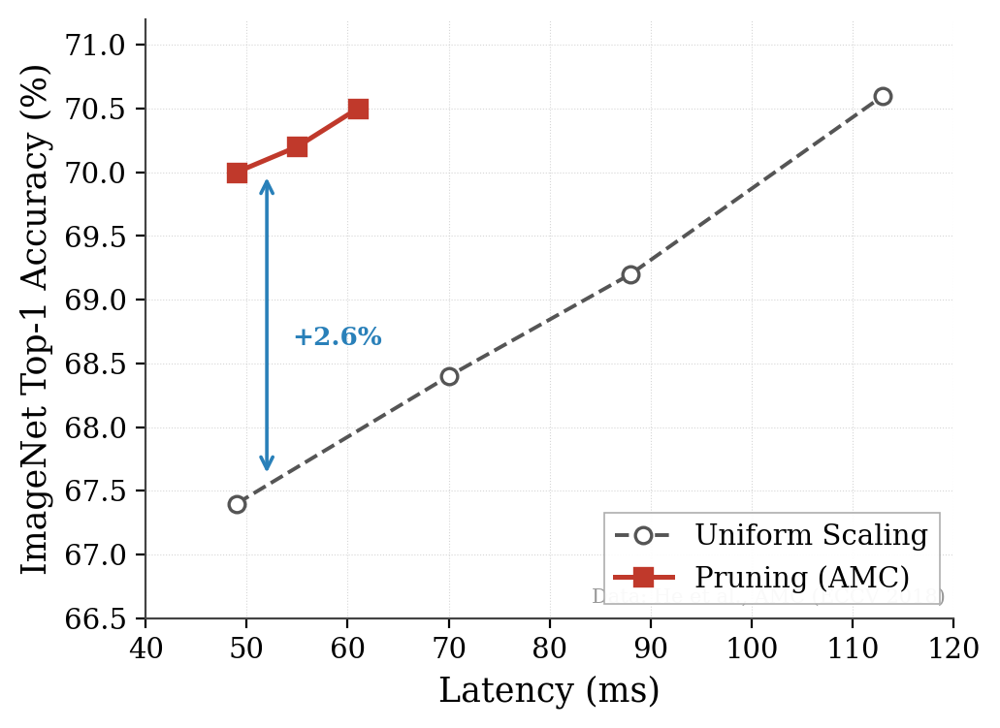

# Lec03 · Pruning & Sparsity (Part I)

> MIT 6.5940 EfficientML.ai · 基于 Song Han 课程讲义整理  
> 前置知识：Lec02（FLOPs、参数量、Memory Bandwidth）  
> 关联：Lec04（Lottery Ticket、自动剪枝率搜索）· Lec05-06（量化）· Lec09（蒸馏）

---

## 0 | 模型越来越大，硬件追不上

从 2017 年 Transformer（~65M 参数）到 GPT-3（175B）再到 MT-NLG（530B），模型参数量膨胀了近 **四个数量级**。同期 GPU 显存从 16 GB（TPUv2）涨到 80 GB（A100），增长不到一个数量级。


模型压缩技术就是为了弥合这个剪刀差。其中剪枝（pruning）是最直觉的思路——训练时需要足够多的参数让优化器找到好解，推理时砍掉冗余也能保住精度。

这件事在生物学上有对应：人脑突触密度在 2–4 岁达到峰值（~15 000 个/神经元），此后大规模修剪，到成年期只剩约一半，认知能力反而更强（Huttenlocher, 1979; Drachman, 2004）。

### 现代剪枝的里程碑

Song Han 2015 年在 NeurIPS 发表的 *Learning Both Weights and Connections* 奠定了现代剪枝的基本范式。核心结果：


| 网络 | 原始参数量 | 剪枝后 | 压缩倍数 | MACs 缩减 |
|:---|---:|---:|---:|---:|
| AlexNet | 61 M | 6.7 M | **9×** | 3× |
| VGG-16 | 138 M | 10.3 M | **13×** | 5× |
| GoogLeNet | 7 M | 2.0 M | 3.5× | 5× |
| ResNet-50 | 26 M | 7.47 M | 3.4× | 6.3× |

> 数据来源：[Han et al., NeurIPS 2015] 及 [Han, Stanford thesis]。注意压缩倍数是参数量比，不直接等于推理加速比。

此后剪枝领域论文数量爆发，从每年不足百篇飙升到 2022 年的 3 000+。

### 工业实践：MLPerf BERT 案例

MLPerf Inference v3.1 Open Division 中，NVIDIA 用 **剪枝 → 蒸馏 → 量化** 三步走把 BERT-Large 从 607 MB 压到 177 MB：

```
Closed Division:  Ckpt → QAT → TRT            1×   99%   607 MB
+ Pruning:        Ckpt → Prune → QAT → TRT    2.6× 99%   177 MB
+ Distillation:   Ckpt → Prune → Distill → QAT → TRT  4.5× 99%
```

吞吐 4.5× 提升，精度仍维持在 99% 以上。这说明单一技术不够用，组合拳才是工业界的常规操作。

---

## 1 | 为什么剪枝能 work？

三个经验观察叠在一起，构成了剪枝的理论基础：

**权重天然接近零。** 训练收敛后权重分布通常是以 0 为中心的钟形曲线（下图左），大量权重绝对值极小，对输出贡献微乎其微。剪掉它们（下图右）对模型输出的扰动远比直觉上小。


**激活天然稀疏。** ReLU 把所有负值置零。实测 AlexNet 在 ImageNet 上激活稀疏度可达 ~60%——超过一半的神经元在任意给定输入下是"沉默"的。

**特征冗余。** 不同 filter 经常学到高度相似的特征模式，存在大量可以合并或删除的冗余 channel。

### 1.1 别把剪枝和量化搞混

这两个经常一起出场，但做的事完全不同：

|  | 剪枝 | 量化 |
|:---|:---|:---|
| 做了什么 | 删权重/结构 | 降数值精度 |
| 网络结构 | 变了（变稀疏或变小） | 不变 |
| 参数数量 | 减少 | 不变（每个参数的位宽变小） |
| 核心矛盾 | 删多少 vs 精度 | 位宽多低 vs 精度 |

实际部署中两者经常组合。前面 MLPerf 的 BERT 案例就是先剪枝、再蒸馏、最后量化。

### 1.2 形式化

给定原始权重 $W$，剪枝可以表述为带 ℓ₀ 约束的优化问题：

```math
\arg\min_{W_P} \mathcal{L}(x;\, W_P) \quad \text{s.t.} \quad \|W_P\|_0 \leq N
```

其中 $\lVert W_P \rVert_0$ 是非零权重数，$N$ 是参数预算。这是一个 NP-hard 问题（ℓ₀ 约束不可微、不凸），实际中只能用启发式方法逼近。

---

## 2 | 剪枝粒度——以什么 pattern 删权重

粒度决定了"以什么形状删权重"。本质上是**精度**和**硬件加速效率**之间的 trade-off：粒度越细，搜索空间越大、保精度越容易；粒度越粗，稀疏 pattern 越规则、GPU 越好利用。


对于卷积层权重 `[C_out, C_in, k_H, k_W]`，常见的粒度从细到粗依次为：

| 粒度 | 删除单元 | 规则性 | 硬件友好度 |
|:---|:---|:---|:---|
| **Fine-grained（非结构化）** | 单个权重 | 完全不规则 | 需要专用硬件 |
| **Pattern-based（N:M 稀疏）** | 每 M 个权重中 N 个为零 | 半规则 | Ampere+ Tensor Core 原生支持 |
| **Vector-level** | 一行/一列 | 较规则 | — |
| **Kernel-level** | 一个 k×k kernel | 较规则 | — |
| **Channel-level（结构化）** | 整个 output channel | 完全规则 | 普通 BLAS 直接加速 |


### 2.1 非结构化剪枝（Unstructured / Fine-grained）

最细粒度，逐个权重独立决定去留。对 $W \in \mathbb{R}^{m \times n}$，生成同形状的二值掩码：

```math
\hat{W} = W \odot M, \quad M \in \{0,1\}^{m \times n}
```

**优点**：搜索空间最大、自由度最高。AlexNet 可以剪掉 89% 参数，精度几乎不掉。

**缺点**：产生不规则稀疏矩阵。GPU 上的 cuBLAS 是为稠密 GEMM 优化的，面对随机稀疏 pattern 根本无法高效调度——你删了 90% 权重，实际推理可能只快 10%，甚至因为 cache miss 增多反而更慢。

> **工程现实**：非结构化剪枝在通用 GPU 上几乎拿不到实际加速，需要专用稀疏硬件支持（如 EIE 加速器、Cerebras WSE 的 sparse mode）。如果你的目标平台是通用 GPU，慎选此方案。

### 2.2 N:M 结构化稀疏（Pattern-based，典型：2:4 Sparsity）

NVIDIA Ampere 架构（A100）引入的折中方案。规则很简单：**每连续 4 个权重中恰好 2 个为零**，固定 50% 稀疏度。


A100 的 Sparse Tensor Core 原生支持此 pattern，只保留非零值 + 2-bit 索引，存储压缩约 62.5%，matmul 提速接近 2×。而且精度损失极小——下面是 NVIDIA 官方的测试数据：

| 网络 | 数据集 | 指标 | Dense FP16 | Sparse FP16 |
|:---|:---|:---|---:|---:|
| ResNet-50 | ImageNet | Top-1 | 76.1 | **76.2** |
| Xception | ImageNet | Top-1 | 79.2 | 79.2 |
| BERT-Large | SQuAD v1.1 | F1 | 91.9 | **91.9** |
| SSD-RN50 | COCO2017 | bbAP | 24.8 | 24.8 |

> 数据来源：[Accelerating Inference with Sparsity Using the NVIDIA Ampere Architecture and NVIDIA TensorRT](https://developer.nvidia.com/blog/accelerating-inference-with-sparsity-using-ampere-and-tensorrt/)

这是目前工业界最务实的"带稀疏"剪枝方案。H100 同样支持。TensorRT-LLM 的 `nvidia-modelopt` 已经集成了 SparseGPT，可以一键对 LLM 做 2:4 剪枝。

### 2.3 通道级剪枝（Channel Pruning / Structured）

最粗的实用粒度——直接删整个 output channel（等价于删一个 filter 及其所有权重）。

卷积层参数量为 $C_{out} \times C_{in} \times k_H \times k_W$ ，剪掉 $p$ 个 output channel 后参数量变为 $(C_{out} - p) \times C_{in} \times k_H \times k_W$ ，同时下一层的 input channel 也自动减少 $p$，产生级联缩减效果。

**核心优势**：剪完后就是一个更小的稠密网络，用标准 cuBLAS / 任何 BLAS 库直接加速，完全不需要稀疏算子支持。

**主要代价**：约束太强，同等压缩比下精度损失比非结构化明显更大。

He et al.（ECCV 2018）的 AMC 论文表明，**非均匀通道剪枝**（不同层根据敏感度分配不同剪枝率）效果显著优于所有层等比缩放。



### 2.4 工程选型建议

| 硬件平台 | 推荐方案 | 理由 |
|:---|:---|:---|
| NVIDIA Ampere / Hopper | 2:4 结构化稀疏 | Sparse Tensor Core 原生支持，接近 2× 加速 |
| 通用 GPU（无稀疏硬件） | 通道级剪枝 | 直出更小稠密网络，零额外依赖 |
| 自研 ASIC / FPGA | 非结构化剪枝 | 可定制 datapath 充分利用稀疏性 |
| 边缘设备 / MCU | 通道级剪枝 + 量化 | 计算库成熟度最高的组合 |

---

## 3 | 剪枝准则——删谁

确定了"以什么粒度删"，下一步是"哪些权重该被删"。


### 3.1 幅度剪枝（Magnitude-based）

最简单、最常用的方法：**绝对值越小的权重越不重要**。

逐权重时，重要性直接等于绝对值：Importance(wᵢ) = \|wᵢ\|。对结构化剪枝则使用范数聚合，常见的有 L1-norm 和 L2-norm：

```math
\text{L1:}\quad \|\mathbf{f}\|_1 = \sum_i |w_i| \qquad \text{L2:}\quad \|\mathbf{f}\|_2 = \sqrt{\sum_i w_i^2}
```

**示例**：对权重矩阵做 50% 非结构化剪枝——

```math
W = \begin{bmatrix} 3 & -2 \\ 1 & -5 \end{bmatrix}
\xrightarrow{\text{删绝对值最小的 2 个}}
\begin{bmatrix} 3 & 0 \\ 0 & -5 \end{bmatrix}
```

按 L1-norm 做行级结构化剪枝：第 0 行 L1 = \|3\| + \|-2\| = 5，第 1 行 L1 = \|1\| + \|-5\| = 6，删 L1 更小的第 0 行：

```math
W = \begin{bmatrix} 3 & -2 \\ 1 & -5 \end{bmatrix}
\xrightarrow{\text{删第 0 行}}
\begin{bmatrix} 0 & 0 \\ 1 & -5 \end{bmatrix}
```

**优点**：不需要数据、不需要梯度，训练完直接用，计算开销几乎为零。

**局限**：完全忽略了权重对 loss 的实际敏感度。一个权重的绝对值大，不代表它对模型输出真的重要；反之亦然。

### 3.2 一阶方法：SNIP（Connection Sensitivity）

核心想法：不看权重本身大小，而是看**删掉它之后 loss 变多少**。

引入掩码变量 $c_j \in \lbrace 0, 1 \rbrace$，用一阶 Taylor 展开近似 loss 变化，经链式法则推导出 saliency 分数：

```math
s_j = \left| \frac{\partial \mathcal{L}}{\partial c_j} \right| = \left| \frac{\partial \mathcal{L}}{\partial w_j} \cdot w_j \right|
```

物理含义：**重要性 ≈ 梯度 × 权重**。如果一个权重虽大但梯度接近零（loss 对它不敏感），saliency 也小。同时考虑了两个因素，比纯 magnitude 更合理。

计算成本很低——只需一次前向 + 一次反向就能算完所有权重的 saliency。

> SNIP 的优势在于可以做到**训练前剪枝**（pruning at initialization），因为它只需要一个 mini-batch 数据跑一次前向反向，不要求模型已收敛。

### 3.3 二阶方法：OBD 与 OBS

一阶近似不够精确，自然会想到引入 Hessian 矩阵做二阶展开。

**OBD（Optimal Brain Damage）**（LeCun et al., NeurIPS 1989）对 loss 做二阶 Taylor 展开：

```math
\delta\mathcal{L} = \sum_i g_i \,\delta w_i + \frac{1}{2}\sum_i h_{ii}\, \delta w_i^2 + \frac{1}{2}\sum_{i \neq j} h_{ij}\,\delta w_i\,\delta w_j + O(\|\delta W\|^3)
```

然后做三个简化假设：

1. **已收敛**：一阶项 $g_i \approx 0$
2. **忽略高阶**：三阶及以上省略
3. **Hessian 对角化**：交叉项 $h_{ij} \approx 0$ （ $i \neq j$ ）

简化后，删除权重 $w_i$ 造成的 loss 变化为：

```math
\text{Importance}(w_i) = \frac{1}{2}\, h_{ii}\, w_i^2
```

其中 $h_{ii} = \partial^2 \mathcal{L} / \partial w_i^2$ 是 Hessian 对角元素。

**OBS（Optimal Brain Surgeon）**（Hassibi & Stork, NeurIPS 1993）放松了对角假设，使用完整 Hessian 逆，而且能给出删除某权重后剩余权重的最优补偿调整量（weight update）。理论上更精确，但计算 Hessian 逆的复杂度是 O(n²) ~ O(n³)，对大模型完全不现实。

> **延伸阅读**：后续 Lec04 会讲到的 **SparseGPT**（Frantar & Alistarh, ICML 2023）本质上是 OBS 思路在 LLM 上的高效落地——通过逐列求解 + 分块 Cholesky 分解，把 175B 参数模型的 one-shot 剪枝变得可行，不需要任何微调。

### 3.4 APoZ（基于激活的准则）

视角从权重转向激活。对一批数据做前向传播，统计每个 channel 激活为零的比例（Average Percentage of Zeros）：

```math
\text{APoZ}(c) = \frac{1}{N \cdot H \cdot W} \sum_{n,h,w} \mathbb{1}\big[\text{ReLU}(z_{n,c,h,w}) = 0\big]
```

APoZ 越高 → 这个 channel 大部分时间都在"睡觉" → 可以安全删除。

需要数据（至少一个 batch 做前向），特别适合 channel pruning 场景。

> **注意**：APoZ 仅适用于 ReLU 系激活函数。如果网络用 GELU、SiLU 等不产生精确零值的激活函数，需要改用其他指标（比如激活值的 L1-norm）。

### 3.5 重建误差准则（Regression-based）

不从全局 loss 出发，而是**逐层最小化特征重建误差**。设第 l 层输出 Z = XWᵀ，引入通道选择向量 β：

```math
\arg\min_{W,\,\beta} \left\| Z - \sum_{c=0}^{C_{in}-1} \beta_c\, X_c\, W_c^T \right\|_F^2 \quad \text{s.t.} \quad \|\beta\|_0 \leq N_c
```

其中 $\beta_c = 0$ 表示第 c 个 input channel 被剪掉。通过交替优化（固定 W 解 β，固定 β 解 W）找到对下游特征影响最小的剪枝方案。

这种方法的好处是逐层独立优化，不需要端到端反向传播，计算量可控。

### 3.6 各准则对比

| 准则 | 核心信号 | 需要数据？ | 需要梯度？ | 计算开销 | 适用场景 |
|:---|:---|:---:|:---:|:---|:---|
| Magnitude | ‖w‖ₚ | 否 | 否 | 极低 | 快速基线、资源受限 |
| SNIP | ‖g · w‖ | 1 batch | 1 次反向 | 低 | 训练前剪枝 |
| OBD | ½ · hᵢᵢ · wᵢ² | 是 | 二阶 | 高 | 小模型精剪 |
| APoZ | 零激活比例 | 是 | 否 | 中 | Channel pruning（ReLU 网络） |
| Reconstruction | min‖Z - Ẑ‖²_F | 是 | 否 | 中 | 逐层精细剪枝 |

---

## 4 | 剪枝流程

### 4.1 标准三步走

```
┌─────────────────┐     ┌──────────────────┐     ┌─────────────────┐
│  1. Train        │     │  2. Prune         │     │  3. Fine-tune    │
│  训练稠密网络     │────▶│  按准则删权重      │────▶│  恢复精度         │
│  (or 加载预训练)  │     │  (生成 mask)       │     │  (lr ÷ 10~100)   │
└─────────────────┘     └──────────────────┘     └─────────────────┘
                                │                         │
                                └─────────────────────────┘
                                    可迭代多轮 (iterative)
```

微调是必不可少的步骤——剪枝打破了层间协作关系，剩余权重需要重新适应。学习率通常设为原始训练的 1/10 ~ 1/100，微调 10–20% 的原始 epoch 数即可。

### 4.2 一次剪 vs 迭代剪


三种策略的差异非常清楚：

**One-shot（不微调）**：稀疏度一高精度就断崖式下跌。只在稀疏度很低（<50%）或对精度要求不高时可用。

**One-shot + Fine-tune**：精度恢复明显，但在高稀疏度（>80%）下仍有不小损失。

**Iterative Prune + Fine-tune**：每次只剪一点、每次都微调。模型有时间通过梯度下降重新分配权重重要性，使后续轮次的剪枝决策更准确。精度保持最好，代价是总训练时间 ×N。

> **大模型的现实**：对 70B+ 的 LLM，迭代剪枝的计算开销很难接受。实际中更多用 SparseGPT 或 Wanda 这类 one-shot 方案——靠 Hessian 信息或激活感知来补偿精度，彻底避免微调。

### 4.3 全局 vs 逐层


**逐层（Local）**：每层固定同一个剪枝率（比如全部 50%）。简单直接，但忽略了不同层的冗余程度差异。通常第一层、最后一层和 skip connection 涉及的层更敏感，中间层冗余更多。

**全局（Global）**：所有层的权重统一排序，设一个全局阈值：

```math
\tau = \text{quantile}_{1-s}\big(\{|w| : w \in W\}\big)
```

效果是敏感层自动少剪、冗余层自动多剪，精度通常明显好于 local 策略。

---

## 5 | 硬件视角：数据搬运比计算贵

很多做算法的人会忽视的一个硬件事实：


Horowitz（ISSCC 2014）给出的经典数据，45 nm 工艺下各操作的能耗对比：

| 操作 | 能耗 (pJ) |
|:---|---:|
| 32-bit INT ADD | 0.1 |
| 32-bit FP ADD | 0.9 |
| 32-bit INT MULT | 3.1 |
| 32-bit FP MULT | 3.7 |
| 32-bit SRAM 读取 | 5 |
| **32-bit DRAM 读取** | **640** |

一次 DRAM 读取的能耗是一次 INT 加法的 **6 400 倍**、是一次 FP 乘法的 **170+ 倍**。

这意味着：**模型压缩的核心收益不在于省 FLOPs，而在于缩小模型体积从而减少内存搬运**。剪枝把模型压小 → DRAM 读取次数减少 → 这才是在边缘设备上真正省电、提速的关键。

---

## 6 | 硬件与推理框架适配

### NVIDIA 生态

A100/H100 的 2:4 稀疏通过 `cusparseLt` 库实现。TensorRT-LLM 集成了 `nvidia-modelopt`（原 ModelOpt），支持 SparseGPT 一键 2:4 剪枝 + 量化。

### vLLM

可以加载剪枝后的 HuggingFace 模型。当前非结构化稀疏仍用稠密计算（没有实际加速）；结构化剪枝后若修改了 `hidden_dim` 并保存为新 config，vLLM 能直接受益于更小的矩阵尺寸。

### FPGA / ASIC

AMD Xilinx 的 Vitis AI 工具链支持剪枝+量化的联合优化；EIE（Han et al., ISCA 2016）是最早为稀疏 DNN 设计的定制加速器。

---

## 7 | 代码示例

### PyTorch 内置剪枝

```python
import torch.nn as nn
import torch.nn.utils.prune as prune

model = nn.Sequential(
    nn.Conv2d(1, 32, 3, padding=1), nn.ReLU(), nn.MaxPool2d(2),
    nn.Conv2d(32, 64, 3, padding=1), nn.ReLU(), nn.MaxPool2d(2),
    nn.Flatten(),
    nn.Linear(64*7*7, 128), nn.ReLU(),
    nn.Linear(128, 10)
)

# --- 非结构化 L1 剪枝：每层删 50% 权重 ---
for name, m in model.named_modules():
    if isinstance(m, (nn.Conv2d, nn.Linear)):
        prune.l1_unstructured(m, 'weight', amount=0.5)

# --- 结构化 filter 剪枝：删 30% 的 output filter ---
for name, m in model.named_modules():
    if isinstance(m, nn.Conv2d):
        prune.ln_structured(m, 'weight', amount=0.3, n=2, dim=0)

# --- 全局剪枝：所有层统一阈值，删 70% ---
params = [(m, 'weight') for m in model.modules()
          if isinstance(m, (nn.Conv2d, nn.Linear))]
prune.global_unstructured(
    params, pruning_method=prune.L1Unstructured, amount=0.7
)
```

### 手写 Magnitude Pruning（核心 3 行）

```python
def magnitude_prune(weight, sparsity):
    threshold = torch.quantile(weight.abs().float(), sparsity)
    mask = (weight.abs() >= threshold).float()
    return weight * mask
```

### SNIP Saliency 计算

```python
def snip_saliency(model, dataloader, criterion):
    images, labels = next(iter(dataloader))
    model.zero_grad()
    loss = criterion(model(images), labels)
    loss.backward()
    return {
        name: (p.grad * p.data).abs()
        for name, p in model.named_parameters()
        if p.grad is not None and 'weight' in name
    }
```

---

## 8 | 常见面试问题

**Q: 非结构化 vs 结构化剪枝的核心区别是什么？**

非结构化逐个权重独立决定去留，产生不规则稀疏矩阵——精度好但需要专用硬件才能拿到实际加速。结构化删整个 channel/filter，剪完后仍是稠密矩阵，普通 GPU 直接受益，代价是同等压缩比下精度损失更大。

**Q: Magnitude pruning 有什么问题？**

只看绝对值大小，忽略了权重对 loss 的实际敏感度。一个绝对值小的权重可能恰好位于决策边界的关键位置。SNIP 的 saliency（梯度 × 权重的绝对值）同时考虑梯度和权重，更合理；OBD 更进一步引入了二阶 Hessian 信息。

**Q: 迭代剪枝为什么好？代价是什么？**

每次只剪一小部分后微调，权重重新分布，后续轮次的剪枝决策更准确（因为此时的 magnitude/saliency 反映的是当前网络状态，而非原始过参数化网络的状态）。代价是总训练时间翻 N 倍。

**Q: 实际部署 LLM 怎么做剪枝？**

首选 SparseGPT 或 Wanda（激活感知的 one-shot 方案），配合 2:4 稀疏在 Ampere+ GPU 上拿硬件加速。70B+ 模型用 one-shot 避免微调的巨大开销。如果目标是通道级剪枝，可以用 LLM-Pruner 等工具。

---

## 参考文献

- LeCun et al., *Optimal Brain Damage*, NeurIPS 1989
- Hassibi & Stork, *Second Order Derivatives for Network Pruning: Optimal Brain Surgeon*, NeurIPS 1993
- Han et al., *Learning Both Weights and Connections for Efficient Neural Networks*, NeurIPS 2015
- Wen et al., *Learning Structured Sparsity in Deep Neural Networks*, NeurIPS 2016
- Liu et al., *Learning Efficient Convolutional Networks through Network Slimming*, ICCV 2017
- Mao et al., *Exploring the Granularity of Sparsity in CNNs*, CVPR-W 2017
- Hu et al., *Network Trimming: A Data-Driven Neuron Pruning Approach*, arXiv 2017
- He et al., *Channel Pruning for Accelerating Very Deep Neural Networks*, ICCV 2017
- Lee et al., *SNIP: Single-shot Network Pruning based on Connection Sensitivity*, ICLR 2019
- He et al., *AMC: AutoML for Model Compression and Acceleration on Mobile Devices*, ECCV 2018
- Mishra et al., *Accelerating Sparse Deep Neural Networks*, arXiv 2021
- Frantar & Alistarh, *SparseGPT: Massive Language Models Can Be Accurately Pruned in One-Shot*, ICML 2023
- Sun et al., *A Simple and Effective Pruning Approach for Large Language Models (Wanda)*, ICML 2024
- Horowitz, *Computing's Energy Problem (and What We Can Do About It)*, ISSCC 2014
