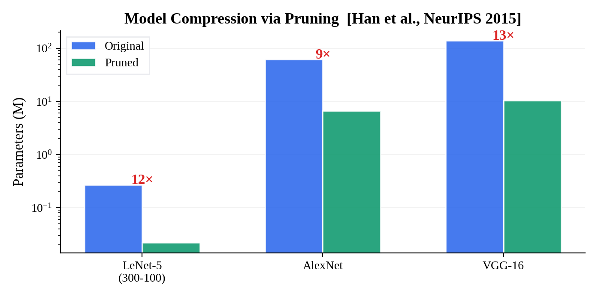
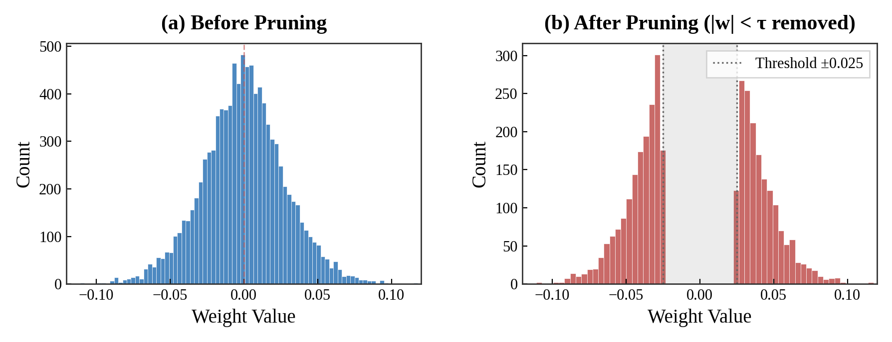
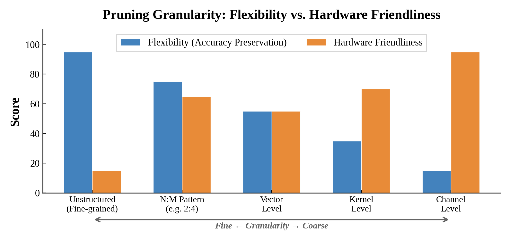
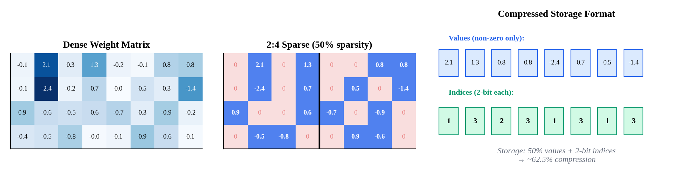
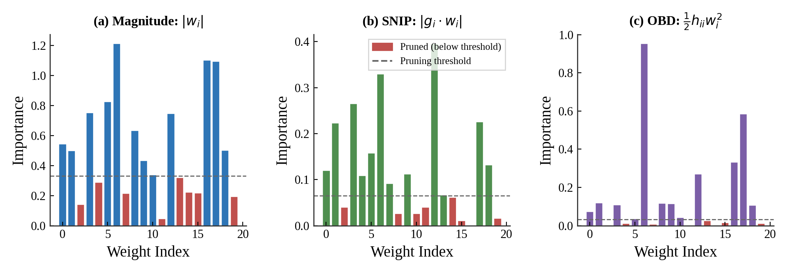
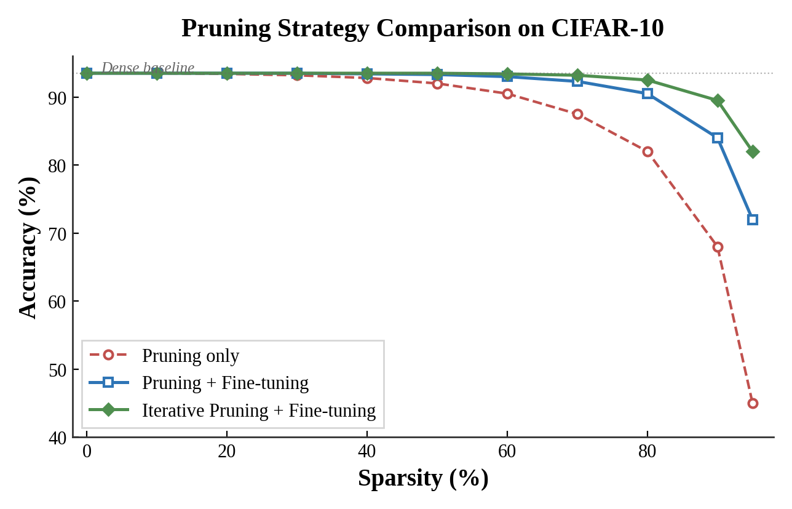
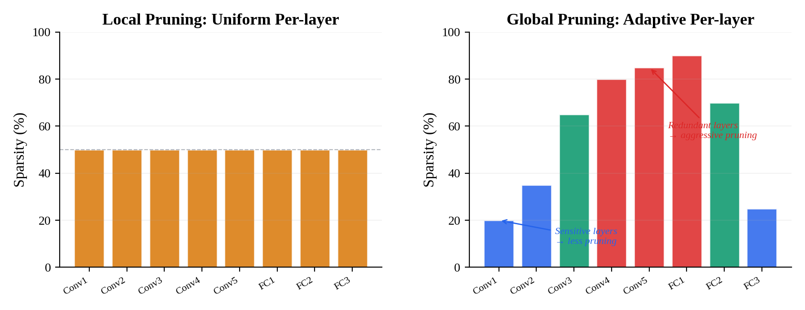
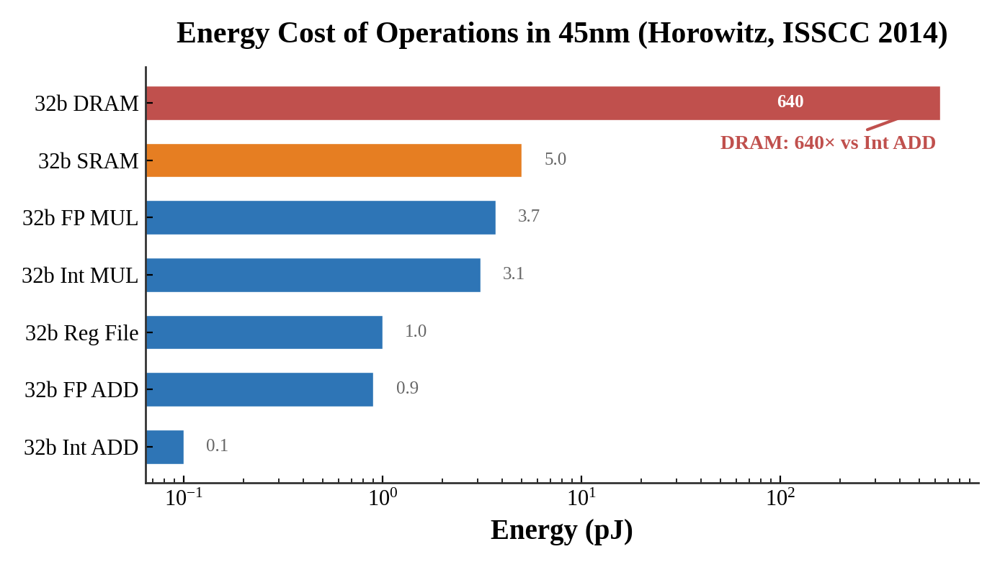

# Lecture 03 · 神经网络剪枝基础 — Pruning & Sparsity (Part I)

> **课程**: MIT 6.5940 TinyML and Efficient Deep Learning Computing  
> **笔记整理**: 基于课程 slides 和讲义  
> **核心关键词**: Pruning, Sparsity, Magnitude Pruning, SNIP, OBD, Structured/Unstructured, 2:4 Sparsity

---

## 写在前面：为什么要聊剪枝？

过去几年，模型的参数量以近乎指数级的速度膨胀——从 2017 年 Transformer 的 50M 参数，到 GPT-3 的 175B，再到 MT-NLG 的 530B。与此同时，单块 GPU 的显存增长远远跟不上这个节奏。这中间的鸿沟，就是模型压缩技术存在的根本意义。

而剪枝（pruning），是最直觉、最经典的压缩手段之一。一句话概括：**训练时我们需要足够多的参数让优化找到好的解，但推理时不需要那么多参数就能保持住精度**。这跟人脑的发育惊人地相似——婴幼儿大脑的突触数量在 2-4 岁时达到峰值（约 15000 个/神经元），此后经历大规模"突触修剪"，成年后只剩约 7000 个/神经元，但认知能力反而更强。

Song Han 在 NeurIPS 2015 的工作 *"Learning Both Weights and Connections"* 是现代深度学习剪枝的里程碑——AlexNet 的参数从 61M 压缩到 6.7M（9×），VGG-16 从 138M 压缩到 10.3M（12×），精度几乎无损。此后关于剪枝的研究论文数量从每年不到 100 篇，飙升到 2022 年的超过 3000 篇。



MLPerf 的 Open Division 也印证了这一点：在 BERT Large 上，通过 **剪枝 + 蒸馏 + 量化** 的组合拳，模型尺寸从 607MB 降到 177MB，推理吞吐提升 4.5×，精度仍保持在 99% 以上。

---

## 1. 剪枝的核心直觉

### 1.1 为什么剪枝能 work？

有三个经验性观察支撑着剪枝的有效性：

**观察一：权重分布天然接近零。** 训练收敛后的权重分布通常是以 0 为中心的钟形分布（下图），大量权重的绝对值很小，对网络输出的贡献微乎其微。把这些"几乎是零"的权重直接抹掉，输出几乎不变。



**观察二：激活天然稀疏。** ReLU 激活函数会将所有负值置零。实测 AlexNet 在 ImageNet 上的激活稀疏度高达 62%——超过一半的神经元在任意给定输入下都是"沉默"的。

**观察三：特征冗余。** 不同 filter 经常学到高度相似的特征模式，存在大量功能重叠。

### 1.2 剪枝 vs 量化

很多人容易混淆这两者。区别其实很简单：

| 维度 | 剪枝 (Pruning) | 量化 (Quantization) |
|------|----------------|---------------------|
| **做了什么** | 删除权重/结构 | 降低数值精度 |
| **网络结构** | 变了（变稀疏或变小） | 不变 |
| **参数数量** | 减少 | 不变（但每个参数的存储位宽变小） |
| **核心矛盾** | 删多少 vs 精度损失 | 位宽多低 vs 精度损失 |

两者可以且经常组合使用。MLPerf 的 BERT 提交就是先剪枝、再蒸馏、最后量化。

### 1.3 形式化定义

给定原始网络权重 $W$，剪枝本质上是在解一个带约束的优化问题：

$$\arg\min_{W_P} \mathcal{L}(x; W_P) \quad \text{s.t.} \quad \|W_P\|_0 \leq N$$

其中 $\|W_P\|_0$ 是非零权重的数量，$N$ 是我们期望保留的参数预算。这是一个 NP-hard 的组合优化问题，实际中只能用各种启发式方法近似求解。

---

## 2. 剪枝粒度：从哪个维度下刀？

剪枝粒度决定了"我们以什么样的 pattern 去删除权重"。这是一个在**灵活性**（越细粒度，可选择的自由度越高，精度保持越好）和**硬件友好性**（越粗粒度，越容易在 GPU 上加速）之间的 trade-off。



### 2.1 非结构化剪枝（Unstructured / Fine-grained）

最细的粒度，逐个权重独立决定保留或删除。对于权重矩阵 $W \in \mathbb{R}^{m \times n}$，生成一个同形状的二值掩码：

$$\hat{W} = W \odot M, \quad M \in \{0, 1\}^{m \times n}$$

**好处**：自由度最高，同等稀疏度下精度损失最小。在 Han et al. 2015 的实验中，AlexNet 可以剪掉约 89% 的参数而精度几乎不变。

**坏处**：产生不规则稀疏矩阵。GPU 上的 cuBLAS 是为稠密矩阵乘法优化的，面对随机的稀疏 pattern 无法高效利用——你删了 90% 的权重，但可能只获得 10% 的实际加速，甚至更慢（因为 cache miss）。需要专门的稀疏硬件或库才能真正受益。

### 2.2 N:M 结构化稀疏（Pattern-based）

NVIDIA 在 Ampere 架构（A100）中引入的 **2:4 稀疏** 是一个非常实用的折中方案。规则很简单：每连续 4 个权重中，必须恰好有 2 个为零。这意味着固定 50% 的稀疏度。



A100 的 Sparse Tensor Core 可以直接处理这种 pattern，实现**近 2× 的 matmul 加速**。而且在各种任务上的精度损失极小（ResNet-50: 76.1 → 76.2, BERT-Large SQuAD F1: 91.9 → 91.9）。

这是目前工业界最务实的非结构化剪枝方案。

### 2.3 通道级剪枝（Channel Pruning）

最粗的实用粒度。直接删除整个输出 channel（等价于删除一个 filter 的所有权重）。

一个卷积层的参数量为 $C_{out} \times C_{in} \times k_H \times k_W$。剪掉 $p$ 个输出 channel 后：

$$\text{Params}' = (C_{out} - p) \times C_{in} \times k_H \times k_W$$

同时，下一层的输入 channel 也自动减少 $p$，产生**级联减参效果**。

**核心优势**：剪枝后的网络就是一个完整的、更小的稠密网络，直接用普通 cuBLAS 就能加速，无需任何稀疏库支持。

**主要劣势**：约束太强，同等参数压缩比下精度损失通常大于非结构化剪枝。

He et al. (ECCV 2018) 的 AMC 工作表明，**非均匀的通道剪枝**（不同层分配不同的剪枝率）显著优于简单地将所有层的 channel 数同比缩小。

### 2.4 怎么选？

实际工程中的选择逻辑：

- **通用 GPU（无稀疏支持）** → 通道级剪枝，直出更小网络
- **NVIDIA Ampere / Hopper GPU** → 2:4 结构化稀疏，几乎免费拿 2× 加速
- **自研 ASIC / FPGA** → 非结构化剪枝，充分利用稀疏加速硬件
- **国产 GPU（如沐曦 MACA）** → 目前稀疏支持不成熟，优先通道级剪枝

---

## 3. 剪枝准则：删谁？

确定了"以什么粒度删"之后，下一个核心问题是"删谁"——也就是如何定义权重的重要性。



### 3.1 幅度剪枝（Magnitude-based）

最简单、最广泛使用的准则：**绝对值越小越不重要**。

对于逐权重剪枝：$\text{Importance}(w_i) = |w_i|$

对于结构化剪枝（如按 filter 剪），可以用 L1 或 L2 范数：

$$\text{L1-norm}: \|\mathbf{f}\|_1 = \sum_{i} |w_i|, \quad \text{L2-norm}: \|\mathbf{f}\|_2 = \sqrt{\sum_{i} w_i^2}$$

举个简单例子。假设有权重矩阵 $W = \begin{bmatrix} 3 & -2 \\ 1 & -5 \end{bmatrix}$，做 element-wise L1 magnitude pruning，保留 50%：重要性分别为 3, 2, 1, 5，删掉最小的两个（2 和 1），得到 $\begin{bmatrix} 3 & 0 \\ 0 & -5 \end{bmatrix}$。

**优点**：实现极其简单，不需要数据，训练完直接用。

**缺点**：完全忽略了权重对 loss 的实际影响。一个权重绝对值大不代表它对模型输出真的重要——如果 loss 对它的梯度接近零，删掉它几乎不影响精度。

### 3.2 基于显著性的剪枝（Saliency-based）

这一族方法的核心思想是：不看权重本身的大小，而看**删掉它之后 loss 变化多少**。

**SNIP（Single-shot Network Pruning）** 用一阶 Taylor 展开来近似：

引入掩码 $c_j \in \{0, 1\}$，令 $\delta c_j = c_j - 1$（从保留到删除），则：

$$\Delta \mathcal{L} \approx \frac{\partial \mathcal{L}(c \odot w)}{\partial c_j}\bigg|_{c=\mathbf{1}} \cdot \delta c_j$$

由链式法则，$\frac{\partial \mathcal{L}(c \odot w)}{\partial c_j}\big|_{c=\mathbf{1}} = \frac{\partial \mathcal{L}}{\partial w_j} \cdot w_j$，因此：

$$s_j = \left| \frac{\partial \mathcal{L}}{\partial w_j} \cdot w_j \right|$$

这个公式的物理意义非常清楚：**重要性 = 梯度大小 × 权重大小**。它同时考虑了两个因素——一个权重大但梯度小（loss 对它不敏感），saliency 也会小。

实现上，只需一次前向 + 反向传播就能算完所有权重的 saliency，计算开销跟算一次梯度一样。

### 3.3 二阶方法：OBD 与 OBS

如果一阶近似不够精确，可以进一步引入 Hessian（二阶导数）信息。

**Optimal Brain Damage (OBD)**，LeCun et al. 1989：

$$\Delta \mathcal{L} \approx \sum_i g_i \delta w_i + \frac{1}{2}\sum_i h_{ii}\delta w_i^2 + \frac{1}{2}\sum_{i \neq j} h_{ij}\delta w_i \delta w_j + O(\|\delta W\|^3)$$

OBD 做了三个假设来简化：(1) 训练已收敛（一阶项 ≈ 0），(2) 高阶项忽略，(3) Hessian 是对角矩阵（交叉项忽略）。最终：

$$\text{Importance}(w_i) = \frac{1}{2} h_{ii} w_i^2$$

**Optimal Brain Surgeon (OBS)** 放松了对角假设，使用完整 Hessian 逆，同时给出删除某个权重后其余权重应该如何补偿调整。理论上更精确，但计算 Hessian 逆的开销 $O(n^2)$ 到 $O(n^3)$ 对现代大模型来说不太现实。

### 3.4 基于激活的准则：APoZ

从权重视角转向激活视角。对一批数据做前向传播，统计每个 channel 的激活中有多少比例为零：

$$\text{APoZ}(c) = \frac{1}{N \cdot H \cdot W} \sum_{n,h,w} \mathbb{1}[\text{ReLU}(z_{n,c,h,w}) = 0]$$

APoZ 越高 → 这个 channel 大部分时间都在"睡觉" → 可以安全删除。

这个准则需要数据（至少一个 batch），但非常直觉，特别适合做 channel pruning。

### 3.5 基于重建误差的准则

不是从全局 loss 出发，而是**逐层最小化特征重建误差**。设第 $l$ 层输出为 $Z = XW^T$，在通道维度引入选择向量 $\beta$：

$$\arg\min_{W, \beta} \left\| Z - \sum_{c=0}^{C_{in}-1} \beta_c X_c W_c^T \right\|_F^2, \quad \text{s.t.} \quad \|\beta\|_0 \leq N_c$$

$\beta_c = 0$ 表示第 $c$ 个输入通道被剪掉。通过交替优化（固定 $W$ 解 $\beta$，固定 $\beta$ 解 $W$），可以找到对下游特征影响最小的剪枝方案。

### 3.6 准则对比小结

| 准则 | 核心公式 | 需要数据？ | 需要梯度？ | 计算开销 | 精度表现 |
|------|---------|-----------|-----------|---------|---------|
| Magnitude | $\|w\|_p$ | 否 | 否 | 极低 | 基线 |
| SNIP | $\|g \cdot w\|$ | 是（1 batch） | 是（1次） | 低 | 优于 magnitude |
| OBD | $\frac{1}{2}h_{ii}w_i^2$ | 是 | 是（二阶） | 高 | 更优 |
| APoZ | 零激活占比 | 是 | 否 | 中等 | 适合 channel pruning |
| Reconstruction | $\min\|Z - \hat{Z}\|_F^2$ | 是 | 否 | 中等 | 较优 |

---

## 4. 剪枝流程与策略

### 4.1 基本流程

标准的剪枝流程是三步走：

1. **预训练**：正常训练一个大模型至收敛
2. **剪枝**：按某种准则删除权重
3. **微调**：用较小学习率继续训练，恢复精度

微调是必不可少的——剪枝打破了网络层间的协作关系，需要让剩余权重重新适应新的网络结构。学习率通常设为原始训练的 1/10 到 1/100，微调 10-20% 的原始 epoch 数即可。

### 4.2 一次剪 vs 分多次剪



上图清楚地展示了三种策略的差异：

**One-shot pruning**（只剪一次，不微调）：稀疏度一高，精度断崖式下跌。

**Pruning + Fine-tuning**（剪一次 + 微调）：精度恢复明显，但在高稀疏度（>80%）下仍有不小损失。

**Iterative Pruning + Fine-tuning**（每次剪一点，每次都微调）：精度保持最好。每一轮中，模型有时间重新分配权重的重要性，后续轮次的剪枝决策更准确。代价是训练总开销正比于迭代次数。

### 4.3 全局剪枝 vs 逐层剪枝



**逐层剪枝（Local）**：每层独立设一个固定剪枝率，比如每层都剪 50%。简单粗暴，但忽略了不同层对精度的敏感度差异——第一层和最后一层通常更敏感，中间层有更多冗余。

**全局剪枝（Global）**：所有层的权重统一排序，设一个全局阈值 $\tau$：

$$\tau = \text{quantile}_{1-s}(\{|w| : w \in W\})$$

结果是：敏感层自动少剪，冗余层自动多剪，精度通常显著更好。

---

## 5. 硬件与推理框架映射

理论再漂亮，最终得跑在真实硬件上。

### 5.1 NVIDIA 生态

**A100 / H100 的 2:4 稀疏**：原生 Sparse Tensor Core 支持，通过 `cusparseLt` 库实现近 2× matmul 加速。TensorRT-LLM 的 `ModelOpt` 工具链（`nvidia-modelopt`）已经集成了 SparseGPT，可以一键对 LLM 做 2:4 剪枝 + 量化。

### 5.2 vLLM

vLLM 可以加载剪枝后的 HuggingFace 模型。对于非结构化稀疏，vLLM 目前仍用稠密计算（稀疏没有实际加速）。结构化剪枝后如果把 `hidden_dim` 改小保存为新 config，则 vLLM 能直接享受加速。

### 5.3 国产硬件

以沐曦 MACA 为例：稀疏加速库尚不成熟，**结构化剪枝是最务实的选择**。Channel pruning 后模型变小，直接用标准矩阵乘法即可。国产硬件上通常优先做量化（工具链更成熟），剪枝更多作为辅助手段。

---

## 6. 关键数据：Memory Access 的能耗真相

最后聊一个被很多算法研究者忽视的硬件事实——**数据搬运的能耗远远大于计算本身**。



Horowitz (ISSCC 2014) 的经典数据表明：在 45nm 工艺下，一次 32-bit DRAM 读取消耗 640pJ，是一次 32-bit 整数加法（0.1pJ）的 **6400 倍**。这意味着，减少模型大小带来的收益不仅是计算量的减少，更重要的是**内存带宽和能耗的节省**。剪枝压缩了模型体积，直接减少了 DRAM 访问次数，这才是它在边缘设备上的真正价值。

---

## 7. 面试考点速查

**Q: 非结构化 vs 结构化剪枝的本质区别？**  
非结构化逐个删权重，产生不规则稀疏矩阵，精度好但需专用硬件加速；结构化删整个 channel/filter，保持矩阵规则性，普通 GPU 直接加速但精度损失更大。

**Q: Magnitude pruning 为什么不是最优的？**  
因为它只看权重绝对值大小，忽略了 loss 对权重的敏感度。SNIP 的 $|g \cdot w|$ 同时考虑两个因素，更准确。

**Q: 迭代剪枝为什么更好？代价呢？**  
每次只剪一小部分，微调后模型有时间重新学习权重分布，后续剪枝决策更准。代价是总训练时间 ×N 倍。

**Q: 实际部署 LLM 时怎么做剪枝？**  
首选 SparseGPT 或 Wanda（激活感知），配合 2:4 稀疏在 Ampere+ GPU 上拿硬件加速。70B+ 模型可用 one-shot 方案避免微调开销。

---

## 8. 代码实战速览

下面给一个 PyTorch 中使用 `torch.nn.utils.prune` 做各种剪枝的最小示例：

```python
import torch
import torch.nn as nn
import torch.nn.utils.prune as prune

# 定义简单 CNN
model = nn.Sequential(
    nn.Conv2d(1, 32, 3, padding=1), nn.ReLU(), nn.MaxPool2d(2),
    nn.Conv2d(32, 64, 3, padding=1), nn.ReLU(), nn.MaxPool2d(2),
    nn.Flatten(),
    nn.Linear(64 * 7 * 7, 128), nn.ReLU(),
    nn.Linear(128, 10)
)

# --- 非结构化 L1 剪枝（删 50% 的权重）---
for name, module in model.named_modules():
    if isinstance(module, (nn.Conv2d, nn.Linear)):
        prune.l1_unstructured(module, 'weight', amount=0.5)

# --- 结构化 Filter 剪枝（删 30% 的 filter）---
for name, module in model.named_modules():
    if isinstance(module, nn.Conv2d):
        prune.ln_structured(module, 'weight', amount=0.3, n=2, dim=0)

# --- 全局剪枝（所有层统一阈值，删 70%）---
params = [(m, 'weight') for m in model.modules() 
          if isinstance(m, (nn.Conv2d, nn.Linear))]
prune.global_unstructured(params, pruning_method=prune.L1Unstructured, amount=0.7)
```

手动实现 magnitude pruning 也只需要几行：

```python
def magnitude_prune(weight, sparsity):
    """保留 top-(1-sparsity) 的权重"""
    threshold = torch.quantile(weight.abs().float(), sparsity)
    mask = (weight.abs() >= threshold).float()
    return weight * mask
```

SNIP saliency 的计算：

```python
def snip_saliency(model, dataloader, criterion):
    """一次前向+反向，计算 |grad * weight|"""
    images, labels = next(iter(dataloader))
    model.zero_grad()
    loss = criterion(model(images), labels)
    loss.backward()
    
    saliency = {}
    for name, p in model.named_parameters():
        if p.grad is not None and 'weight' in name:
            saliency[name] = (p.grad * p.data).abs()
    return saliency
```

---

## 9. 知识图谱

本讲在整个课程体系中的位置：

- **前置**：Lec02（FLOPs / 参数量 / Memory Bandwidth 基础概念）
- **后续**：Lec04（Lottery Ticket Hypothesis, 自动剪枝比率搜索, 2:4 稀疏系统支持）
- **横向**：Lec05-06（量化，可与剪枝组合）、Lec09（知识蒸馏，用于恢复剪枝后的精度损失）

---

*笔记完。如有错漏，欢迎指正。*
