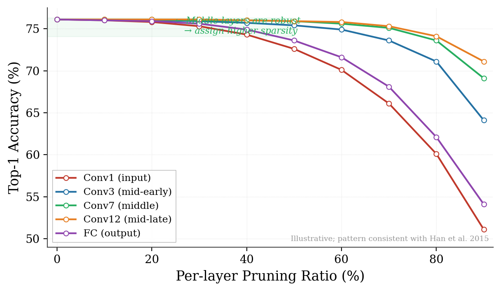
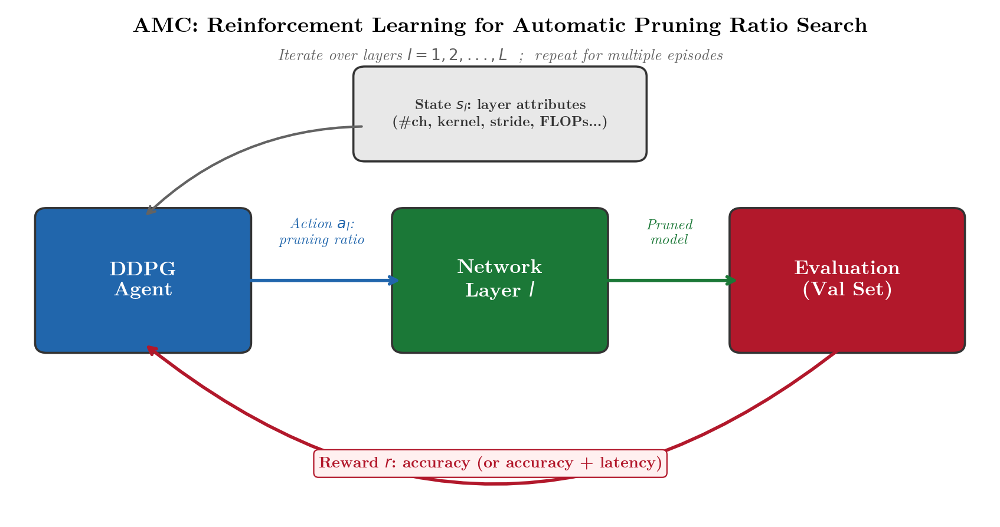
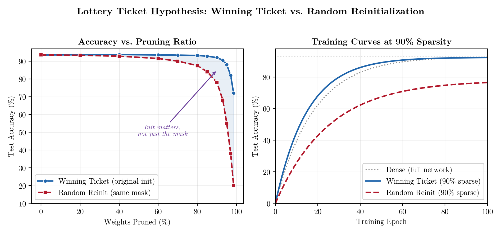
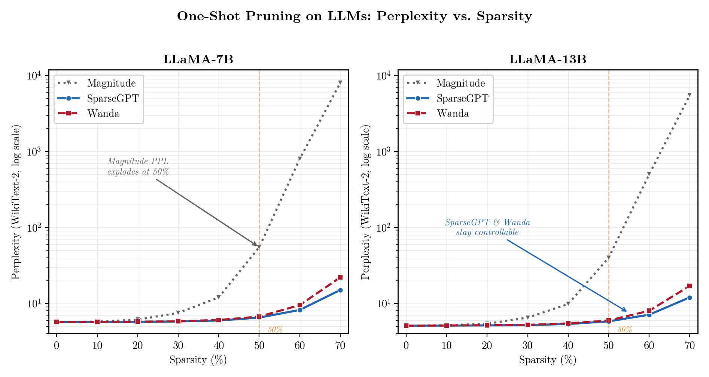
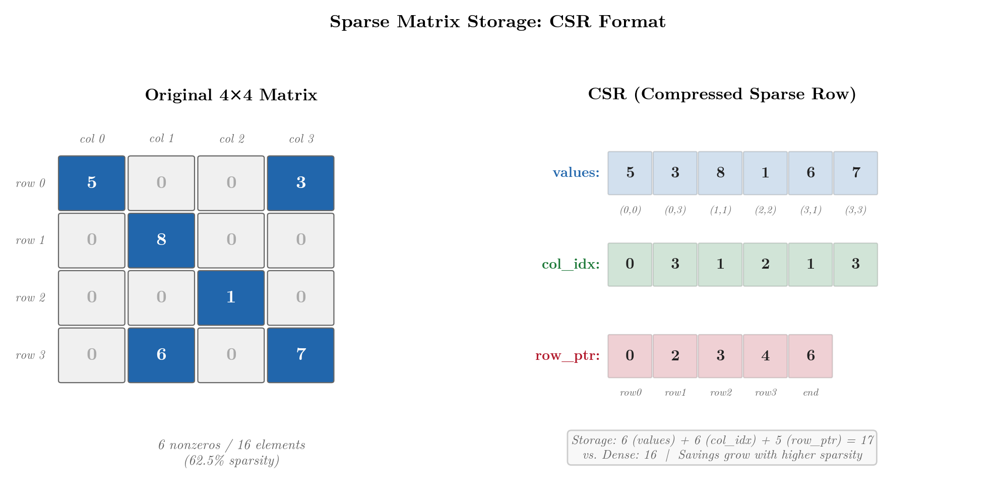

# Lec04 · Pruning & Sparsity (Part II)

> MIT 6.5940 EfficientML.ai · 基于 Song Han 课程讲义整理  
> 前置知识：Lec03（剪枝粒度、剪枝准则、剪枝流程）  
> 关联：Lec05-06（量化）· Lec07-08（NAS）· Lec09（蒸馏）

---

## 0 | 承接 Lec03：剪枝的完整流程

Lec03 解决了剪枝的前两个问题：**以什么粒度删**（granularity）和**删谁**（criterion）。Lec04 继续解决剩下的两个：

```
┌──────────────┐   ┌──────────────┐   ┌──────────────┐   ┌──────────────┐
│ 1. Granularity│   │ 2. Criterion │   │ 3. Ratio     │   │ 4. Fine-tune │
│ 以什么粒度删  │──▶│ 删谁         │──▶│ 每层删多少   │──▶│ 怎么恢复精度 │
│ (Lec03)      │   │ (Lec03)      │   │ ★ 本讲       │   │ ★ 本讲       │
└──────────────┘   └──────────────┘   └──────────────┘   └──────────────┘
```

此外，本讲还覆盖两个重要专题：**Lottery Ticket Hypothesis**（彩票假说）和**稀疏矩阵的系统/硬件支持**。

---

## 1 | 每层删多少——剪枝率的确定

同一个网络里，不同层对剪枝的"耐受力"差异巨大。第一层和最后一层通常很敏感（它们分别负责提取底层特征和做最终分类），中间层往往冗余更多。



如果给所有层分配同样的剪枝率（uniform），结果往往不如按层敏感度差异化分配（non-uniform）。问题是：怎么找到每一层的最优剪枝率？

### 1.1 Sensitivity Scan（手动启发式）

最朴素的方法——逐层扫描：

1. 固定其他层不动，单独对第 l 层尝试不同剪枝率（10%, 20%, ..., 90%）
2. 每次评估模型在验证集上的精度
3. 画出每层的 accuracy-vs-sparsity 曲线
4. 根据曲线人工选择每层的剪枝率，使得所有层的精度下降大致均匀

这个方法简单直觉，但有两个问题：计算成本随层数线性增长；忽略了层间耦合效应——实际剪枝时所有层同时变稀疏，单独扫描并不能捕捉层间的联合影响。

### 1.2 AMC：用强化学习自动搜索剪枝率

He et al.（ECCV 2018）提出 AMC（AutoML for Model Compression），把剪枝率搜索建模为一个序贯决策问题，用 DDPG（一种连续动作空间的 RL 算法）来自动求解。



工作流程：

- **State**：当前层的属性向量——包括层编号、channel 数、kernel size、stride、输入分辨率、FLOPs 等
- **Action**：RL agent 输出该层的剪枝率（连续值，0 ~ 1）
- **Reward**：剪枝后模型的精度（或精度 + 延迟的加权组合）

Agent 从第一层扫到最后一层，逐层决定剪枝率；跑完一轮后用 reward 更新策略，反复迭代直到收敛。

AMC 的核心贡献：它找到的**非均匀剪枝策略**（不同层差异化剪枝）显著优于人工设计的等比缩放。在 MobileNet-V1 上，同样 50% FLOPs 约束下，AMC 比 uniform scaling 高出 ~2% ImageNet Top-1。

> **工程备注**：AMC 的搜索成本不算高——DDPG 只需几百个 episode，每个 episode 是一次前向评估（不需要完整训练）。但它需要一个可微分的评估指标和一个可控的搜索空间。

### 1.3 NetAdapt：基于规则的迭代搜索

不用 RL，NetAdapt（Yang et al., ECCV 2018）采用更简单的贪心策略：

1. 设定全局 latency 预算
2. 每一轮遍历所有层，尝试对每层各删一些 channel，评估精度
3. 选精度最高的那个修改方案执行
4. 重复直到满足 latency 目标

好处是实现简单、不需要 RL 框架；缺点是贪心搜索可能陷入局部最优。

### 1.4 正则化引导剪枝

另一个思路是不显式搜索剪枝率，而是在训练目标里加入稀疏正则项，让优化器自动把不重要的结构"推向零"：

```math
\mathcal{L}_{total} = \mathcal{L}_{task} + \lambda \sum_{l} R(\mathbf{W}_l)
```

其中 $R$ 可以是 L1 正则（逐权重稀疏）、Group Lasso（逐 channel 稀疏）或 BN 的 γ 参数的 L1 惩罚（Network Slimming, Liu et al. ICCV 2017）。训练完成后，范数低于阈值的结构自然被删除，不需要手动设定剪枝率。

### 1.5 四种方案对比

| 方法 | 搜索策略 | 需要额外训练？ | 自动化程度 | 典型代表 |
|:---|:---|:---:|:---|:---|
| Sensitivity Scan | 逐层扫描 | 否（只推理） | 低 | Han et al. 2015 |
| AMC | RL（DDPG） | 否（策略梯度） | 高 | He et al. 2018 |
| NetAdapt | 贪心迭代 | 短微调 | 中 | Yang et al. 2018 |
| Regularization | 训练时正则 | 是（联合训练） | 高 | Liu et al. 2017 |

---

## 2 | 微调——如何恢复精度

剪枝打破了层间的协作关系，剩余权重需要重新适应。微调（fine-tuning）的策略对最终精度影响很大。

### 2.1 标准微调

最常见的做法：剪枝后用较小的学习率继续训练若干 epoch。

关键超参数：学习率通常设为原始训练末期的 1/10 ~ 1/100，训练 10–20% 的原始 epoch 数。学习率太大会破坏已有的权重结构，太小则收敛不到好的解。

### 2.2 Learning Rate Rewinding

Renda et al.（ICLR 2020）发现一个有趣的现象：与其用固定的小学习率微调，不如**重播原始训练的学习率 schedule**（从中间某个 epoch 的学习率开始）。

直觉是：微调时模型需要先"大步搜索"新的好区域（需要较大学习率），再"小步收敛"（需要衰减学习率），这个过程跟原始训练后半程的动力学是类似的。

### 2.3 Weight Rewinding（Lottery Ticket 的关键操作）

比学习率 rewinding 更激进——不仅重播学习率 schedule，还**把权重回退到训练早期某个 checkpoint 的值**，然后重新训练。

这就是 Lottery Ticket Hypothesis 的核心操作，我们在下一节详细展开。

---

## 3 | Lottery Ticket Hypothesis

### 3.1 核心主张

Frankle & Carlin（ICLR 2019）提出了一个极具影响力的猜想：

> 一个随机初始化的稠密网络，包含一个稀疏子网络（"winning ticket"），这个子网络用**原始的初始化权重**从头训练，能在相同或更少的迭代次数内达到与完整网络相当的精度。

换句话说，不是所有参数都是平等的——网络中存在一小撮"天选之子"，它们的初始化值恰好落在了 loss landscape 的好位置上。训练过程不过是在发掘和强化这些幸运的连接。

### 3.2 Iterative Magnitude Pruning (IMP)

找到 winning ticket 的标准流程：

```
1. 随机初始化网络，记录初始权重 W₀
2. 训练网络到收敛，得到 W_trained
3. 按 magnitude 剪掉 p% 的最小权重，得到 mask M
4. 将剩余权重重置为 W₀ 中对应位置的值（weight rewinding）
5. 用 mask M 约束，重新训练 → 回到步骤 3
```

重复 N 轮后，网络被压缩到原来的很小比例，但精度几乎不损失——甚至可能更好。



上图展示了核心对照实验：用**原始初始化**（winning ticket）和**随机重初始化**（相同 mask，但权重随机重来）分别训练。随着剪枝比例加大，winning ticket 维持精度，而随机重初始化的精度快速崩塌。这证明了初始化的价值——不是 mask 本身重要，而是 mask + 原始初始化的组合才是关键。

### 3.3 Late Rewinding：大模型的务实修正

原始 LTH 把权重回退到 epoch 0 的初始值，这在小网络（LeNet, 小 ResNet）上效果很好。但 Frankle et al.（ICML 2020）发现，在大网络（ResNet-50, ImageNet 规模）上，回退到 epoch 0 不 work——需要回退到训练早期（比如 epoch k，通常 k 占总训练量的 0.1% ~ 7%）的 checkpoint。

这被称为 **Late Rewinding** 或 **Rewinding to Iteration k**。它表明大网络在训练最初几步内就完成了某种关键的"结构适应"，这几步的学习不能跳过。

### 3.4 LTH 的实际意义与局限

**LTH 告诉我们什么**：过参数化不是浪费——它让优化器有更大的搜索空间来找到好的子网络。训练时需要大网络，推理时只需要小网络，这给剪枝提供了理论根基。

**LTH 的局限**：找 winning ticket 的成本不低——IMP 需要完整训练 N 次。对于 LLM 级别的模型（训练一次就要数百万美金），IMP 完全不可行。这催生了下一节的 one-shot 方法。

---

## 4 | LLM 时代的剪枝

70B+ 参数的 LLM 训练成本极高，迭代剪枝+微调不现实。工业界需要的是**训练后一次性完成**的 one-shot 方案。

### 4.1 SparseGPT

Frantar & Alistarh（ICML 2023）把经典的 OBS（Optimal Brain Surgeon）思路搬到了 LLM 上。

核心思路：逐列处理权重矩阵，对每一列决定哪些权重删除，同时用 Hessian 信息计算剩余权重的最优补偿量（closed-form weight update），使得该层的输出重建误差最小。

关键工程突破：把逐列 Hessian 逆运算转化为分块 Cholesky 分解的增量更新，复杂度从 O(d³) 降到了可接受的水平。在单台 A100 上，4–5 小时即可完成对 175B 参数 OPT 模型的 one-shot 50% 非结构化剪枝，且不需要任何微调。

### 4.2 Wanda

Sun et al.（ICML 2024）提出了一个更简单的方案：**Wanda（Pruning by Weights and Activations）**。

重要性分数只用两个量的乘积：

```math
s_{ij} = |w_{ij}| \cdot \|X_j\|_2
```

其中 $\|w_{ij}\|$ 是权重绝对值，$\lVert X_j \rVert_2$ 是对应输入 channel 的激活 L2 范数（在一小批校准数据上统计）。

这个公式的直觉很自然：一个权重同时满足"自身绝对值大"和"它连接的输入 channel 激活强"两个条件时，才被认为重要。

Wanda 不需要计算 Hessian，不需要权重补偿更新，实现只需几十行代码，速度比 SparseGPT 快一个数量级。精度在 50% 非结构化稀疏下与 SparseGPT 接近。

### 4.3 One-shot 方法对比



| 方法 | 核心信号 | 需要校准数据？ | 权重补偿？ | 速度 | 精度（50% 稀疏） |
|:---|:---|:---:|:---:|:---|:---|
| Magnitude | 权重绝对值 | 否 | 否 | 极快 | 差（PPL 爆炸） |
| SparseGPT | Hessian + 逐列 OBS | 是（128 样本） | 是 | 中等 | 好 |
| Wanda | 权重 × 激活范数 | 是（128 样本） | 否 | 快 | 接近 SparseGPT |

> 在 LLaMA-7B / 13B 上，纯 magnitude pruning 到 50% 稀疏度时 perplexity 就已崩溃，而 SparseGPT 和 Wanda 仍能维持在合理范围。60% 以上稀疏度时 SparseGPT 的 Hessian 补偿优势开始显现。

---

## 5 | 稀疏矩阵的系统与硬件支持

算法上"删掉"了权重，硬件上怎么真正跳过这些零值计算？这取决于稀疏矩阵的存储格式和硬件的计算能力。

### 5.1 稀疏矩阵存储格式

稠密矩阵把每个元素都存下来（包括零），浪费空间。稀疏矩阵的核心思路：只存非零值 + 它们的位置信息。

**CSR（Compressed Sparse Row）**：最通用的格式，用三个数组描述稀疏矩阵：



- `values`：所有非零值，按行优先顺序排列
- `col_idx`：每个非零值对应的列索引
- `row_ptr`：每行的非零值在 `values` 中的起始位置（长度 = 行数 + 1）

对于上图的 4×4 矩阵（5 个非零值 vs 16 个元素），CSR 只需要 5 + 5 + 5 = 15 个值，而稠密存储需要 16 个。稀疏度越高，压缩率越大。

**CSC（Compressed Sparse Column）**：同理，但按列压缩。EIE 加速器使用的就是 CSC 变体。

### 5.2 EIE：第一个稀疏 DNN 加速器

Han et al.（ISCA 2016）设计的 EIE（Efficient Inference Engine）是最早专门为稀疏压缩 DNN 设计的硬件加速器。

EIE 的设计要点：

- 用 CSC 格式存储稀疏权重矩阵，配合相对索引（relative index）减小索引位宽
- 同时利用权重稀疏（剪枝产生的零值）和激活稀疏（ReLU 产生的零值）
- 用 Leading Non-zero Detection（LNZD）单元跳过零激活，避免无效计算
- 将矩阵行交替分配到多个 PE（Processing Element）实现并行

EIE 在 AlexNet FC 层上实现了 189× speedup 和 13× energy savings（vs 通用 CPU）。这证明了稀疏性在专用硬件上可以被充分利用。

> **后续影响**：EIE 开创了一个研究方向。后来的 ESE（FPGA 2017）把同样思路用于 LSTM；SpArch（HPCA 2020）优化了 SpMM（Sparse Matrix-Matrix Multiply）的数据流；SpAtten（HPCA 2021）把稀疏性扩展到了 Attention 机制中的 token pruning。

### 5.3 GPU 上的稀疏支持

通用 GPU 最初对稀疏性很不友好——cuBLAS 是为稠密 GEMM 优化的。但 NVIDIA 逐渐加入了稀疏支持：

**cuSPARSE / cuSPARSELt**：支持 CSR/CSC 格式的稀疏矩阵运算。适合高稀疏度（>90%），但在中等稀疏度时可能因为索引开销反而比稠密计算慢。

**Sparse Tensor Core（Ampere A100+）**：硬件原生支持 2:4 结构化稀疏（N:M sparsity）。每 4 个连续权重中恰好 2 个为零，硬件在 matmul 时自动跳过零值，实现约 2× 吞吐提升。这是目前工业界最成熟的 GPU 稀疏加速方案。

**Block Sparsity**：把矩阵分成小块（如 4×4、8×8），以块为单位做零/非零判断。比非结构化稀疏更规则，比通道级剪枝更灵活。CUTLASS 库提供了 Block SpMM 的实现。

### 5.4 SpMM 的性能挑战

稀疏矩阵乘（SpMM）的核心难点不是计算量，而是内存访问模式。非结构化稀疏导致：

- 不规则内存访问 → cache miss 率高
- 负载不均衡 → 部分 PE 空闲等待
- 索引开销 → 额外内存带宽消耗

这就是为什么**稀疏度不够高时，稀疏计算反而比稠密更慢**——索引开销 > 计算节省。经验法则：非结构化稀疏在通用 GPU 上通常需要 >95% 稀疏度才能看到实际加速；2:4 结构化稀疏在 50% 就能拿到硬件加速。

---

## 6 | 代码示例

### Sensitivity Scan（逐层敏感度分析）

```python
import torch
import copy

def sensitivity_scan(model, val_loader, criterion, layer_names, ratios):
    """对每层独立扫描不同剪枝率下的精度"""
    results = {}
    for name in layer_names:
        results[name] = {}
        for ratio in ratios:
            # 拷贝模型，只对目标层做剪枝
            model_copy = copy.deepcopy(model)
            for n, m in model_copy.named_modules():
                if n == name and hasattr(m, 'weight'):
                    w = m.weight.data
                    threshold = torch.quantile(w.abs().float(), ratio)
                    mask = (w.abs() >= threshold).float()
                    m.weight.data = w * mask
            # 评估精度
            acc = evaluate(model_copy, val_loader, criterion)
            results[name][ratio] = acc
    return results
```

### Wanda 剪枝（核心逻辑）

```python
def wanda_prune(weight, activations, sparsity):
    """
    weight: [out_features, in_features]
    activations: [n_samples, in_features] — 校准数据的输入激活
    """
    # 计算每个输入 channel 的激活 L2 范数
    act_norms = activations.float().norm(dim=0)  # [in_features]
    # 重要性 = |权重| × 激活范数
    importance = weight.abs() * act_norms.unsqueeze(0)
    # 按重要性排序，删最不重要的
    threshold = torch.quantile(importance.flatten().float(), sparsity)
    mask = (importance >= threshold).float()
    return weight * mask
```

### Lottery Ticket 的 IMP 流程（伪代码）

```python
def iterative_magnitude_pruning(model_fn, train_fn, prune_pct=0.2, rounds=10):
    """
    model_fn: 返回随机初始化模型的工厂函数
    train_fn: 训练函数，返回训练后的模型
    """
    model = model_fn()
    init_state = copy.deepcopy(model.state_dict())  # 保存 W₀
    mask = {n: torch.ones_like(p) for n, p in model.named_parameters()
            if 'weight' in n}

    for round in range(rounds):
        # 训练（带 mask 约束）
        trained = train_fn(model, mask)

        # 按 magnitude 剪枝：在当前 mask 的非零位置中，删最小的 prune_pct
        for name, param in trained.named_parameters():
            if name in mask:
                alive = mask[name].bool()
                alive_weights = param.data[alive].abs()
                threshold = torch.quantile(alive_weights.float(), prune_pct)
                new_mask = (param.data.abs() >= threshold).float()
                mask[name] *= new_mask

        # Weight rewinding：重置权重到 W₀
        model.load_state_dict(init_state)
        # 应用更新后的 mask
        for name, param in model.named_parameters():
            if name in mask:
                param.data *= mask[name]

    return model, mask
```

---

## 7 | 常见面试问题

**Q: 怎么确定每层的剪枝率？**

最基本的方法是 sensitivity scan——逐层扫描不同剪枝率下的精度变化，然后人工选择。更自动化的方法包括 AMC（用 RL agent 逐层决策）、NetAdapt（贪心迭代搜索）和基于正则化的方法（训练时自动稀疏化）。核心思想是不同层冗余程度不同，非均匀剪枝率优于均匀。

**Q: Lottery Ticket Hypothesis 的核心发现是什么？**

稠密网络中存在稀疏子网络（winning ticket），用原始初始化权重从头训练就能达到全网络精度。关键是**初始化值**而非网络结构本身——同样的 mask 配上随机重初始化效果会大幅下降。对大模型需要用 late rewinding（回退到训练早期 checkpoint 而非 epoch 0）。

**Q: SparseGPT 和 Wanda 有什么区别？**

SparseGPT 基于 OBS，用 Hessian 信息逐列求解最优剪枝 + 权重补偿，精度好但计算量较大。Wanda 用权重绝对值 × 激活范数作为重要性分数，不做权重补偿，实现简单、速度快约一个数量级。50% 稀疏度下两者精度接近；60%+ 稀疏度时 SparseGPT 的 Hessian 补偿优势开始体现。

**Q: 为什么非结构化剪枝在 GPU 上拿不到加速？**

GPU 的计算核心是 SIMD/SIMT——同一条指令处理一批数据。非结构化稀疏导致不规则内存访问（cache miss 高）、负载不均衡（部分线程空等）和索引开销（额外带宽消耗）。稀疏度不够高时（<95%），这些开销反而超过了跳过零值节省的计算量。2:4 结构化稀疏通过规则化 pattern 解决了这个问题。

**Q: EIE 为什么能做到那么大的加速？**

EIE 是专用 ASIC，在硬件层面同时利用了权重稀疏（剪枝）和激活稀疏（ReLU），用 CSC 格式存储 + LNZD 跳过零激活 + PE 并行。相比通用 CPU/GPU 对稀疏性"视而不见"的稠密计算，EIE 的每个 cycle 都在做有效工作。

---

## 参考文献

- Frankle & Carlin, *The Lottery Ticket Hypothesis: Finding Sparse, Trainable Neural Networks*, ICLR 2019
- Frankle et al., *Linear Mode Connectivity and the Lottery Ticket Hypothesis*, ICML 2020
- Renda et al., *Comparing Rewinding and Fine-tuning in Neural Network Pruning*, ICLR 2020
- He et al., *AMC: AutoML for Model Compression and Acceleration on Mobile Devices*, ECCV 2018
- Yang et al., *NetAdapt: Platform-Aware Neural Network Adaptation for Mobile Devices*, ECCV 2018
- Liu et al., *Learning Efficient Convolutional Networks through Network Slimming*, ICCV 2017
- Frantar & Alistarh, *SparseGPT: Massive Language Models Can Be Accurately Pruned in One-Shot*, ICML 2023
- Sun et al., *A Simple and Effective Pruning Approach for Large Language Models (Wanda)*, ICML 2024
- Han et al., *EIE: Efficient Inference Engine on Compressed Deep Neural Network*, ISCA 2016
- Han et al., *ESE: Efficient Speech Recognition Engine with Sparse LSTM on FPGA*, FPGA 2017
- Zhang et al., *SpArch: Efficient Architecture for Sparse Matrix Multiplication*, HPCA 2020
- Wang et al., *SpAtten: Efficient Sparse Attention Architecture*, HPCA 2021
- Wen et al., *Learning Structured Sparsity in Deep Neural Networks*, NeurIPS 2016
