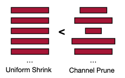

# 04 进阶剪枝 (Pruning Part II)

> 📺 [Lecture 04 - Pruning (Part II)](https://youtu.be/91stHPsxwig)
> 📄 [Slides](https://hanlab.mit.edu/courses/2024-fall-65940)

---

## 4.1 Lottery Ticket Hypothesis (LTH)

### 4.1.1 核心假设

> "A randomly-initialized, dense neural network contains a subnetwork that can match the accuracy of the original network when trained in isolation." — Frankle & Carbin, 2019

随机初始化的密集网络中，存在一个**winning ticket**（中奖子网络），单独训练它就能达到原始网络的精度。

### 4.1.2 Iterative Magnitude Pruning (IMP)

```
1. 随机初始化网络 W₀
2. 训练到收敛 → W_T
3. 剪掉 p% 的最小 |w| → 得到 mask m
4. 用 W₀（原始初始化！）× m 重新训练
5. 重复 2-4 直到达到目标稀疏度
```

**关键发现**: 用**原始初始化**重训练效果 >> 用**随机初始化**重训练。说明初始化中包含了"好子网络"的信息。

### 4.1.3 Scaling Limitation

LTH 在小网络上成立（CIFAR-10, MNIST），但在大网络（ImageNet, LLM）上：
- 需要learning rate warmup 才能找到 winning ticket
- 稀疏度很高时（>90%），winning ticket 效果下降
- 大模型的 winning ticket 可能不是唯一的

---

## 4.2 自动剪枝率选择

手动设每层剪枝率很耗时，自动化方法：

| 方法 | 原理 |
|------|------|
| RL-based | 用强化学习搜索最优剪枝率组合 |
| Rule-based | 按层灵敏度自动分配（敏感层少剪，鲁棒层多剪） |
| Regularization | L0/L1 正则化让不重要权重自动变0 |
| Meta-Learning | 用元学习预测最优剪枝率 |

**L1 正则化剪枝**: 在 loss 中加 $\lambda \sum |w_i|$，训练后小权重自然趋近 0。

---

## 4.3 剪枝初始化 (Pruning at Initialization)

不用训练就能决定剪谁——省去完整训练成本。

### SNIP (Connection Sensitivity)

$$s_j = \left|\frac{\partial L}{\partial w_j}\bigg|_{W=W_0} \times w_j\right|$$

只做**一次** forward-backward，计算每个权重的 sensitivity，然后剪掉 sensitivity 最低的。

### Gradient Signal Preservation

不是剪"小权重"，而是保持**梯度流通畅**：
- 剪枝后梯度流不应被阻断
- 用 GraSP (Gradient Signal Preservation) 最大化剪枝后的梯度范数

---

## 4.4 硬件稀疏支持

### 4.4.1 为什么非结构化稀疏需要专门硬件？

非结构化剪枝产生不规则的稀疏模式：



- 权重位置不连续 → **内存访问不规则** → cache miss 高
- 普通GPU的矩阵乘法单元针对密集矩阵优化，稀疏矩阵无法高效利用

### 4.4.2 稀疏矩阵格式

| 格式 | 存储 | 适用场景 |
|------|------|---------|
| COO (Coordinate) | (row, col, value) 三元组 | 简单但空间大 |
| CSR (Compressed Sparse Row) | values + col_indices + row_ptr | 行切片高效 |
| CSC (Compressed Sparse Column) | values + row_indices + col_ptr | 列切片高效 |

```python
import scipy.sparse as sp
import numpy as np

# 稀疏矩阵示例
dense = np.random.randn(100, 100)
dense[dense < 1.5] = 0  # 约 7% 非零
sparse_mat = sp.csr_matrix(dense)

print(f"Dense 大小: {dense.nbytes} bytes")
print(f"CSR 大小: {sparse_mat.data.nbytes + sparse_mat.indices.nbytes + sparse_mat.indptr.nbytes} bytes")
print(f"稀疏度: {1 - sparse_mat.nnz / dense.size:.1%}")
```

### 4.4.3 EIE: 高效稀疏推理引擎

MIT Song Han 团队设计的稀疏推理加速器：
- **Relative Index**: 存储非零元素的相对位置（不是绝对位置），节省存储
- **Column Pointer**: 按列组织稀疏数据，支持高效的稀疏矩阵-向量乘
- 直接操作量化后的权重，不需要反量化

### 4.4.4 GPU 稀疏支持

**NVIDIA Ampere+ (A100/H100) 2:4 结构化稀疏**:
- 每 4 个连续权重中至少 2 个为 0
- 硬件自动跳过零值运算 → **2x 加速**
- 需要训练后用特定算法把权重调整成 2:4 模式

```python
# PyTorch 2:4 稀疏示例
import torch
from torch.sparse import to_sparse_semi_structured

# 创建 2:4 稀疏矩阵 (每4个中恰好2个为0)
dense = torch.randn(64, 64, device='cuda')
# 手动创建 2:4 pattern
mask = torch.tensor([[0, 0, 1, 1]] * 16, device='cuda').flatten()
sparse = dense * mask[:dense.shape[1]]
# 用硬件加速
result = to_sparse_semi_structured(sparse) @ torch.randn(64, 64, device='cuda')
```

**Block SpMM (Blocked-ELL format)**:
- 把稀疏矩阵分成固定大小的 block（如 4×4）
- 每个 block 内做密集运算，block 间跳过零块
- 在 GPU 上比 CSR 格式高效

**PatDNN (FKW format)**:
- 针对移动端优化的稀疏格式
- Filter-wise Kernel pruning + Weight packing

---

## 4.5 LLM 剪枝

### SparseGPT
- **一次性剪枝** LLM，不需要重训练
- 基于 Hessian 的局部重建：$\min_{W_s} \|Wx - W_s x\|^2$
- 在 175B 模型上可以剪到 50% 稀疏度，精度损失极小

### Wanda (Pruning by Weights and Activations)
- 重要性分数 = |weight| × |activation|
- 比 SparseGPT 简单（不需要 Hessian），效果相当
- 只需要少量校准数据统计 activation magnitude

```python
# Wanda 剪枝核心逻辑 (伪代码)
def wanda_prune(weight, activations, sparsity=0.5):
    """
    weight: [out_features, in_features]
    activations: [n_samples, in_features] — 校准数据
    """
    act_importance = activations.abs().mean(dim=0)  # [in_features]
    score = weight.abs() * act_importance.unsqueeze(0)  # [out, in]
    threshold = torch.quantile(score.flatten(), sparsity)
    mask = score > threshold
    return weight * mask
```

---

## 代码示例: IMP (Iterative Magnitude Pruning)

```python
import torch
import torch.nn as nn
import copy

def iterative_magnitude_pruning(model, train_fn, prune_ratio=0.2, n_rounds=5):
    """
    IMP: 迭代幅度剪枝
    1. 保存原始初始化
    2. 训练 → 剪枝 → 用原始初始化重置 → 再训练
    """
    # 保存原始初始化 (winning ticket hypothesis 关键!)
    original_init = copy.deepcopy(model.state_dict())
    mask = {k: torch.ones_like(v) for k, v in model.state_dict().items()}

    for round_i in range(n_rounds):
        # 训练
        train_fn(model)

        # 计算剪枝 mask (magnitude-based)
        state = model.state_dict()
        for name, param in state.items():
            if param.dim() > 1:  # 只剪权重，不剪 bias
                threshold = torch.quantile(param.abs().flatten(), prune_ratio)
                new_mask = (param.abs() > threshold).float()
                mask[name] = new_mask

        # 用原始初始化重置，但保留 mask
        model.load_state_dict(original_init)
        state = model.state_dict()
        for name in mask:
            state[name] = state[name] * mask[name]
        model.load_state_dict(state)

        sparsity = 1 - sum(m.sum().item() for m in mask.values()) / \
                   sum(m.numel() for m in mask.values())
        print(f"Round {round_i+1}: sparsity = {sparsity:.1%}")

    return model, mask
```

---

## Infra 实战映射

### vLLM
- vLLM 本身不做剪枝，但可以加载已剪枝的模型
- MoE (Mixture of Experts) 可以看作一种动态结构化稀疏
- Sparse attention 在 vLLM 中有实验支持

### TensorRT-LLM (NVIDIA)
- 原生支持 2:4 结构化稀疏（Ampere+ GPU）
- Sparse Tensor Core 自动利用 2:4 稀疏加速 GEMM
- 需要在导出时把权重调整到 2:4 模式

### 沐曦 MACA
- 需要确认硬件是否有稀疏 Tensor Core
- 如果没有，非结构化稀疏的加速效果有限
- 可以考虑结构化剪枝（直接减少通道数），在任何硬件上都有效

---

## 跨 Lecture 关联

- **前置 ←** [Lec03: 剪枝基础](../lec03-pruning-I/README.md) — 剪枝粒度、准则
- **延伸 →** [Lec13: LLM 部署](../lec13-llm-deploy/README.md) — SparseGPT, Wanda, MoE
- **横向 ↔** [Lec05: 量化](../lec05-quantization-I/README.md) — 剪枝 + 量化可以组合 (Deep Compression)
- **横向 ↔** [Lec11: 推理引擎](../lec11-tiny-engine/README.md) — 稀疏矩阵的硬件支持

---

## 面试高频题

**Q1: Lottery Ticket Hypothesis 的实际意义是什么？**
> A: 说明神经网络的冗余是结构性的，不是训练出来的。一个好子网络从初始化就"存在"。实际意义：如果你能找到 winning ticket，就可以直接训练这个小网络，省时省力。但大模型上找 winning ticket 仍然很困难。

**Q2: 2:4 结构化稀疏是什么？为什么是 2:4？**
> A: 每 4 个连续权重恰好 2 个为 0。NVIDIA Ampere+ 的 Sparse Tensor Core 硬件原生支持这种模式，可以 2x 加速 GEMM。2:4 是精度和稀疏度的平衡点。

**Q3: SparseGPT vs Wanda 怎么选？**
> A: SparseGPT 精度略好（用 Hessian），但实现复杂、速度慢。Wanda 更简单（只需 weight × activation magnitude），速度快，效果接近。工程上先试 Wanda。

**Q4: 结构化 vs 非结构化剪枝，工业界用哪个？**
> A: 工业界主流是**结构化剪枝**（删整个 channel/filter），因为任何硬件都能直接加速。非结构化剪枝精度好但需要稀疏硬件支持。NVIDIA 的 2:4 稀疏是一个折中方案。
