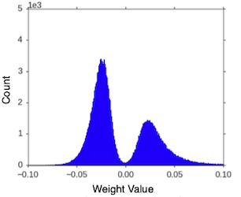
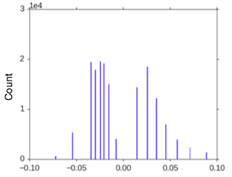
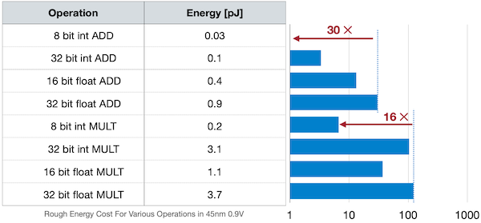
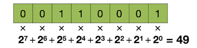
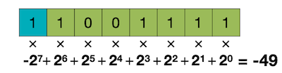
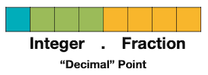
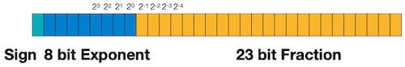
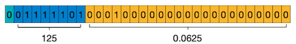
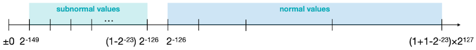
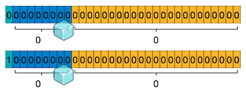

# 05 量化基础 (Quantization Part I)

> 📺 [Lecture 05 - Quantization (Part I)](https://youtu.be/91stHPsxwig)
> 📄 [Slides](https://hanlab.mit.edu/courses/2024-fall-65940)
> 📝 参考: [erectbranch 韩文笔记](https://github.com/erectbranch/MIT-Efficient-AI/tree/master/2022/lec05/summary01)



量化（Quantization）是把连续信号映射到有限离散集合的过程。在深度学习中，就是把高精度数值（FP32）映射到低精度（INT8/INT4），从而减少模型大小、加速推理、降低功耗。



---

## 5.1 数值数据类型 (Numeric Data Types)

bit-width 越低，运算能耗越少：



| 类型 | 位宽 | 动态范围 | 精度 | 能耗比(vs FP32) |
|------|------|---------|------|----------------|
| FP32 | 32bit | ~10^-38 ~ 10^38 | 高 | 1x |
| FP16 | 16bit | ~10^-8 ~ 65504 | 中 | ~0.1x |
| BF16 | 16bit | ~10^-38 ~ 10^38 | 低(和FP32同指数位) | ~0.1x |
| INT8 | 8bit | [-128, 127] | 整数 | ~0.05x |
| INT4 | 4bit | [-8, 7] | 整数 | ~0.01x |

### 5.1.1 Integer (整数)

**Unsigned INT8**: range [0, 2^8 - 1] = [0, 255]



**Signed INT8 (Two's Complement)**: range [-2^7, 2^7 - 1] = [-128, 127]

```
例子: 十进制 49
Unsigned:  00110001
Signed:    00110001 (正数相同)

例子: 十进制 -49
Two's Complement: 11001111 (= ~00110000 + 1)
```



### 5.1.2 Fixed-Point Number (定点数)

定点数可以用**整数运算硬件**加速，核心是 **shift 操作**。

`fixed<8,4>`: 总宽 8bit，小数部分 4bit

```
Sign(1bit) | Integer(3bit) | Fraction(4bit)
0            010              0100

= +0 × 2^3 + 1 × 2^2 + 0 × 2^1 + 0 × 2^0 + 0 × 2^-1 + 1 × 2^-2 + 0 × 2^-3 + 0 × 2^-4
= 4 + 0.25 = 4.25
```



### 5.1.3 IEEE FP32 (浮点数)

$$(-1)^{\text{sign}} \times (1 + \text{Fraction}) \times 2^{\text{Exponent} - 127}$$

- Sign: 1 bit
- Exponent: 8 bits (bias = 127)
- Fraction (mantissa): 23 bits



```
FP32 表示 0.265625:
0.265625 = 1.0625 × 2^{-2}
→ Sign=0, Exponent=125(01111101), Fraction=0.0625
```



**Subnormal Numbers**: 当 Exponent=0 时，用线性表示极小值：

$$(-1)^{\text{sign}} \times \text{Fraction} \times 2^{1 - 127}$$

最小值: $2^{-149}$，最大 subnormal: $2^{-126} - 2^{-149}$





### 5.1.4 FP16 vs BF16 — 关键区别

| | FP16 | BF16 |
|---|------|------|
| Exponent | 5 bits | **8 bits** (和FP32一样) |
| Fraction | 10 bits | **7 bits** |
| 动态范围 | 小 (~65504) | **大** (~10^38) |
| 精度 | 较高 | 较低 |
| 溢出风险 | **高** — 容易溢出 | **低** — 不易溢出 |

> **为什么训练用 BF16？** 动态范围和 FP32 一致，不需要 loss scaling 防溢出。代价是精度低一些，但训练对精度不敏感。

### 5.1.5 NVIDIA FP8 — 两种模式

- **E4M3**: 4bit exponent + 3bit mantissa → 用于前向推理（精度优先）
- **E5M2**: 5bit exponent + 2bit mantissa → 用于反向传播（动态范围优先）

### 5.1.6 计算成本对比

| 运算类型 | 相对能耗 |
|---------|---------|
| FP32 乘法 | 3.7x |
| FP32 加法 | 1x |
| INT8 乘法 | 0.2x |
| INT8 加法 | 0.06x |

> **关键洞察**: INT8 运算比 FP32 节能约 **20x**，这就是量化的根本动力。

---

## 5.2 线性量化 (Linear Quantization)

### 5.2.1 核心公式

量化：$q = \text{round}\left(\frac{r}{S}\right) + Z$

反量化：$\hat{r} = S \times (q - Z)$

其中：
- $r$ = 原始浮点值 (real value)
- $q$ = 量化后的整数值 (quantized value)
- $S$ = scale (缩放因子)，$S > 0$
- $Z$ = zero-point (零点偏移)

**量化误差** $= r - \hat{r} = r - S \times (q - Z)$

### 5.2.2 对称量化 (Symmetric Quantization)

$$Z = 0, \quad S = \frac{\max(|r|)}{2^{b-1} - 1}$$

$$q = \text{round}\left(\frac{r}{S}\right), \quad q \in [-2^{b-1}, 2^{b-1}-1]$$

- 适用于**权重**（分布大致以 0 为中心对称）
- INT8: q ∈ [-128, 127]
- **浪费**: 如果值域不是以 0 对称，会浪费量化级数

### 5.2.3 非对称量化 (Asymmetric Quantization)

$$S = \frac{r_{\max} - r_{\min}}{2^b - 1}, \quad Z = \text{round}\left(-\frac{r_{\min}}{S}\right)$$

$$q = \text{round}\left(\frac{r}{S}\right) + Z, \quad q \in [0, 2^b - 1]$$

- 适用于 **activation**（ReLU 后全为非负值）
- 完全利用量化范围，不浪费
- **缺点**: 计算复杂，需要处理 zero-point

### 5.2.4 量化误差来源

1. **Clipping Error**: 超出量化范围的值被截断
2. **Rounding Error**: 连续值映射到离散点
3. **Scale 精度**: S 本身是浮点数，低 bit 时误差放大

```python
import numpy as np

def symmetric_quantize(tensor, n_bits=8):
    """对称量化"""
    n_levels = 2 ** (n_bits - 1) - 1  # 127 for INT8
    scale = np.max(np.abs(tensor)) / n_levels
    q = np.round(tensor / scale).clip(-n_levels - 1, n_levels)
    return q.astype(np.int8), scale

def asymmetric_quantize(tensor, n_bits=8):
    """非对称量化"""
    q_min, q_max = 0, 2**n_bits - 1
    r_min, r_max = tensor.min(), tensor.max()
    scale = (r_max - r_min) / (q_max - q_min)
    zero_point = round(-r_min / scale)
    q = np.round(tensor / scale + zero_point).clip(q_min, q_max)
    return q.astype(np.uint8), scale, zero_point

# 演示
w = np.random.randn(100).astype(np.float32)
q_sym, s1 = symmetric_quantize(w)
q_asym, s2, z = asymmetric_quantize(w)

# 反量化看误差
w_hat_sym = q_sym.astype(np.float32) * s1
w_hat_asym = (q_asym.astype(np.float32) - z) * s2
print(f"对称量化 MSE: {np.mean((w - w_hat_sym)**2):.6f}")
print(f"非对称量化 MSE: {np.mean((w - w_hat_asym)**2):.6f}")
```

---

## 5.3 量化粒度 (Quantization Granularity)

| 粒度 | 描述 | 精度 | 硬件支持 |
|------|------|------|---------|
| Per-tensor | 整个 tensor 用一个 S, Z | 低 | 好硬 |
| Per-channel | 每个 channel 用自己的 S, Z | 高 | 一般 |
| Per-group | 每组(如128个值)一个 S, Z | 最高 | AWQ/GPTQ |

### Per-tensor Quantization

整个权重矩阵 W 只用一组 (S, Z)。问题是如果某个 channel 的值域特别大（outlier），会撑大 scale，导致其他 channel 的精度下降。

### Per-channel Quantization

每个输出 channel 独立计算 S, Z。对卷积层来说，每个 filter 有自己的 scale。

```python
def per_channel_quantize(weight, n_bits=8):
    """Per-channel 对称量化 — weight shape: [out_channels, in_channels]"""
    n_levels = 2 ** (n_bits - 1) - 1
    # 每个 output channel 独立计算 scale
    scales = np.max(np.abs(weight), axis=1, keepdims=True) / n_levels
    q = np.round(weight / scales).clip(-n_levels - 1, n_levels)
    return q.astype(np.int8), scales.squeeze()
```

### Group Quantization (Sub-channel)

AWQ 和 GPTQ 用的方式。把每行权重分成大小为 group_size 的小组，每组独立量化。

```python
def group_quantize(weight, group_size=128, n_bits=4):
    """Group quantization — AWQ/GPTQ 的量化方式"""
    n_levels = 2 ** (n_bits - 1) - 1
    orig_shape = weight.shape
    # reshape: [out, in] -> [out, in/group, group]
    weight_grouped = weight.reshape(-1, group_size)
    scales = np.max(np.abs(weight_grouped), axis=1, keepdims=True) / n_levels
    q = np.round(weight_grouped / scales).clip(-n_levels - 1, n_levels)
    return q, scales, orig_shape
```

> **为什么 group quantization 对 LLM 重要？**
> LLM 的 weight 分布不均匀，同一行内有的区域值大有的小。per-tensor 精度太差，per-channel 又不够细。group=128 是精度和 overhead 的甜点。

---

## 5.4 Uniform vs Non-uniform Quantization

### Uniform Quantization

量化间隔是均匀的：$\Delta = \frac{r_{\max} - r_{\min}}{2^b - 1}$

硬件实现简单（整数运算），绝大多数系统用这个。

### Non-uniform Quantization

量化间隔不均匀。可以用 K-means 聚类找最优量化中心：

```python
from sklearn.cluster import KMeans

def kmeans_quantize(weight, n_bits=4):
    """K-means 非均匀量化 (Deep Compression 方法)"""
    n_clusters = 2 ** n_bits
    flat = weight.reshape(-1, 1)
    kmeans = KMeans(n_clusters=n_clusters, n_init=10)
    kmeans.fit(flat)
    # 每个 weight 用最近的聚类中心代替
    q = kmeans.cluster_centers_[kmeans.labels_].reshape(weight.shape)
    centroids = kmeans.cluster_centers_.flatten()
    return q, centroids
```

Deep Compression 论文的做法: **迭代剪枝 → K-means 量化 → Huffman 编码**，三者叠加可以压缩 30-50x。

---

## 5.5 Product Quantization (PQ)

把高维向量切成子向量，每个子向量独立量化：

$$\mathbf{x} = [\mathbf{x}_1, \mathbf{x}_2, \ldots, \mathbf{x}_M]$$

每个 $\mathbf{x}_m$ 独立做 K-means 量化。总 codebook 大小从 $K^d$ 降到 $M \times K^{d/M}$，大幅节省存储。

PQ 常用于向量检索（如 FAISS）和 LLM 的权重压缩。

---

## 代码示例: 完整量化流程

```python
import torch
import torch.nn as nn
import numpy as np

class FakeQuantize(torch.autograd.Function):
    """模拟量化 + STE (Straight-Through Estimator)"""
    @staticmethod
    def forward(ctx, x, scale, zero_point, q_min, q_max):
        # 量化
        q = torch.round(x / scale + zero_point).clamp(q_min, q_max)
        # 反量化
        return (q - zero_point) * scale

    @staticmethod
    def backward(ctx, grad_output):
        # STE: 梯度直通
        return grad_output, None, None, None, None

class QuantizedLinear(nn.Module):
    """带 fake quantization 的线性层"""
    def __init__(self, in_features, out_features, n_bits=8):
        super().__init__()
        self.weight = nn.Parameter(torch.randn(out_features, in_features))
        self.bias = nn.Parameter(torch.zeros(out_features))
        self.n_bits = n_bits
        self.register_buffer('weight_scale', torch.tensor(1.0))
        self.register_buffer('weight_zp', torch.tensor(0.0))

    def calibrate(self):
        """校准: 计算 scale 和 zero_point"""
        q_max = 2 ** (self.n_bits - 1) - 1
        q_min = -(q_max + 1)
        r_max = self.weight.data.abs().max()
        self.weight_scale = r_max / q_max
        self.weight_zp = torch.tensor(0.0)  # 对称量化

    def forward(self, x):
        if self.training:
            # 训练: fake quantize
            q_max = 2 ** (self.n_bits - 1) - 1
            q_min = -(q_max + 1)
            w_q = FakeQuantize.apply(
                self.weight, self.weight_scale, self.weight_zp, q_min, q_max
            )
            return x @ w_q.T + self.bias
        else:
            # 推理: 直接用量化权重
            return x @ self.weight.T + self.bias

# 测试
model = QuantizedLinear(512, 256)
model.calibrate()
x = torch.randn(1, 512)
out = model(x)
print(f"输出 shape: {out.shape}")
```

---

## Infra 实战映射

### vLLM
- vLLM 默认用 FP16/BF16 推理，不内置量化
- 但可以加载 AWQ/GPTQ 量化后的模型（通过 `QuantizationConfig`）
- 关键配置: `--quantization awq` 或 `--quantization gptq`

### TensorRT-LLM (NVIDIA)
- 原生支持 INT8 weight-only 和 INT8 smoothquant
- FP8 (E4M3) 推理: 在 H100 上默认使用
- TensorRT 会自动选择最优量化策略
- 核心优化: kernel fusion 让量化/反量化和矩阵乘法合并

### 沐曦 MACA
- 需要确认硬件原生支持的数值格式（INT8/INT4/FP16/BF16）
- 如果没有 INT4 硬件支持，需要用软件模拟（先 INT8 再 shift）
- MACA 的 B推理框架需要自己实现 quantize/dequantize kernel

---

## 跨 Lecture 关联

- **前置知识 ←** [Lec02: 数值精度基础](../lec02-basics/README.md) — FP32/FP16/BF16 的位表示
- **前置知识 ←** [Lec02: 效率指标](../lec02-basics/README.md) — 为什么量化能提速
- **后续延伸 →** [Lec06: 进阶量化](../lec06-quantization-II/README.md) — PTQ, QAT, STE, 低比特
- **后续延伸 →** [Lec13: LLM 部署](../lec13-llm-deploy/README.md) — SmoothQuant, AWQ, GPTQ
- **横向关联 ↔** [Lec03: 剪枝](../lec03-pruning-I/README.md) — 量化+剪枝可以组合

---

## 面试高频题

**Q1: 对称量化 vs 非对称量化，什么时候用哪个？**
> A: 权重一般用对称量化（分布以0为中心），activation 一般用非对称量化（ReLU 后全为正）。如果activation也用对称量化，会浪费一半的量化范围。

**Q2: FP16 和 BF16 的区别？为什么训练用 BF16？**
> A: FP16 有 10bit fraction + 5bit exponent，BF16 有 7bit fraction + 8bit exponent。BF16 的指数位和 FP32 一样多，动态范围相同，不容易溢出，训练时不需要 loss scaling。精度低一些但训练对精度不敏感。

**Q3: Per-tensor vs Per-channel 量化的 trade-off？**
> A: Per-tensor 硬件友好（一个 scale 跑完全层），但精度差（outlier 会撑大 scale）。Per-channel 精度好（每通道独立适应），但需要存储 N 个 scale，某些硬件不支持高效实现。

**Q4: 为什么 LLM 量化比 CNN 难？**
> A: LLM 的 activation 中存在 extreme outlier（某些 channel 的值比其他大 100x），per-tensor 量化时 outlier 会撑大 scale，导致其他值的量化误差极大。CNN 的 activation 分布相对均匀。解决方法见 SmoothQuant (Lec13)。

**Q5: 4-bit 量化模型大小能减少多少？**
> A: FP16 → INT4，模型大小减少 4x（16bit → 4bit）。7B 模型从 14GB → 3.5GB，可以在 RTX 3090 上跑。但实际还需要存储 scale 等元数据，所以大约 3.5-4x。
