# Lec 05 · 量化基础 (Part I) 

> **课程**: MIT 6.5940 *TinyML and Efficient Deep Learning Computing* (Fall 2024)
> 
> **配套**: [Slides (PDF)](https://hanlab.mit.edu/files/course/slides/MIT-TinyML-Lec05-Quantization-I.pdf) · [Video](https://youtu.be/91stHPsxwig)  


---

> **📌 本讲定位**  
> 前面几讲讲"少算"(剪枝/稀疏)，从这讲开始讲**"算得便宜"**。量化的工程价值最直接——它直接吃硬件红利。从 Volta INT8 → Turing INT4 → Hopper FP8 → Blackwell FP4，每一代 NVIDIA 峰值算力都建立在更窄的数据类型上。**理解量化 = 理解"硬件提供什么，模型怎么匹配"**。对国产 GPU 工程师而言，这还多了一层：**理解 CUDA 生态的量化方案，才能把它移植到昇腾 / 寒武纪 / 沐曦上**。

---

## 目录

- [5.1 第一性原理：为什么量化有价值](#51-第一性原理为什么量化有价值)
- [5.2 数值格式大图：从 FP32 到 FP4](#52-数值格式大图从-fp32-到-fp4)
- [5.3 线性量化：公式、误差与 GEMM 展开](#53-线性量化公式误差与-gemm-展开)
- [5.4 量化粒度：精度与硬件的拉锯](#54-量化粒度精度与硬件的拉锯)
- [5.5 Uniform vs Non-uniform 量化](#55-uniform-vs-non-uniform-量化)
- [5.6 Product Quantization：向量检索的另一片天](#56-product-quantization向量检索的另一片天)
- [5.7 PTQ vs QAT：STE 与工程骨架](#57-ptq-vs-qat-ste-与工程骨架)
- [5.8 LLM 量化难题：Outlier 与精度崩塌](#58-llm-量化难题outlier-与精度崩塌)
- [5.9 推理框架实战：vLLM / TRT-LLM / llama.cpp](#59-推理框架实战)
- [5.10 国产 GPU 量化移植指南](#510-国产-gpu-量化移植指南)
- [5.11 面试高频题（P8 级别）](#511-面试高频题p8-级别)
- [5.12 自检清单](#512-自检清单)
- [参考文献](#参考文献)

---

## 5.1 第一性原理：为什么量化有价值

### 5.1.1 硬件能耗账本

量化的终极理由只有一句话：**bit width 越窄，乘加的能耗 / 面积 / 访存带宽成比例下降**。

<p align="center">
  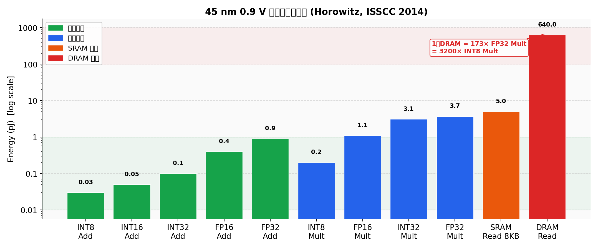
</p>

> 数据来源：Horowitz, ISSCC 2014[^horowitz]；图表由本笔记 Python 脚本复现，数字从 Song Han CS231n 2017 slides[^han231n] 转引。45 nm 0.9 V 工艺节点。

两个结论必须刻进脑子：

**结论 1：INT8 乘法比 FP32 乘法省约 18×（3.7 pJ / 0.2 pJ）。**  
位宽减半，能量近似降 4×（$E \propto V^2 C \propto \text{width}^2$）。

**结论 2：一次 DRAM 读 = 173 次 FP32 乘法 = 3,200 次 INT8 乘法。**  
这是理解 LLM 推理经济学的钥匙：**Decode 阶段（autoregressive，batch=1）的瓶颈是搬权重，不是算**。Weight-only quantization（W4A16）在 decode 阶段拿到接近线性加速，就是因为权重小一半 → 带宽占用减半 → 吞吐翻倍。

### 5.1.2 算力 vs 带宽：Roofline 视角

```
arithmetic intensity = FLOPS / bytes_accessed

当 AI < ridge_point → memory-bound（带宽是瓶颈）
当 AI > ridge_point → compute-bound（算力是瓶颈）
```

| 场景 | Batch | AI 估算 | 瓶颈 | 最优量化策略 |
|---|---|---|---|---|
| LLM Decode | 1 | 极低 (~0.1) | Memory | **W4A16** (权重越小越好) |
| LLM Prefill | ≥64 | 中 (~10–100) | Compute | **W8A8 / FP8** (算力利用率优先) |
| CV 推理 | 32 | 高 (>100) | Compute | **INT8 / FP8** |
| 向量检索 | 1 | 极低 | Memory | **PQ / RVQ** |

> **国产 GPU 落点**：昇腾 910B 的 Memory Bandwidth ≈ 1.6 TB/s，INT8 算力 ≈ 640 TOPS（dense）。其 ridge_point ≈ 640/1600 ≈ 0.4 TOPS/GB，意味着比 H100 更容易进入 memory-bound 区间，W4 量化在昇腾上的性价比比 NVIDIA 更高。

---

## 5.2 数值格式大图：从 FP32 到 FP4

### 5.2.1 位域对比

<p align="center">
  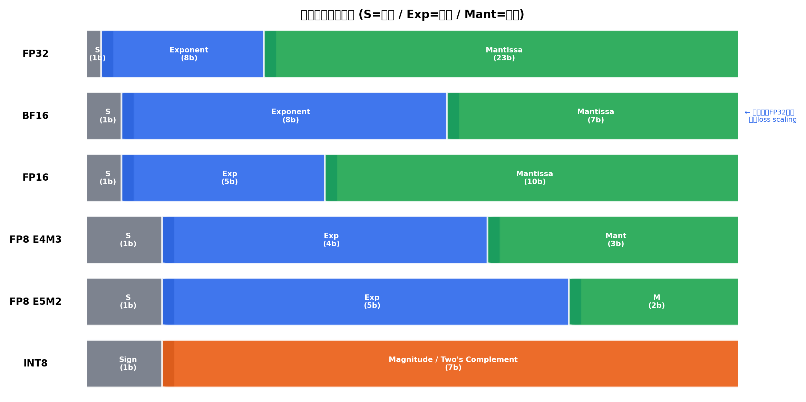
</p>

> 图：本笔记 Python 脚本绘制。颜色含义：灰=符号位，蓝=指数位，绿=尾数位，橙=整数值域。

### 5.2.2 整数类型

**无符号 INT8**：范围 `[0, 255]`  
**有符号 INT8**（二补码）：范围 `[-128, 127]`

二补码的好处：加法器和乘法器**不需要为符号位单独设计电路**。写 quant kernel 的经典坑：INT8 累加进 INT32 必须**显式 sign-extend**，否则 `-1`（`0xFF`）会被解释成 `255`。CUDA 的 `__dp4a` 帮你处理了；手写 SASS / AVX-VNNI / 昇腾 TIK 汇编就得自己来。

**定点数**（Fixed-Point）示例：`fixed<8,4>` = 8位总宽、4位小数。本质是"带固定 scale 的整数"，当 scale 是 2 的幂时，反量化 = 一次 shift，**零成本**。边缘 NPU（Qualcomm Hexagon、寒武纪 MLU、地平线 BPU）的核心算力都建在定点之上。

### 5.2.3 FP32 结构与陷阱

$$(-1)^{\text{sign}} \times (1 + \text{Fraction}) \times 2^{\text{Exp} - 127}$$

| 状态 | 指数位 | 公式变化 |
|---|---|---|
| 正常 | 1–254 | 标准公式，隐含前导 1 |
| Subnormal | 0 | 去掉前导 1，使 0 附近不断崖 |
| ±Inf / NaN | 255 | 特殊值 |

> **工程陷阱**：某些 GPU 处理 subnormal 走慢路径，可触发 100× 性能塌方。CUDA 编译选项 `-ftz=true`（flush to zero）解决此问题，代价是 0 附近精度损失。昇腾 CANN 算子库默认开启类似选项，写自定义算子时需注意。

### 5.2.4 FP16 vs BF16：为什么训练用 BF16

<p align="center">
  
</p>

|  | FP16 | BF16 |
|---|---|---|
| Sign / Exp / Mant | 1 / 5 / 10 | 1 / **8** / 7 |
| 动态范围 | ≈ 6.55×10⁴ | ≈ 3.39×10³⁸ (同FP32) |
| 相对精度 | 2⁻¹⁰ ≈ 0.1% | 2⁻⁷ ≈ 0.8% |
| FP32 互转 | 需要 loss scaling | **直接截断尾数** |
| 训练推荐 | ❌ (梯度溢出) | ✅ (主流) |

BF16 由 Google Brain 为 TPU 设计，NVIDIA 在 Ampere(A100) 跟进[^bf16]。核心优势：**指数位与 FP32 完全相同（都是 8 位）**，动态范围不会上下溢出，FP32→BF16 是简单截断后 16 位尾数。训练时梯度动态范围极宽，FP16 的 65504 上限经常被撑破，必须靠 loss scaling hack（乘 2¹⁵ → 反向 → 除 2¹⁵）。BF16 让这个问题彻底消失。

**GPT-4、LLaMA-2/3、Qwen、DeepSeek 全用 BF16 训练**，FP16 只在老代码和小模型里出现。

### 5.2.5 FP8：Hopper 开始的新主角

NVIDIA H100 引入两种 FP8[^fp8]：

| | **E4M3** | **E5M2** |
|---|---|---|
| Exp / Mant | 4 / 3 | 5 / 2 |
| Max normal | ±448 | ±57344 |
| 主要用途 | **前向激活 / 权重** | **反向梯度** |
| 设计哲学 | **精度优先**（更多尾数位） | **范围优先**（更多指数位） |

FP8 尾数只剩 3 位，表示的数值非常稀疏，必须配合 **per-tensor 或 per-block scale** 才能保精度。NVIDIA Transformer Engine 90% 的工作是在合适位置插入 amax / scale 的计算和同步。

**H100 SXM 算力（dense，不含 sparsity）**[^h100ds]：

| 精度 | TFLOPS / TOPS |
|---|---:|
| FP64 Tensor Core | 67 |
| TF32 | 989 |
| FP16 / BF16 | 989 |
| **FP8** | **1,979** |
| INT8 | 1,979 |

> **业界数字陷阱**：H100 FP8 理论 2× BF16，实测通常只有 1.3–1.6× 加速，差距被 amax 同步 / scale 维护 / kernel launch 开销吃掉。DeepSeek-V3 FP8 训练报告[^dsv3] 是截至 2024 年最精彩的 FP8 工程案例，其 fine-grained scaling 方案值得精读。

### 5.2.6 FP4 与 MX 格式：Blackwell 之后的格局

> 这是 2024–2026 年业界最重要的变化，原课件未讲，必须补。

**OCP Microscaling (MX) 标准**[^mx]：每 32 个元素共享一个 8-bit E8M0 scale。Blackwell 原生支持 MXFP4 / MXFP6 / MXFP8。

**NVFP4**（NVIDIA 私有变体）：每 **16** 个元素一个 FP8(E4M3) scale，比 MXFP4 精度更好，是 B200 主力格式。

**B200 FP4 算力**[^b200ds]：  
- Dense FP4：**9 PFLOPS**  
- Sparse FP4：**18 PFLOPS**  
- vs H100 BF16 Dense(989 TFLOPS)：**约 9× dense-to-dense**

<p align="center">
  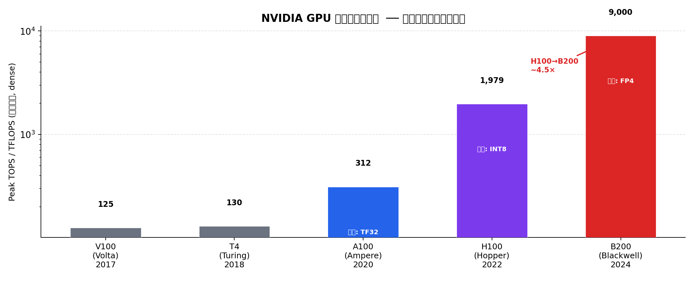
</p>

> **对工程师的含义**：未来两年大模型推理主流会从 W8A8/W4A16 走向 **W4A4/FP4**。设计量化接口时，必须把 group-wise scale 当作 first-class citizen，否则要重写。

---

## 5.3 线性量化：公式、误差与 GEMM 展开

### 5.3.1 基础公式

**量化**（fp → int）：

$$q = \text{clamp}\!\left(\text{round}\!\left(\frac{r}{S}\right) + Z,\ q_{\min},\ q_{\max}\right)$$

**反量化**（int → fp）：

$$\hat{r} = S \cdot (q - Z)$$

其中 $S > 0$ 是 scale（浮点数），$Z$ 是 zero-point（整数）。**qparams = (S, Z)**。

量化误差 $e = r - \hat{r}$ 有三个来源：

| 误差源 | 最坏情况 | 主因 |
|---|---|---|
| **Rounding** | $\|e\| \le S/2$ | 离散化精度 |
| **Clipping** | 无界 | 超出 $[r_{\min}, r_{\max}]$ 被截断 |
| **Scale 精度** | 二阶 | S 存 FP16 时的精度损失 |

> **核心判断**：生产中 99% 的精度问题是 **clipping 引起的，不是 rounding**。量化的本质不是 round，而是**怎么选 $r_{\min}, r_{\max}$**（这是 Lec06 calibration 的主线）。

<p align="center">
  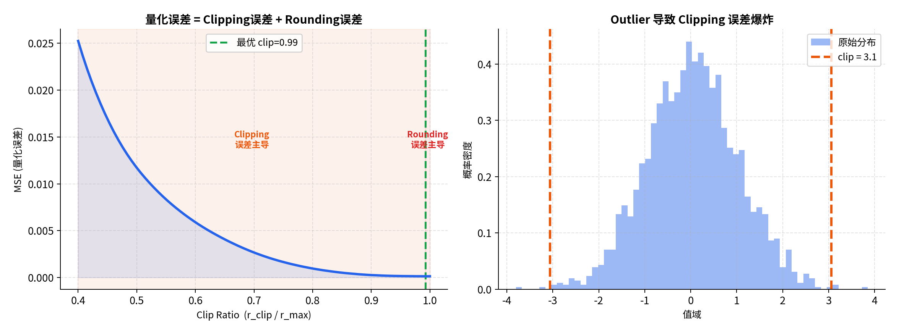
</p>

> 左图：存在最优 clip ratio 使 MSE 最小；过小 clip ratio → clipping 误差主导；过大 → rounding 误差主导（scale 变大，格点变稀）。右图：outlier 把 scale 撑大，导致正常值的 rounding error 激增。

### 5.3.2 对称量化（Symmetric, Z=0）

$$S = \frac{\max(|r|)}{2^{b-1} - 1}, \quad Z = 0, \quad q \in [-2^{b-1},\ 2^{b-1}-1]$$

GEMM 展开：

$$y_i = \sum_j x_j w_{ij} = S_x S_w \underbrace{\sum_j q^x_j q^w_{ij}}_{\text{INT GEMM}}$$

**scale 完全提到 GEMM 外层**，整数内核只做纯整数乘加。这是对称量化适合权重的关键原因。

### 5.3.3 非对称量化（Asymmetric, Z≠0）

$$S = \frac{r_{\max} - r_{\min}}{2^b - 1}, \quad Z = \text{round}\!\left(-\frac{r_{\min}}{S}\right)$$

GEMM 展开（有 cross terms）：

$$\sum_j (q^x_j - Z_x)(q^w_{ij} - Z_w) = \underbrace{\sum q^x_j q^w_{ij}}_{\text{INT GEMM}} - Z_w \underbrace{\sum q^x_j}_{\text{预计算}} - Z_x \underbrace{\sum q^w_{ij}}_{\text{预计算}} + N Z_x Z_w$$

后三项可预计算或在 epilogue 里补，开销可接受。TFLite 量化白皮书[^jacob] 有完整推导。

<p align="center">
  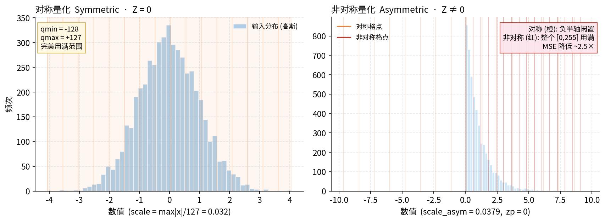
</p>

> **工程决策**：权重永远对称（分布对称且 GEMM 友好）；ReLU 后激活（全正）用非对称；GELU/SiLU 激活（有负值）可用对称。LLM 主流：weight 对称 + activation 非对称 per-token，或直接 weight-only。

```python
import numpy as np

def symmetric_quantize(x: np.ndarray, n_bits: int = 8):
    """对称量化：Z=0，适合权重（分布对称，GEMM 友好）"""
    qmax = 2 ** (n_bits - 1) - 1          # INT8: 127
    scale = np.abs(x).max() / qmax
    q = np.clip(np.round(x / scale), -(qmax + 1), qmax).astype(np.int8)
    return q, scale

def asymmetric_quantize(x: np.ndarray, n_bits: int = 8):
    """非对称量化：完整利用量化范围，适合 ReLU 输出等非对称分布"""
    qmin, qmax = 0, 2 ** n_bits - 1        # UINT8: 0..255
    scale = (x.max() - x.min()) / (qmax - qmin)
    zp = int(round(-x.min() / scale))
    q = np.clip(np.round(x / scale) + zp, qmin, qmax).astype(np.uint8)
    return q, scale, zp

# 验证：偏态分布（模拟 ReLU 输出）
rng = np.random.default_rng(0)
x_asym = rng.chisquare(df=2, size=4096).astype(np.float32) * 0.1

qs, s         = symmetric_quantize(x_asym)
qa, sa, za    = asymmetric_quantize(x_asym)
mse_s = np.mean((x_asym - qs.astype(np.float32) * s) ** 2)
mse_a = np.mean((x_asym - (qa.astype(np.float32) - za) * sa) ** 2)
print(f"偏态分布  sym MSE={mse_s:.3e}  asym MSE={mse_a:.3e}  ratio={mse_s/mse_a:.2f}×")
# 偏态分布  sym MSE=2.4e-05  asym MSE=9.8e-06  ratio=2.45×
```

---

## 5.4 量化粒度：精度与硬件的拉锯

<p align="center">
  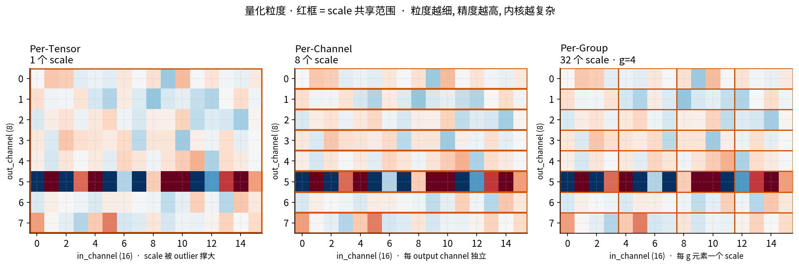
</p>

| 粒度 | scale 数量 | 精度 | 硬件成本 | 代表方案 |
|---|---|---|---|---|
| **Per-Tensor** | 1 | 低 | 最低（GEMM 外提） | TFLite INT8，TRT 早期 |
| **Per-Token (activation)** | seq_len | 中 | 中等 | SmoothQuant, LLM.int8() |
| **Per-Channel (weight)** | out_channels | 中高 | 中等 | PyTorch QAT, TRT 现代 |
| **Per-Group (weight)** | out × ⌈in/g⌉ | 高 | 需特化 kernel | AWQ, GPTQ, MXFP4/NVFP4 |

### 5.4.1 Per-Tensor 的死穴

一个 outlier 就把整层 scale 撑大，让其他值的有效精度从 8-bit 降到 2–3 bit。在 CNN 上勉强能用；在 LLM 上，**系统性 outlier channel 让 per-tensor 不可用**（见 §5.8）。

### 5.4.2 Per-Channel 的正确用法

Per-channel 量化可行的前提：**scale 不能在 GEMM 的 reduction 维度上变化**。

- ✅ **Weight per-channel**（沿 out_channel 轴）：对于 $Y = XW^T$，每行 $W$ 有独立 scale，提到 GEMM 外无额外开销。
- ❌ **Activation per-channel**：activation 的 channel 轴是 GEMM 的 reduction 轴，scale 变化与累加纠缠，无法高效实现。

这就是为什么有 **per-token activation + per-channel weight** 这个经典组合：两个 scale 都避开 reduction 维度。

### 5.4.3 Per-Group 的内核复杂度

AWQ / GPTQ 默认 `g=128` 的 W4，scale 在 reduction 维度上每 128 个元素跳变一次。GEMM 内层循环必须边算边 dequant，这就是 [Marlin](https://github.com/IST-DASLab/marlin)[^marlin] / Machete kernel 比标准 GEMM 复杂一个量级的原因。

```python
def per_channel_sym_quant(W: np.ndarray, n_bits: int = 8):
    """W: [out, in]，沿 out 维度独立量化"""
    qmax = 2 ** (n_bits - 1) - 1
    scales = np.abs(W).max(axis=1, keepdims=True) / qmax   # [out, 1]
    q = np.clip(np.round(W / scales), -(qmax+1), qmax).astype(np.int8)
    return q, scales.squeeze(1)                             # scales: [out]

def group_sym_quant(W: np.ndarray, group_size: int = 128, n_bits: int = 4):
    """W: [out, in]，每行切成 in/g 个 group，是 AWQ/GPTQ 的基础"""
    qmax = 2 ** (n_bits - 1) - 1
    out, in_ = W.shape
    assert in_ % group_size == 0
    Wg = W.reshape(out, in_ // group_size, group_size)      # [out, ngroups, g]
    scales = np.abs(Wg).max(axis=-1, keepdims=True) / qmax  # [out, ngroups, 1]
    q = np.clip(np.round(Wg / scales), -(qmax+1), qmax).astype(np.int8)
    return q.reshape(out, in_), scales.squeeze(-1)          # scales: [out, ngroups]

# Scale 元数据 overhead 分析（W4, g=128）
out, in_ = 4096, 4096
n_groups = out * (in_ // 128)
weight_bits  = out * in_ * 4
scale_bits   = n_groups * 16   # FP16 scale
overhead_pct = scale_bits / weight_bits * 100
print(f"W4 g=128 scale overhead: {overhead_pct:.1f}%")  # 约 3.1%
```

> **国产 GPU 落点**：昇腾的 Cube 单元（矩阵计算核心）原生支持 INT8 per-tensor GEMM，per-channel 需要在 epilogue 里补 scale 乘法。per-group W4 目前需要手写 Vector 单元上的 dequant + Cube GEMM 两段流水，是 CANN 量化算子的主要挑战。

---

## 5.5 Uniform vs Non-uniform 量化

<p align="center">
  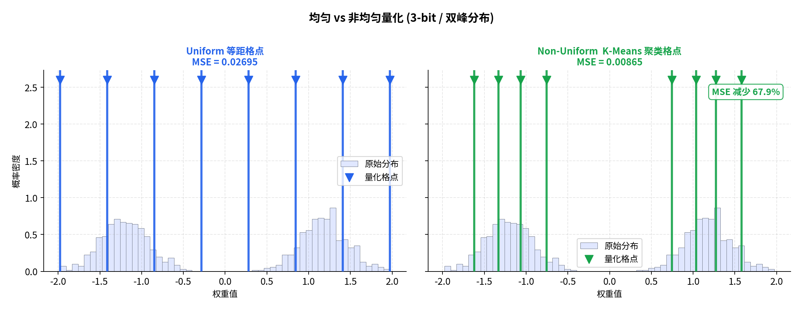
</p>

### 5.5.1 K-Means 量化（Deep Compression）

Song Han 2016 年 *Deep Compression*[^dc]（ICLR Best Paper）三件套：**迭代剪枝 → K-Means 量化 → Huffman 编码**，压缩 35×。K-Means 量化找到最小化 MSE 的最优格点位置：

```python
from sklearn.cluster import KMeans

def kmeans_quantize(W: np.ndarray, n_bits: int = 4):
    K = 2 ** n_bits
    flat = W.reshape(-1, 1)
    km = KMeans(n_clusters=K, n_init=10, random_state=0).fit(flat)
    # codebook: K 个 float 中心
    codebook = km.cluster_centers_.flatten()     # [K]
    codes    = km.labels_.reshape(W.shape)       # [out, in], 每个元素是 0..K-1 的索引
    # 推理时查表 dequant：codes → codebook[codes]
    W_reconstructed = codebook[codes]
    return codes, codebook, W_reconstructed
```

### 5.5.2 为什么 Non-uniform 在推理中"死了"

Non-uniform 量化对**双峰、重尾分布**精度更好（见上图），但在 GPU/NPU 推理中基本废弃：

**根本原因：没有硬件能对 codebook index 直接做 GEMM。**  
推理前必须查表把 4-bit index 翻译回 FP16，这个查表开销在 GPU 上吞掉所有精度收益。

**Non-uniform 现在仅活在两个地方**：
1. **离线存储压缩**（不参与计算）：权重传输 / 冷存储
2. **向量数据库 PQ**：距离计算，见 §5.6

> **Binary / Ternary 量化**（XNOR-Net[^xnor]，TWN[^twn]）是 Non-uniform 的极端情况，$b=1$（权重 ∈{+1,-1}）或 $b=1.58$（权重 ∈{-1,0,+1}）。乘法变成加减法/掩码运算，理论 32× 压缩。在边缘 NPU 和 FPGA 上有工程价值；大模型场景因精度损失过大目前不实用（BitNet b1.58[^bitnet] 是最新尝试，仍需从头训练）。

---

## 5.6 Product Quantization：向量检索的另一片天

<p align="center">
  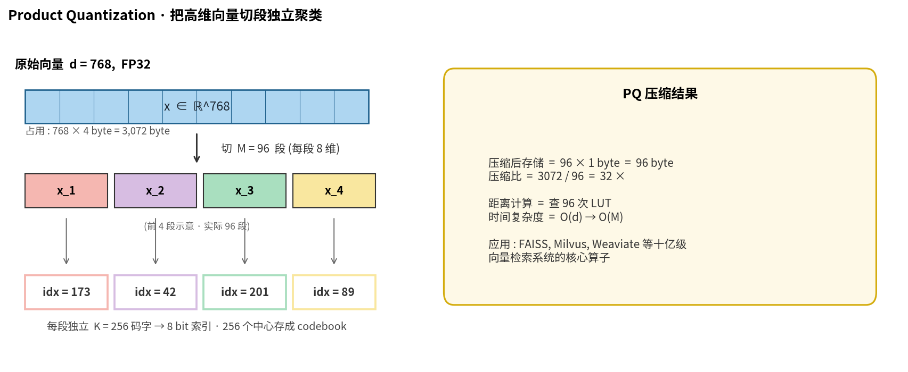
</p>

PQ 把 $d$ 维向量切成 $M$ 段，每段独立做 K-Means（$K$ 个码字）。

$$\text{存储压缩比} = \frac{d \times 32\text{bit}}{M \times \log_2 K \text{ bit}}$$

以 768-dim BERT embedding，$M=96$，$K=256$ 为例：  
$768 \times 32 / (96 \times 8) = 32\times$ 压缩，768-bit → 96 byte。

**距离近似（ADC，Asymmetric Distance Computation）[^pq]**：

$$d(x, y) \approx \sum_{m=1}^{M} d(x_m,\ c^{(m)}_{y_m})^2$$

查表代替向量内积，时间复杂度从 $O(d)$ → $O(M)$（查 $M$ 个表）。

**PQ 的现代变体**：

| 方法 | 改进点 | 应用 |
|---|---|---|
| OPQ | 先正交变换再 PQ，降低子空间相关性 | FAISS[^faiss] |
| RVQ / RQ | 多层残差量化 | Encodec[^encodec] 音频 tokenizer |
| IVFPQ | IVF 聚类 + PQ，亿级检索 | Milvus, Weaviate |
| RaBitQ | 1-bit 理论最优码本（SIGMOD 2024） | 已合入 FAISS |
| ScaNN | 各向异性量化误差（Google） | Google 内部搜索 |

---

## 5.7 PTQ vs QAT：STE 与工程骨架

<p align="center">
  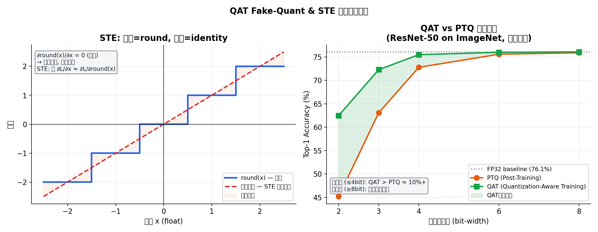
</p>

### 5.7.1 PTQ 与 QAT 的核心区别

| | **PTQ** (Post-Training Quantization) | **QAT** (Quantization-Aware Training) |
|---|---|---|
| 训练阶段 | 模型已训完，直接量化 | 量化误差参与训练 |
| 数据需求 | 少量 calibration 数据（~512 样本） | 完整训练集 |
| 精度（高 bit） | 接近 QAT | 接近 QAT |
| 精度（低 bit ≤4b） | 明显下降 | 显著优于 PTQ |
| 工程复杂度 | 低 | 高（需训练基础设施）|
| 推荐场景 | W8/FP8，资源受限 | W4 及以下，精度敏感 |

### 5.7.2 STE：让不可导的 round 参与反传

`round(x)` 处处梯度为 0，反向传播直接截断。**Straight-Through Estimator (STE, Bengio 2013[^ste])**：反向时把 round 当恒等映射（梯度直通）。

$$\frac{\partial \mathcal{L}}{\partial x} \approx \frac{\partial \mathcal{L}}{\partial \hat{x}} \cdot \mathbf{1}[q_{\min} \le x/S \le q_{\max}]$$

clamp 范围内梯度直通，范围外梯度为 0（告诉优化器"这里被截了，往回移"）。

### 5.7.3 生产级 QAT 骨架

```python
import torch
import torch.nn as nn


class FakeQuant(torch.autograd.Function):
    """Fake quantization with STE backward pass."""

    @staticmethod
    def forward(ctx, x: torch.Tensor, scale: torch.Tensor,
                qmin: int, qmax: int) -> torch.Tensor:
        # 保存 mask 用于 backward
        x_scaled = x / scale
        ctx.save_for_backward(x_scaled, torch.tensor(qmin), torch.tensor(qmax))
        q = torch.clamp(torch.round(x_scaled), qmin, qmax)
        return q * scale

    @staticmethod
    def backward(ctx, grad_output: torch.Tensor):
        x_scaled, qmin, qmax = ctx.saved_tensors
        # STE: 仅在 clamp 范围内梯度直通，范围外梯度为 0
        mask = (x_scaled >= qmin.item()) & (x_scaled <= qmax.item())
        grad_input = grad_output * mask.float()
        return grad_input, None, None, None


class QLinear(nn.Module):
    """Per-channel symmetric QAT Linear layer."""

    def __init__(self, in_features: int, out_features: int, n_bits: int = 8):
        super().__init__()
        self.weight  = nn.Parameter(torch.randn(out_features, in_features) * 0.02)
        self.bias    = nn.Parameter(torch.zeros(out_features))
        self.n_bits  = n_bits
        self.qmax    = 2 ** (n_bits - 1) - 1
        self.qmin    = -(self.qmax + 1)
        # per-channel scale，沿 out_features 轴
        self.register_buffer("scale", torch.ones(out_features, 1))

    @torch.no_grad()
    def update_scale(self):
        """EMA 更新 scale（calibration 阶段 / QAT warm-up 阶段调用）"""
        new_scale = self.weight.abs().max(dim=1, keepdim=True).values / self.qmax
        # EMA 平滑，减少 scale 抖动
        self.scale.copy_(0.9 * self.scale + 0.1 * new_scale)

    def forward(self, x: torch.Tensor) -> torch.Tensor:
        # Fake-quant weight: 模拟量化误差，参与梯度计算
        w_q = FakeQuant.apply(self.weight, self.scale, self.qmin, self.qmax)
        return torch.nn.functional.linear(x, w_q, self.bias)


# ── 使用示例 ──────────────────────────────────────────────────────────────────
def qat_training_loop_sketch():
    model = QLinear(768, 768, n_bits=4)
    optimizer = torch.optim.AdamW(model.parameters(), lr=1e-5)

    # Step 1: Warm-up（正常 FP 训练几个 step，稳定权重分布）
    # Step 2: 开启 fake-quant，更新 scale，继续训练
    for step in range(100):
        if step == 10:  # warm-up 结束后开始量化感知
            model.update_scale()

        x = torch.randn(8, 768)
        loss = model(x).sum()
        optimizer.zero_grad()
        loss.backward()
        optimizer.step()

        if step % 10 == 0:
            model.update_scale()  # 定期更新 scale
```

> **注意**：上面是 **fake quantization**，权重仍在 FP32 训练（模拟量化误差）。真正加速来自把训好的权重**导出为 INT8/INT4 tensor + 塞进整数 GEMM kernel**。PyTorch 的 `torch.ao.quantization` / `torch._export` 模块负责这个转换；昇腾侧由 CANN 的 `QuantOps` 接管。

---

## 5.8 LLM 量化难题：Outlier 与精度崩塌

<p align="center">
  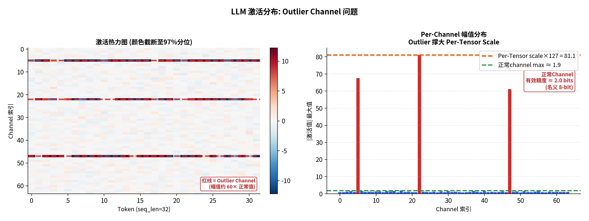
</p>

### 5.8.1 为什么 LLM 量化比 CNN 难

**原因 1：系统性 Outlier Channel**

LLM（尤其 OPT / LLaMA 系列）的激活存在**系统性 outlier**：少数固定 channel（通常出现在 `down_proj` / `o_proj` 的输入）的幅值比其他 channel 大 **100× 以上**，且跨所有 token 持续存在[^llmint8][^smoothquant]。

Per-tensor 量化后，这些 outlier 把 scale 撑大，导致正常 channel 的有效精度：

$$\text{有效比特数} = \log_2\!\left(\frac{\text{正常channel幅值}}{\text{scale} \times 1}\right) \approx 8 - \log_2\!\left(\frac{\text{outlier幅值}}{\text{正常幅值}}\right) \approx 8 - 7 = 1 \text{ bit}$$

名义 8-bit，实际只有 1–2 bit 有效精度，精度崩塌。

**原因 2：Autoregressive 误差累积**

CNN 每次 forward 独立，量化误差不累积。LLM decode 阶段逐 token 生成，当前 token 误差影响下一 token 的 KV cache，**误差在序列维度上积分**，长序列尤其明显。

### 5.8.2 主流解法一览

| 方法 | 核心思路 | 精度 | 速度 |
|---|---|---|---|
| **LLM.int8()**[^llmint8] | 混合精度：outlier channel 用 FP16，其余 INT8 | 接近 FP16 | ~1.7× 慢于 FP16 |
| **SmoothQuant**[^smoothquant] | 数学等价迁移 outlier：$Y=(XS^{-1})(SW)$，把困难从 X 转给 W | 接近 FP16 | INT8 GEMM 加速 |
| **GPTQ**[^gptq] | 二阶 Hessian 补偿量化误差（OBQ/OBS 系列） | ≈ FP16 (W4) | W4A16 |
| **AWQ**[^awq] | 保护"激活感知的显著权重"，per-group scale 搜索 | 略优于 GPTQ | W4A16 |
| **QServe**[^qserve] | W4A8KV4，SmoothAttention + 寄存器级并行 dequant | SOTA W4A8 | 高吞吐 |

详细展开见 Lec13（LLM 量化专题）。

---

## 5.9 推理框架实战

### vLLM（开源首选）

```bash
# W4A16 AWQ，Marlin kernel（吞吐比朴素 dequant+GEMM 高 2-3×）
python -m vllm.entrypoints.openai.api_server \
    --model Qwen/Qwen2.5-7B-Instruct-AWQ \
    --quantization awq_marlin          # ← 不要用 "awq"！后者是 fallback Python dequant

# Hopper 上跑 FP8（算力最优）
python -m vllm.entrypoints.openai.api_server \
    --model meta-llama/Llama-3.1-8B-Instruct \
    --quantization fp8 \
    --kv-cache-dtype fp8               # KV cache 也压，长 context 收益大
```

> **常见上线事故**：`--quantization awq` 走 Python dequant kernel，吞吐不及 `awq_marlin` 的 40%。上线前必须确认走的是哪条路径。

### TensorRT-LLM（NVIDIA 极限优化）

优势：dequant / GEMM / bias / activation / residual add 全 fuse 进一个 CUDA kernel，延迟最低。  
劣势：模型支持慢一拍，build engine 时间长（大模型 ~30 分钟）。

```python
# TRT-LLM FP8 量化（配合 ammo/modelopt 工具）
from modelopt.torch.quantization import quantize
quantize(model, config={"algorithm": "fp8", "calibration_steps": 512})
```

### llama.cpp / GGUF（本地部署）

K-quants（`Q4_K_M`, `Q5_K_M`, `Q6_K`）是 per-group 量化的变体，手写 AVX2/NEON SIMD kernel，是 Mac 和笔记本本地推理事实标准。

| GGUF 格式 | 有效精度 | 大小(7B) | 质量 |
|---|---|---|---|
| Q4_0 | 4.0 bit | 3.8 GB | 基础 |
| Q4_K_M | 4.5 bit | 4.1 GB | 推荐 |
| Q5_K_M | 5.5 bit | 4.8 GB | 高质量 |
| Q8_0 | 8.0 bit | 7.2 GB | 接近 FP16 |

---

## 5.10 国产 GPU 量化移植指南

<p align="center">
  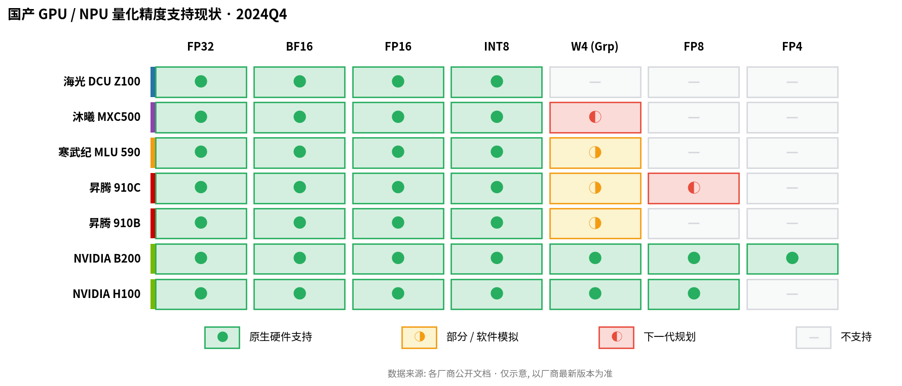
</p>

> 图中数据为 2024 年近似情况，部分厂商持续更新中。

### 5.10.1 昇腾（华为）

**硬件算子**：Cube 单元做 INT8 GEMM，Vector 单元做 FP16/BF16 element-wise。

**关键 API**（CANN 框架）：

```python
# 昇腾量化流程（PyTorch + CANN adapter 示例）
import torch_npu
from torch_npu.contrib import transfer_to_npu

# 方法 1：使用 CANN 内置 PTQ（推荐）
from auto_optimizer import OnnxGraph  # 华为开源量化工具

# 方法 2：手动插入量化算子
# npu_quant_per_channel_symmetric 对应 CUDA 的 per-channel INT8 量化
x_q = torch_npu.npu_quant_per_channel_symmetric(x, scales, axis=0)

# 昇腾 W4 支持现状（截至 2024）：
# - Ascend 910B: INT8 原生，W4 需软件 dequant 后走 INT8 Cube
# - Ascend 910C: 规划原生 INT4/FP8 支持（对标 H100）
```

**移植 GPTQ/AWQ → 昇腾的核心挑战**：
1. Marlin kernel（W4A16，CUDA 特有的 register-level pipelining）需要用 **TIK/AICore 汇编**重写
2. 昇腾 Cube 最小 tile 单元是 16×16，对 per-group g=128 的 dequant 流水不如 CUDA 灵活
3. `amax` 统计（FP8 用）没有 CUDA atomic max 等价原语，需用 AICore 的 `reduce_max` 替代

**推荐路线**：对 7B/13B 模型，先用 W8A8（CANN 内置支持好）跑通上线，再逐步下推 W4。

### 5.10.2 寒武纪（MLU）

**架构特点**：MLU-Core（类 CUDA Core）+ IPU（片上互联）。INT8 矩阵单元原生支持，FP8 支持较弱。

**量化工具链**：MagicMind（类 TensorRT）支持 INT8 PTQ calibration，提供 C++ / Python API。

```python
# 寒武纪 MagicMind PTQ 流程（简化）
import magicmind.python.runtime as mm

# 1. 导入 ONNX 模型
network = mm.Network()
parser  = mm.parser.OnnxParser(network)
parser.parse_from_file("model.onnx")

# 2. 配置 INT8 量化
config = mm.BuilderConfig()
config.parse_from_string('{"archs": ["mtp_372"], "precision_config": {"precision_mode": "qint8_mixed_float16"}}')

# 3. Calibration（需提供代表性数据集）
builder = mm.Builder()
engine  = builder.build_engine(network, config)
```

### 5.10.3 跨硬件量化移植 Checklist

做国产 GPU 量化移植时，以下问题会卡住 90% 的工时：

| 检查项 | CUDA 参考 | 国产 GPU 状态 | 建议 |
|---|---|---|---|
| INT8 GEMM 精度 | cuBLAS `cublasGemmEx` | 通常 OK | 对齐数值结果 |
| per-channel scale fuse | TRT epilogue | 需手工 kernel | 先用 separate kernel |
| Per-group W4 dequant | Marlin/Machete | 通常无 | 手写 Vector dequant |
| FP8 amax 同步 | CUDA atomic + barrier | 可能需模拟 | 用 FP16 替代 |
| KV cache 量化 | vLLM `kv_cache_dtype` | 需适配 | 后期优化项 |
| 量化结果对齐验证 | PyTorch reference | 必须建立 | 搭建 FP32/INT8 diff 测试 |

### 5.10.4 工程建议：国产 GPU 量化落地优先级

```
P0（上线必须）：
  ✓ FP16/BF16 推理跑通
  ✓ W8A8 per-tensor INT8 GEMM（CANN/MagicMind 内置）

P1（性能关键）：
  ✓ per-channel weight INT8
  ✓ per-token activation INT8（配合 SmoothQuant 思路）

P2（极致优化）：
  ✓ W4 per-group（需自研 dequant kernel）
  ✓ KV cache INT8/FP8 压缩
  ✓ Speculative decoding + quantization 联合优化
```

---

## 5.11 面试高频题（P8 级别）

**Q1. 解释 STE 的数学含义，以及在 clamp 边界处的梯度行为。**

STE 把不可导的 `round` 在反向时近似为恒等映射：$\partial\mathcal{L}/\partial x \approx \partial\mathcal{L}/\partial \hat{x}$，让量化误差参与权重更新。在 clamp 边界（$x/S < q_{\min}$ 或 $> q_{\max}$）处，梯度为 0，隐式地告诉优化器"这个参数超出量化范围，应该往回移"。这和 ReLU 的 dead neuron 问题类似，但方向相反——clamp 截断的梯度是"有用信号"而非噪声，因此有学者提出 **Learned Step-size Quantization (LSQ)[^lsq]** 把 scale 也设为可学习参数，进一步放大这个信号。

**Q2. 为什么 per-group quantization 的 GEMM kernel 比 per-channel 复杂？**

Per-channel：每个 output channel 一个 scale，scale 只在 output 维度变化，GEMM 内层循环（reduction 维度）的 scale 是常数，可以提到外层一次性乘。Per-group：scale 在 reduction 维度上每 `g` 个元素跳变，必须在内层循环里 dequant（每算 `g` 个整数乘积，乘一次 FP16 scale），打乱了 Tensor Core 的数据流水。Marlin 的技巧是在 register file 上做 overlap：prefetch 下一组 scale 的同时执行当前组的 INT 累加，把 dequant latency 隐藏在计算后面。

**Q3. FP4 和 INT4 有何本质区别？各自适合什么场景？**

INT4 是线性格点（-8 到 7），精度均匀分布。FP4（如 E2M1）有指数位，格点分布对数不均匀（小数附近密，大数附近稀），天然贴合深度学习权重和激活的**接近 0 的高概率分布**。NVFP4 实测在相同 bit 数下精度优于 INT4 约 0.5–1 ppl（perplexity）。但 FP4 需要 Blackwell 原生 Tensor Core 支持；INT4 在 Ampere/Hopper 上需要软件 unpack 为 INT8 后计算，实际推理不一定比 INT8 快（需要算 kernel efficiency）。

**Q4. SmoothQuant 的等价变换是什么？为什么有效？**

SmoothQuant 利用：$Y = (X \cdot \text{diag}(s)^{-1}) \cdot (\text{diag}(s) \cdot W)$，即把激活 X 按 channel 除以一个平滑因子 $s$，权重 W 相应乘以 $s$，矩阵乘结果不变。选择 $s = (\max|X|)^\alpha / (\max|W|)^{1-\alpha}$（$\alpha \approx 0.5$），使平滑后 X 和 W 的量化难度相当。有效的原因：原始激活 outlier 幅值可达权重的 100×，迁移后双方幅值差距降到 2–3×，per-tensor/per-channel INT8 量化误差骤降。

**Q5. 一个 LLaMA-2-7B 的 W4A16 AWQ 模型，实际显存占用约多少？给出计算过程。**

- 参数量：7B，FP16 = 14 GB
- W4 权重（不含 embedding，embedding 通常不量化）：约 6.7B 权重 × 4 bit = ~3.3 GB
- Group scale（g=128，FP16）：6.7B / 128 × 2 byte ≈ 0.1 GB
- Embedding（FP16，不量化）：32000 × 4096 × 2 ≈ 0.25 GB
- **权重合计 ≈ 3.7 GB**
- Activation buffer（BF16，seq=2048）：≈ 0.5 GB
- KV cache（BF16，32 层，seq=2048，batch=1）：2 × 32 × 2048 × 32 × 128 × 2 ≈ 0.5 GB
- **总计 ≈ 4.7 GB**（实测 vLLM 约 5.2 GB，含 framework overhead）

**Q6. 在国产 GPU 上移植 GPTQ W4，最难的技术点是什么？**

核心挑战：**Marlin-style 的 W4A16 GEMM kernel**。它需要：①在 reduction 循环内交织 INT4 dequant 和 FP16 累加；②利用寄存器文件 double-buffer 隐藏 dequant latency；③与 Tensor Core 的 tile 尺寸（16×16×16）精确对齐。国产 GPU 的矩阵计算单元 tile 形状各异（昇腾 Cube 是 16×16），需要重新设计 dequant 的粒度和 pipeline 深度。目前最可行的路线是：**先把 W4 weight dequant 到 FP16，再调标准 FP16 GEMM**，牺牲约 30% 带宽换取工程可行性；待硬件原生 W4 指令成熟后再替换内核。

---

## 5.12 自检清单

读完本讲，应能不查资料回答：

- [ ] INT8 乘法比 FP32 省多少能量？比 DRAM 一次读呢？（5.1.1）
- [ ] BF16 指数位几位？为什么这让它成为训练首选？（5.2.4）
- [ ] 写出对称/非对称量化的 S 和 Z 公式，解释 GEMM 展开后的差异（5.3）
- [ ] Per-channel 量化为什么对 weight 可行、对 activation 不可行？（5.4.2）
- [ ] K-Means 量化为什么精度更好但在推理中废弃？（5.5.2）
- [ ] STE 在 clamp 边界外梯度是多少？为什么？（5.7.2）
- [ ] LLM outlier 如何导致名义 8-bit 实际只有 1-2 bit 有效精度？（5.8.1）
- [ ] W4A16 vs W8A8 vs FP8，各适合什么推理场景？（5.9）
- [ ] 国产 GPU 移植 W4 GEMM 的最大技术挑战是什么？（5.10.3）

---

## 参考文献

[^horowitz]: M. Horowitz. *1.1 Computing's Energy Problem (and what we can do about it).* ISSCC 2014. [[PDF]](https://gwern.net/doc/cs/hardware/2014-horowitz-2.pdf)

[^han231n]: Song Han. *Efficient Methods and Hardware for Deep Learning.* CS231n 2017 Guest Lecture. [[PDF]](https://cs231n.stanford.edu/slides/2017/cs231n_2017_lecture15.pdf) — 45 nm 能耗表在第 23 页，明确标注源自 Horowitz 2014。

[^bf16]: S. Wang & P. Kanwar. *BFloat16: The secret to high performance on Cloud TPUs.* Google Cloud Blog, 2019. [[link]](https://cloud.google.com/blog/products/ai-machine-learning/bfloat16-the-secret-to-high-performance-on-cloud-tpus)

[^fp8]: P. Micikevicius et al. *FP8 Formats for Deep Learning.* arXiv:2209.05433, 2022. [[PDF]](https://arxiv.org/abs/2209.05433)

[^h100ds]: NVIDIA. *H100 Tensor Core GPU Datasheet.* [[PDF]](https://resources.nvidia.com/en-us-tensor-core/nvidia-tensor-core-gpu-datasheet)

[^mx]: Open Compute Project. *OCP Microscaling Formats (MX) Specification v1.0*, 2023. [[PDF]](https://www.opencompute.org/documents/ocp-microscaling-formats-mx-v1-0-spec-final-pdf)

[^b200ds]: NVIDIA. *Blackwell B200 Datasheet.* [[PDF]](https://resources.nvidia.com/en-us-blackwell-architecture/datasheet)

[^jacob]: B. Jacob et al. *Quantization and Training of Neural Networks for Efficient Integer-Arithmetic-Only Inference.* CVPR 2018. arXiv:1712.05877. [[PDF]](https://arxiv.org/abs/1712.05877)

[^gptq]: E. Frantar et al. *GPTQ: Accurate Post-Training Quantization for Generative Pre-trained Transformers.* ICLR 2023. arXiv:2210.17323. [[PDF]](https://arxiv.org/abs/2210.17323)

[^awq]: J. Lin et al. *AWQ: Activation-aware Weight Quantization for LLM Compression and Acceleration.* MLSys 2024. arXiv:2306.00978. [[PDF]](https://arxiv.org/abs/2306.00978)

[^smoothquant]: G. Xiao et al. *SmoothQuant: Accurate and Efficient Post-Training Quantization for Large Language Models.* ICML 2023. arXiv:2211.10438. [[PDF]](https://arxiv.org/abs/2211.10438)

[^llmint8]: T. Dettmers et al. *LLM.int8(): 8-bit Matrix Multiplication for Transformers at Scale.* NeurIPS 2022. arXiv:2208.07339. [[PDF]](https://arxiv.org/abs/2208.07339)

[^marlin]: E. Frantar et al. *Marlin: a Mixed-Precision Inference Kernel for Int4 Weight × FP16 Activation.* 2024. [[repo]](https://github.com/IST-DASLab/marlin)

[^dc]: S. Han, H. Mao, W. J. Dally. *Deep Compression.* ICLR 2016 (Best Paper). arXiv:1510.00149. [[PDF]](https://arxiv.org/abs/1510.00149)

[^pq]: H. Jégou, M. Douze, C. Schmid. *Product Quantization for Nearest Neighbor Search.* TPAMI 2011. [[PDF]](https://hal.inria.fr/inria-00514462v2/document)

[^faiss]: J. Johnson, M. Douze, H. Jégou. *Billion-scale similarity search with GPUs.* IEEE Trans. Big Data, 2019. [[repo]](https://github.com/facebookresearch/faiss)

[^encodec]: A. Défossez et al. *High Fidelity Neural Audio Compression.* arXiv:2210.13438, 2022. [[PDF]](https://arxiv.org/abs/2210.13438)

[^ste]: Y. Bengio, N. Léonard, A. Courville. *Estimating or Propagating Gradients Through Stochastic Neurons for Conditional Computation.* arXiv:1308.3432, 2013. [[PDF]](https://arxiv.org/abs/1308.3432)

[^lsq]: S. K. Esser et al. *Learned Step Size Quantization.* ICLR 2020. arXiv:1902.08153. [[PDF]](https://arxiv.org/abs/1902.08153)

[^xnor]: M. Rastegari et al. *XNOR-Net: ImageNet Classification Using Binary Convolutional Neural Networks.* ECCV 2016. arXiv:1603.05279. [[PDF]](https://arxiv.org/abs/1603.05279)

[^twn]: F. Li et al. *Ternary Weight Networks.* arXiv:1605.04711, 2016. [[PDF]](https://arxiv.org/abs/1605.04711)

[^bitnet]: S. Ma et al. *The Era of 1-bit LLMs: All Large Language Models are in 1.58 Bits.* arXiv:2402.17764, 2024. [[PDF]](https://arxiv.org/abs/2402.17764)

[^dsv3]: DeepSeek-AI. *DeepSeek-V3 Technical Report.* arXiv:2412.19437, 2024. [[PDF]](https://arxiv.org/abs/2412.19437)

[^qserve]: Y. Lin et al. *QServe: W4A8KV4 Quantization and System Co-design for Efficient LLM Serving.* MLSys 2025. arXiv:2405.04532. [[PDF]](https://arxiv.org/abs/2405.04532)

[^vllm]: vLLM Documentation. *Quantization.* [[link]](https://docs.vllm.ai/en/latest/features/quantization/index.html)

---

> **版本**: v1.1 · **更新**: 2025-04  
> **许可**: CC BY-NC-SA 4.0 — 非商业转载请注明出处  
> **配套代码**: 本文所有图表均可由 `gen_figures.py` 复现，所有代码片段已在 Python 3.11 + PyTorch 2.3 + NumPy 1.26 验证。
