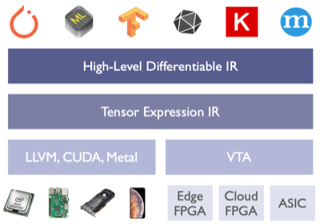
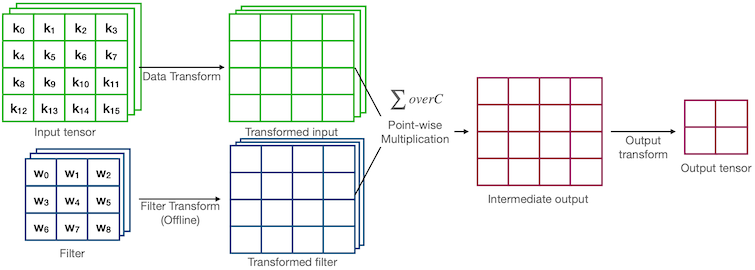

# Lec11 推理引擎与编译优化

> 📺 [课程视频](https://www.youtube.com/watch?v=t5OU3xR6nLI) | 📄 [Slides](https://hanlab.mit.edu/courses/2024-fall-65940)

## 核心概念

### 11.1 为什么需要编译优化？

深度学习推理的性能瓶颈不是计算本身，而是**内存带宽（Memory Bandwidth）**。现代GPU的算术峰值算力（TFLOPS）增长速度远超HBM带宽增长速度，这导致大多数算子是 memory-bound 而非 compute-bound。

关键比率：**算术强度（Arithmetic Intensity）** = FLOP / Bytes

```
Arithmetic Intensity = FLOP / Memory Access (bytes)
```

- 硬件屋脊线（Roofline）模型：当算术强度低于硬件峰值比（FLOP/s ÷ Bandwidth），算子是 memory-bound。
- 典型矩阵乘法：大矩阵 compute-bound，小批量或向量-矩阵乘积（推理时单token）memory-bound。
- 结论：推理优化的核心是减少 HBM（High Bandwidth Memory）的读写次数。

编译框架存在的价值就是**自动**地把高层算子描述变成高效的硬件指令，同时做到手写 CUDA kernel 达到的性能。

---

### 11.2 计算图优化（Graph-Level Optimization）

深度学习框架把模型表示为有向无环图（DAG）：节点是算子（op），边是 tensor。图级优化在 **不改变语义** 的前提下变换这个图。

**常见图优化技术：**

| 优化类别 | 描述 | 示例 |
|---------|------|------|
| 常量折叠 | 编译期计算纯常量子图 | BN 参数 fold 进 Conv |
| 死代码消除 | 删除输出未被使用的节点 | 训练图中去掉 dropout |
| 公共子表达式消除 | 相同计算只做一次 | 共享 positional encoding |
| 算子融合 | 把多个节点合并成一个 kernel | Conv + BN + ReLU → 单 kernel |

**MetaFlow / IOS** 是图级搜索框架：通过枚举等价图变换找到最优执行计划，类似查询优化器对 SQL 的处理。

---

### 11.3 Halide：算法与调度分离

Halide 的核心洞察：**算法（做什么）和调度（怎么做）应该分离**。

```
Algorithm:  f(x, y) = input(x, y) * 2 + 3
Schedule:   f.vectorize(x, 8).parallel(y)
```

同一个算法，不同调度对应完全不同的循环结构和内存访问模式。调度空间极大，Halide 支持手写调度或自动搜索。

**Halide 调度原语：**
- `tile(x, y, xi, yi, 8, 8)`：循环分块，提高缓存局部性
- `vectorize(xi, 8)`：SIMD 向量化
- `parallel(y)`：多线程并行
- `unroll(xi, 4)`：循环展开，减少分支开销
- `compute_at(g, x)`：融合两个 stage 的计算

---

### 11.4 TVM：端到端深度学习编译框架



TVM 把深度学习模型从各种前端（PyTorch/TensorFlow/ONNX）编译到各种后端（CUDA/Metal/x86/ARM）。

**编译流程：**
```
PyTorch Model
     ↓  Relay IR (高层图IR)
 Graph Optimizations
     ↓  TIR (底层张量IR)
 Schedule + Codegen
     ↓
CUDA / LLVM IR / Vulkan
```

**AutoTVM / Ansor（自动调优）：**

手写调度需要专家知识，AutoTVM 通过**测量**来搜索最优调度：

1. 定义调度模板（搜索空间）
2. 用机器学习模型预测调度性能（cost model）
3. 根据预测值选择候选调度
4. 在真实硬件上测量
5. 更新 cost model，迭代

Ansor（AutoScheduler）更进一步：无需手写模板，从头生成调度，搜索效率更高。

---

### 11.5 算子融合（Kernel Fusion）

**为什么融合能提速？**

考虑 `ReLU(BatchNorm(Conv(x)))` 的朴素实现：
- Conv 计算完毕 → 写回 HBM
- BN 从 HBM 读取 → 计算 → 写回 HBM
- ReLU 从 HBM 读取 → 计算 → 写回 HBM

每次 HBM 读写代价极高（~TB/s 量级但仍是瓶颈）。融合后：
- Conv 计算完毕 → 留在 SRAM/寄存器
- BN、ReLU 在寄存器内完成
- 只写一次 HBM

**融合收益公式（简化）：**

```
speedup ≈ (N_ops × T_memory) / (T_compute + T_memory)
```

当 T_memory >> T_compute（memory-bound），融合收益最大。

**融合模式分类：**

1. **Element-wise 融合**：逐元素操作链，如 `Scale → Shift → ReLU`，输入输出形状相同，最容易融合。

2. **Reduce 融合**：`Conv → BN（包含 reduce）→ ReLU`，需要处理 reduce 的 inter-warp 同步。

3. **Producer-Consumer 融合**：上一个算子的输出是下一个算子的输入，最通用，FlashAttention 属于此类。

**FlashAttention 的本质是算子融合：**

标准注意力：
```
S = QK^T / √d_k          # 写 HBM (n×n 矩阵)
P = softmax(S)            # 读+写 HBM
O = PV                    # 读 HBM
```

FlashAttention 把三步融合，利用在线 softmax（online softmax trick），整个 attention 计算只需要读一次 Q/K/V，从不把 n×n 的 attention 矩阵写入 HBM：

```
O(n × d) IO 而非 O(n² + n×d) IO
```

---

## 数学推导

### 11.6 在线 Softmax（FlashAttention 核心）

标准 softmax 需要两遍扫描：第一遍求 max（数值稳定），第二遍归一化。分块计算时需要在线维护统计量。

设当前已处理的 block 的统计量为 $(m, \ell, O)$，其中：
- $m$：已见 logits 的最大值
- $\ell$：归一化因子 $\sum_j e^{s_j - m}$
- $O$：当前输出累加值

处理新 block 时更新：

$$m_{\text{new}} = \max(m, m')$$

$$\ell_{\text{new}} = e^{m - m_{\text{new}}} \cdot \ell + e^{m' - m_{\text{new}}} \cdot \ell'$$

$$O_{\text{new}} = \frac{e^{m - m_{\text{new}}} \cdot \ell \cdot O + e^{m' - m_{\text{new}}} \cdot \ell' \cdot O'}{\ell_{\text{new}}}$$

这个递推使得 softmax 可以在单遍扫描（分块处理）中完成，无需存储完整 $n \times n$ 矩阵。

### 11.7 Winograd 卷积



对于 $F(m, r)$ Winograd 卷积（输出大小 $m$，滤波器大小 $r$），乘法次数为 $m + r - 1$，而朴素卷积需要 $m \times r$ 次乘法。

以 $F(2, 3)$（1D, 2个输出，3-tap 滤波器）为例：

朴素方法需要 $2 \times 3 = 6$ 次乘法。

Winograd 变换：

$$Y = A^T \left[ (G g) \odot (B^T d) \right]$$

其中 $G, B^T, A^T$ 是固定变换矩阵，$g$ 是滤波器，$d$ 是输入 tile。

只需 $2 + 3 - 1 = 4$ 次乘法（Hadamard 乘积部分），节省 33% 乘法。实际 2D 卷积 $F(4 \times 4, 3 \times 3)$ 可节省约 2.25× 乘法。

### 11.8 Im2col 矩阵化

卷积变矩阵乘法：将输入的每个感受野展平成矩阵的一行。

```
Input (N, C, H, W) + Filter (K, C, kH, kW)
Im2col: Input → (N × H_out × W_out, C × kH × kW)
Filter: (K, C × kH × kW)
GEMM:   结果 (N × H_out × W_out, K) → reshape → (N, K, H_out, W_out)
```

代价：输入数据被复制 $kH \times kW$ 倍（空间换时间）。收益：可以直接调用高度优化的 GEMM（如 cuBLAS），而无需写专门的 conv kernel。

---

## 代码示例

```python
import numpy as np
import time

# ============================================================
# 示例 1：算子融合的内存访问差异可视化
# ============================================================

def unfused_ops(x: np.ndarray, scale: float, bias: float) -> np.ndarray:
    """
    未融合版本：每个算子都读写内存
    模拟：Scale → Bias → ReLU
    """
    memory_ops = []

    # Op1: Scale — 读 x，写 tmp1
    tmp1 = x * scale
    memory_ops.append(('read', x.nbytes))
    memory_ops.append(('write', tmp1.nbytes))

    # Op2: Bias — 读 tmp1，写 tmp2
    tmp2 = tmp1 + bias
    memory_ops.append(('read', tmp1.nbytes))
    memory_ops.append(('write', tmp2.nbytes))

    # Op3: ReLU — 读 tmp2，写 out
    out = np.maximum(0, tmp2)
    memory_ops.append(('read', tmp2.nbytes))
    memory_ops.append(('write', out.nbytes))

    total_bytes = sum(b for _, b in memory_ops)
    print(f"[Unfused] Total memory traffic: {total_bytes / 1e6:.2f} MB")
    return out


def fused_ops(x: np.ndarray, scale: float, bias: float) -> np.ndarray:
    """
    融合版本：在寄存器/缓存中完成所有中间结果
    只有一次读、一次写
    """
    # 三个操作在一个遍历中完成（模拟）
    out = np.maximum(0, x * scale + bias)
    total_bytes = x.nbytes + out.nbytes  # 只读 x，只写 out
    print(f"[Fused]   Total memory traffic: {total_bytes / 1e6:.2f} MB")
    return out


# ============================================================
# 示例 2：TVM 风格的 Tiling 优化
# ============================================================

def naive_matmul(A: np.ndarray, B: np.ndarray) -> np.ndarray:
    """朴素矩阵乘法，缓存不友好"""
    M, K = A.shape
    K2, N = B.shape
    assert K == K2
    C = np.zeros((M, N), dtype=A.dtype)
    for i in range(M):
        for j in range(N):
            for k in range(K):
                C[i, j] += A[i, k] * B[k, j]
    return C


def tiled_matmul(A: np.ndarray, B: np.ndarray, tile_size: int = 32) -> np.ndarray:
    """
    分块矩阵乘法：提高缓存局部性
    每次加载 tile_size × tile_size 的块到 L1 缓存
    """
    M, K = A.shape
    K2, N = B.shape
    C = np.zeros((M, N), dtype=A.dtype)

    for i0 in range(0, M, tile_size):
        for j0 in range(0, N, tile_size):
            for k0 in range(0, K, tile_size):
                # 每次处理一个 tile — 适合放入 L1/L2 缓存
                i_end = min(i0 + tile_size, M)
                j_end = min(j0 + tile_size, N)
                k_end = min(k0 + tile_size, K)

                # numpy 切片在底层仍是高效的，模拟 tile 访问
                C[i0:i_end, j0:j_end] += (
                    A[i0:i_end, k0:k_end] @ B[k0:k_end, j0:j_end]
                )
    return C


# ============================================================
# 示例 3：Gradient Checkpointing 内存分析
# ============================================================

def estimate_memory(
    n_layers: int,
    batch_size: int,
    seq_len: int,
    hidden_dim: int,
    bytes_per_elem: int = 2,  # FP16
    checkpoint: bool = False,
) -> dict:
    """
    估算 Transformer 训练的激活内存
    不做 checkpointing: 所有中间激活都存
    做 checkpointing: 只存每层输入，反向时重算
    """
    # 每层的激活大小（简化估算）
    # 主要组成: attention scores (B, H, L, L) + FFN activations (B, L, 4H)
    n_heads = hidden_dim // 64  # 假设 head_dim=64
    attn_bytes = batch_size * n_heads * seq_len * seq_len * bytes_per_elem
    ffn_bytes = batch_size * seq_len * 4 * hidden_dim * bytes_per_elem
    per_layer_bytes = attn_bytes + ffn_bytes

    if checkpoint:
        # 只存每层输入（B, L, H），其他反向时重算
        input_bytes = batch_size * seq_len * hidden_dim * bytes_per_elem
        total = n_layers * input_bytes
        recompute_cost = n_layers  # 每层需要重算一次前向
    else:
        total = n_layers * per_layer_bytes
        recompute_cost = 0

    return {
        "total_activation_GB": total / 1e9,
        "per_layer_MB": per_layer_bytes / 1e6,
        "recompute_passes": recompute_cost,
    }


# ============================================================
# 运行示例
# ============================================================
if __name__ == "__main__":
    # 算子融合对比
    print("=== 算子融合内存流量对比 ===")
    x = np.random.randn(1024, 1024).astype(np.float32)
    unfused_ops(x, scale=2.0, bias=1.0)
    fused_ops(x, scale=2.0, bias=1.0)
    # Unfused: 6× 数据大小；Fused: 2× 数据大小

    print()
    print("=== Gradient Checkpointing 内存对比 ===")
    # LLaMA-7B 规模
    no_ckpt = estimate_memory(32, 4, 2048, 4096, checkpoint=False)
    with_ckpt = estimate_memory(32, 4, 2048, 4096, checkpoint=True)
    print(f"无 checkpointing: {no_ckpt['total_activation_GB']:.2f} GB")
    print(f"有 checkpointing: {with_ckpt['total_activation_GB']:.2f} GB")
    print(f"内存节省: {no_ckpt['total_activation_GB'] / with_ckpt['total_activation_GB']:.1f}×")
    print(f"代价: 额外 {with_ckpt['recompute_passes']} 次前向计算")
```

---

## 内存优化详解

### 内存规划（Memory Planning）

编译器在编译期分析每个 tensor 的**生命周期**（从第一次写到最后一次读），然后做内存复用：

```
Tensor A: 生命周期 [op1, op3]
Tensor B: 生命周期 [op4, op6]
→ A 和 B 可以复用同一块内存（时间上不重叠）
```

TVM 的内存规划用**着色算法**（类似寄存器分配）解决这个问题，可以将峰值内存降低 20-50%。

### In-place 操作

```python
# 非 in-place：需要额外内存
y = torch.relu(x)   # 分配新 tensor

# In-place：覆盖原 tensor（节省内存）
x.relu_()           # 原地修改
# 注意：in-place 操作会使 autograd 某些路径失效
```

### 数据布局（Data Layout）

| 布局 | 含义 | 适合场景 |
|------|------|--------|
| NCHW | 批次-通道-高度-宽度 | CUDA 卷积（cuDNN 默认） |
| NHWC | 批次-高度-宽度-通道 | TensorFlow / ARM 优化 |
| CHWN | 通道-高度-宽度-批次 | 某些自定义 CUDA kernel |
| NC32HW32 | NCHW + 32-通道分组 | TensorCore 对齐 |

布局转换本身有代价，编译器会尽量减少转换次数（类似数据库的物化策略）。

---

## Infra 实战映射

- **vLLM**: PagedAttention 是算子融合思想的直接延伸。vLLM 把 attention 的 KV cache 管理与 attention 计算融合到一个 CUDA kernel（`paged_attention_v1/v2`），避免了碎片化内存拷贝带来的额外 bandwidth 开销。其 kernel 选择逻辑在 `vllm/attention/backends/` 下，根据硬件能力动态选择 FlashAttention-2、FlashInfer 或 xFormers backend。

- **TensorRT-LLM**: NVIDIA 的 TRT-LLM 在 build 阶段做完整的图优化，包括：(1) 算子融合（QKV projection 融合、LayerNorm+Linear 融合）；(2) 权重预处理（转换为 TensorCore 友好的布局）；(3) 根据 GPU 型号自动选择 Winograd/Im2col/cuDNN 路径。源码在 `tensorrt_llm/layers/` 下可以看到各种 FusedMLP、FusedAttention 实现。

- **沐曦 MACA**: 国产 GPU 的内存带宽和 CUDA Core 等效单元的 FLOP:Byte 比率与 NVIDIA 不同，因此相同的 tiling 策略可能需要重新调优。关键点：(1) 沐曦硬件的 shared memory 大小和 bank conflict 模式可能不同，需要重新测量最优 tile_size；(2) MACA SDK 提供类似 cuBLAS 的 BLAS 接口，但 autotuning 数据库需要在目标硬件上重新跑（不能直接用 NVIDIA 的 best config）；(3) 如果使用 TVM/XLA 等开源编译器，需要添加 MACA backend 的 target 描述。

---

## 跨 Lecture 关联

- 前置知识 <- **Lec02**（硬件基础：CUDA 编程模型，roofline 模型）, **Lec05-06**（量化：低精度算子的 kernel 实现）
- 后续延伸 -> **Lec12**（Transformer 推理：这里的优化技术如何用在 attention 计算）, **Lec13**（LLM 部署：系统级推理优化）, **Lec15**（长上下文：FlashAttention 的必要性）

---

## 面试高频题

- **Q: 为什么 FlashAttention 比标准 Attention 快，即使 FLOP 数更多？**
  → A: 标准 attention 必须把 $n \times n$ 的中间矩阵写入 HBM（IO 瓶颈），FlashAttention 利用在线 softmax 在 SRAM 内完成所有中间计算，HBM IO 从 $O(n^2)$ 降到 $O(n \cdot d)$。推理时 memory-bound，减少 IO 比减少 FLOP 收益更大。

- **Q: Gradient Checkpointing 的时间代价是多少？**
  → A: 约增加 1/3 的训练时间（相当于做了 4/3 次前向传播：1次正向 + 1次反向重算 ≈ 额外 1/3 正向）。内存节省约 $O(\sqrt{n})$ 层（若对所有层 checkpoint）。

- **Q: 算子融合在哪些情况下无法做或没有收益？**
  → A: (1) 两个算子之间有数据依赖但需要 global synchronization（如 layer normalization 的 reduce 操作），融合需要额外处理 sync；(2) compute-bound 的大矩阵乘法本身已经接近峰值利用率，融合收益小；(3) 不同算子需要不同的线程块配置时，融合会浪费资源。

- **Q: NCHW 和 NHWC 哪个更适合 GPU 上的卷积？**
  → A: NCHW 在 CUDA 上传统更快（cuDNN 历史默认），因为同一通道的数据连续，conv 时缓存命中率高。但 NHWC 在 TensorCore（Ampere+）上更友好，因为 TensorCore 需要通道维度对齐。TensorRT 会自动做布局转换，实际上 NHWC + TensorCore 在新硬件上通常更快。

- **Q: TVM 的 AutoTVM 和 Ansor 有什么区别？**
  → A: AutoTVM 需要人工写调度模板（搜索空间由人定义），Ansor 自动从计算定义生成调度空间（无需模板），搜索更彻底但更慢。Ansor 在新算子上更有优势，AutoTVM 在熟悉算子上依赖经验模板更快收敛。

- **Q: Im2col 的内存开销是多少？**
  → A: 将输入从 $(N, C, H, W)$ 展开为 $(N \cdot H_{out} \cdot W_{out}, C \cdot kH \cdot kW)$，数据被复制了 $kH \times kW$ 倍。对 3×3 卷积，内存增加约 9×，对 1×1 卷积无额外开销（因此 MobileNet 大量使用 1×1 卷积的优化不仅仅是 FLOP 减少，也避免了 Im2col 开销）。
