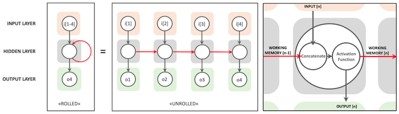
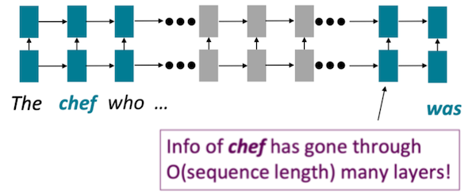
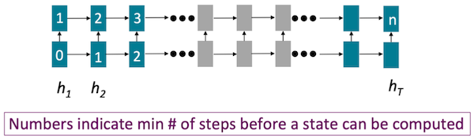
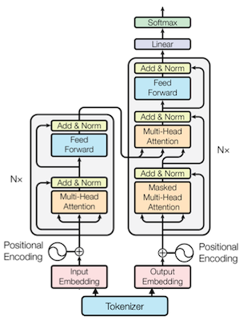

# 12 Transformer 架构

> 📺 [Lecture 12 - Transformer and LLM](https://youtu.be/mR4u6ZaCYe4)
> 📄 [Slides](https://hanlab.mit.edu/courses/2024-fall-65940)

---

## 12.1 Pre-Transformer 时代

### 12.1.1 RNN / LSTM 的问题

| 问题 | 描述 |
|------|------|
| 长距离依赖弱 | 两个 token 的 interaction 需要 O(seq_len) 步 |
| 无法并行 | state 依赖前一个 state → 无法并行计算 |
| 语言无局部性 | 图像有局部性(相邻像素相关)，语言的依赖关系可以是任意距离 |







### 12.1.2 CNN for NLP

- 用 1D 卷积处理文本，可以并行
- 但 receptive field 有限，无法捕获长距离依赖

---

## 12.2 Transformer 核心架构

> [Attention Is All You Need](https://arxiv.org/abs/1706.03762) (Vaswani et al., 2017)

### 12.2.1 整体流程

```
输入文本 → Tokenizer → Token IDs → Embedding → Transformer Blocks × N → Output
                                                         ↓
                                              [MHA → Add&Norm → FFN → Add&Norm]
```



### 12.2.2 Tokenizer

把文本切成 token（不是字也不是词，是子词）：

```python
from transformers import AutoTokenizer
tok = AutoTokenizer.from_pretrained("gpt2")
text = "Hello, how are you?"
tokens = tok.encode(text)
print(tok.convert_ids_to_tokens(tokens))
# ['Hello', ',', 'Ġhow', 'Ġare', 'Ġyou', '?']  (Ġ = 空格)
print(f"文本 {len(text.split())} 个词 → {len(tokens)} 个 token")
```

### 12.2.3 Embedding

Token ID → 密集向量 (look-up table):
- Vocab size V, embedding dim d
- 表: [V × d]，查表得到每个 token 的 d 维向量
- 加上 positional encoding

### 12.2.4 Multi-Head Self-Attention (MHA)

**核心计算**:

$$\text{Attention}(Q, K, V) = \text{softmax}\left(\frac{QK^T}{\sqrt{d_k}}\right) V$$

**为什么除以 $\sqrt{d_k}$？**
- 当 $d_k$ 很大时，点积 $q \cdot k$ 的方差也会很大
- 导致 softmax 输出接近 one-hot（梯度消失）
- 除以 $\sqrt{d_k}$ 使方差归一化到 ~1

```python
import torch
import torch.nn.functional as F
import math

def scaled_dot_product_attention(Q, K, V):
    """
    Q: [batch, heads, seq_len, d_k]
    K: [batch, heads, seq_len, d_k]
    V: [batch, heads, seq_len, d_v]
    """
    d_k = Q.size(-1)
    # 1. 计算注意力分数
    scores = torch.matmul(Q, K.transpose(-2, -1)) / math.sqrt(d_k)
    # 2. softmax
    attn_weights = F.softmax(scores, dim=-1)
    # 3. 加权求和
    output = torch.matmul(attn_weights, V)
    return output

class MultiHeadAttention(nn.Module):
    def __init__(self, d_model=512, n_heads=8):
        super().__init__()
        self.n_heads = n_heads
        self.d_k = d_model // n_heads
        self.W_q = nn.Linear(d_model, d_model)
        self.W_k = nn.Linear(d_model, d_model)
        self.W_v = nn.Linear(d_model, d_model)
        self.W_o = nn.Linear(d_model, d_model)

    def forward(self, x):
        B, S, D = x.shape
        # 投影 + 分头
        Q = self.W_q(x).view(B, S, self.n_heads, self.d_k).transpose(1, 2)
        K = self.W_k(x).view(B, S, self.n_heads, self.d_k).transpose(1, 2)
        V = self.W_v(x).view(B, S, self.n_heads, self.d_k).transpose(1, 2)
        # Attention
        out = scaled_dot_product_attention(Q, K, V)
        # 合并头
        out = out.transpose(1, 2).contiguous().view(B, S, D)
        return self.W_o(out)
```

**复杂度分析**:
- 计算量: $O(n^2 \cdot d)$ — n 是序列长度，d 是维度
- 空间: $O(n^2)$ — 需要存 attention matrix
- 当 n 很大时 (128K context) → 这是主要瓶颈

### 12.2.5 Feed-Forward Network (FFN)

$$\text{FFN}(x) = \text{GELU}(xW_1 + b_1)W_2 + b_2$$

- 两层线性变换 + 激活函数
- 隐藏维度通常是 d_model 的 4 倍 (如 512 → 2048 → 512)
- FFN 的参数量 >> Attention 的参数量

### 12.2.6 Layer Normalization

| 位置 | 描述 |
|------|------|
| **Post-Norm** (原始 Transformer) | $x = \text{Norm}(x + \text{Sublayer}(x))$ |
| **Pre-Norm** (LLM 主流) | $x = x + \text{Sublayer}(\text{Norm}(x))$ |

Pre-Norm 训练更稳定（梯度不爆炸），现在几乎所有 LLM 都用 Pre-Norm。

### 12.2.7 Positional Encoding

Transformer 本身没有位置信息（attention 是 permutation invariant），需要额外注入：

| 方法 | 描述 | 代表模型 |
|------|------|---------|
| Sinusoidal | 固定的三角函数编码 | 原始 Transformer |
| Learned | 可学习的位置 embedding | BERT, GPT |
| RoPE | 旋转位置编码，通过旋转矩阵注入 | LLaMA |
| ALiBi | 直接在 attention score 加距离偏置 | BLOOM |

**RoPE (Rotary Position Embedding)**:
- 把位置信息编码为旋转角度
- 优点: 天然支持相对位置，外推性好
- LLaMA / Qwen / Mistral 都用 RoPE

---

## 12.3 Transformer 变体

### 12.3.1 三种架构

| 类型 | 代表 | 适用任务 | Attention 方向 |
|------|------|---------|---------------|
| Encoder-Decoder | T5, BART | 翻译 | Encoder 双向, Decoder 单向 |
| Encoder-only | BERT | 理解/分类 | 双向 |
| **Decoder-only** | GPT, LLaMA | 生成 | 单向 (causal mask) |

> **为什么 LLM 都用 Decoder-only？** 简单、高效、scaling 好。实践发现 Encoder-Decoder 的优势不足以弥补额外的复杂度。

### 12.3.2 KV Cache 优化

| 方法 | K/V heads | 参数 | 代表 |
|------|-----------|------|------|
| MHA | Q heads = KV heads | 多 | 原始 Transformer |
| **MQA** (Multi-Query) | KV heads = 1 | 少 | PaLM |
| **GQA** (Grouped-Query) | KV heads < Q heads | 中 | LLaMA-2, Mistral |

```python
# KV Cache 大小计算
def kv_cache_size(n_layers, n_kv_heads, d_head, seq_len, dtype_bytes=2):
    """计算 KV Cache 的显存占用"""
    return 2 * n_layers * n_kv_heads * d_head * seq_len * dtype_bytes

# LLaMA-2-7B: 32 layers, 32 heads -> 32 KV heads (MHA), d_head=128
mha_cache = kv_cache_size(32, 32, 128, 2048, 2)  # FP16
print(f"LLaMA-7B MHA KV Cache (2048 tokens): {mha_cache / 1e9:.2f} GB")

# LLaMA-2-70B: 80 layers, GQA 8 KV heads, d_head=128
gqa_cache = kv_cache_size(80, 8, 128, 2048, 2)
print(f"LLaMA-70B GQA KV Cache (2048 tokens): {gqa_cache / 1e9:.2f} GB")
```

### 12.3.3 Gated Linear Unit (SwiGLU)

$$\text{SwiGLU}(x) = (\text{SiLU}(xW_g) \odot xW_1) W_2$$

LLaMA 的 FFN 用 SwiGLU 替代标准 ReLU FFN，效果更好。

---

## 12.4 推理分析

### 12.4.1 自回归推理 (Autoregressive)

```
输入: "The cat sat on"
Step 1: "The cat sat on the"     → 生成 "the"
Step 2: "The cat sat on the mat" → 生成 "mat"
Step 3: ...
```

每步只生成 1 个 token，但需要处理整个历史序列 → **memory-bound**

### 12.4.2 Prefill vs Decode

| 阶段 | 描述 | Bound | 并行度 |
|------|------|-------|--------|
| **Prefill** | 处理整个 prompt | Compute-bound | 高（所有 token 并行） |
| **Decode** | 逐 token 生成 | Memory-bound | 低（每次 1 token） |

> Prefill 时矩阵乘法是大 batch（所有 prompt tokens），充分利用 GPU。Decode 时 batch=1，GPU 大部分算力在等内存。

---

## Infra 实战映射

### vLLM
- PagedAttention 管理 KV Cache (Lec13 详解)
- Continuous batching 提高 decode 阶段 GPU 利用率
- 支持 GQA/MQA 模型的 KV Cache 优化

### TensorRT-LLM
- Kernel fusion 优化 attention (FlashAttention)
- 支持 FP8/INT8 attention 加速
- 自动选择最优 GEMM kernel

### 沐曦 MACA
- 需要实现高效的 attention kernel（参考 FlashAttention 思路）
- GQA 可以减少 MACA 上的显存压力
- Causal mask 的 attention 可以优化为只计算下三角

---

## 跨 Lecture 关联

- **前置 ←** [Lec02: DL基础](../lec02-basics/README.md) — FLOPs, 参数量
- **延伸 →** [Lec13: LLM部署](../lec13-llm-deploy/README.md) — KV Cache, 推理系统
- **延伸 →** [Lec15: 长上下文](../lec15-long-context/README.md) — 稀疏注意力, StreamingLLM
- **延伸 →** [Lec16: ViT](../lec16-vit/README.md) — Transformer 用于视觉

---

## 面试高频题

**Q1: 为什么 Attention 要除以 $\sqrt{d_k}$？**
> A: 当 d_k 大时，点积的方差 ∝ d_k，导致 softmax 输入值很大 → softmax 输出接近 one-hot → 梯度极小（梯度消失）。除以 $\sqrt{d_k}$ 使方差归一化。

**Q2: MHA / MQA / GQA 的区别和 trade-off？**
> A: MHA 每个 Q head 有独立的 KV heads，精度好但 KV Cache 大。MQA 所有 Q heads 共享 1 组 KV，KV Cache 小但精度可能下降。GQA 是折中：Q heads 分组共享 KV heads。LLaMA-2 用 GQA(8组)，KV Cache 减少 4x，精度几乎不变。

**Q3: 为什么 LLM 都用 Decoder-only？**
> A: 简单（只有 causal attention）、训练效率高、scaling 性质好。实践发现 encoder-decoder 的双语建模优势不足以弥补额外的复杂度。加上 few-shot learning 和 instruction tuning 的成功，decoder-only 成为主流。

**Q4: Prefill 和 Decode 的区别为什么重要？**
> A: Prefill 是 compute-bound（可以充分利用 GPU），Decode 是 memory-bound（大部分时间在等内存加载权重和 KV）。这决定了推理系统的优化方向：prefill 阶段用 FlashAttention，decode 阶段用 batch 策略和量化。
