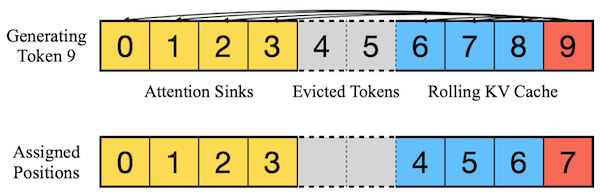

# 15 长上下文与高效注意力

> 📺 [Lecture 15 - Long Context LLM](https://hanlab.mit.edu/courses/2024-fall-65940)
> 📄 [Slides](https://hanlab.mit.edu/courses/2024-fall-65940)

---

## 15.1 长上下文挑战

### 15.1.1 KV Cache 显存爆炸

KV Cache 大小 = $2 \times N_{layers} \times N_{kv\_heads} \times d_{head} \times seq\_len \times dtype\_bytes$

```python
def kv_cache_gb(n_layers, n_kv_heads, d_head, seq_len, dtype="fp16"):
    bytes_per = 2 if dtype == "fp16" else 1
    elements = 2 * n_layers * n_kv_heads * d_head * seq_len
    return elements * bytes_per / 1e9

# LLaMA-3-8B: 32 layers, 8 KV heads (GQA), d_head=128
for seq in [2048, 8192, 32768, 131072]:
    print(f"Seq {seq:>6}: KV Cache = {kv_cache_gb(32, 8, 128, seq):.2f} GB")

# Seq   2048: KV Cache = 0.13 GB
# Seq   8192: KV Cache = 0.50 GB
# Seq  32768: KV Cache = 2.00 GB
# Seq 131072: KV Cache = 8.00 GB  ← 128K context 光 KV Cache 就要 8GB!
```

### 15.1.2 O(n²) Attention 计算

| 序列长度 | Attention FLOPs (相对) | 延迟 |
|---------|----------------------|------|
| 1K | 1x | ~1ms |
| 8K | 64x | ~64ms |
| 128K | 16384x | ~16s |

### 15.1.3 Lost in the Middle

模型对中间位置的信息检索能力弱 — 开头和结尾的信息记得好，中间的容易忘。

---

## 15.2 稀疏注意力方法

### 15.2.1 StreamingLLM

**核心发现: Attention Sink**
- LLM 推理时，开头的几个 token 会"吸收"大量 attention（attention sink）
- 这些 sink token 必须保留，否则模型输出崩溃

**方法**: 保留 attention sink (前 S 个 token) + 滑动窗口 (最近 W 个 token)



$$\text{KV Cache} = \{\text{sink tokens}\} \cup \{\text{recent W tokens}\}$$

- 显存: O(S + W)，不随序列长度增长 → **无限长推理**
- 局限: 丢弃了大部分历史 KV，无法检索早期细节

```python
class StreamingLLMCache:
    """StreamingLLM 的简化 KV Cache"""
    def __init__(self, n_sink=4, window_size=1024):
        self.n_sink = n_sink      # attention sink 数量
        self.window_size = window_size
        self.sink_kv = []         # 固定的 sink KV
        self.recent_kv = []       # 滑动窗口

    def update(self, new_k, new_v, position):
        if position < self.n_sink:
            self.sink_kv.append((new_k, new_v))
        else:
            self.recent_kv.append((new_k, new_v))
            if len(self.recent_kv) > self.window_size:
                self.recent_kv.pop(0)  # 淘汰最老的

    def get_all_kv(self):
        return self.sink_kv + self.recent_kv
```

### 15.2.2 DuoAttention

**洞察**: 不是所有 attention head 都需要检索全部历史。

两种 head:
- **Retrieval Head**: 需要访问完整 KV → 用于事实检索
- **Streaming Head**: 只需滑动窗口 → 用于局部语法/逻辑

自动识别: 用少量 calibration 数据测量每个 head 的 attention pattern。

```python
# DuoAttention 的 KV Cache 策略
duo_config = {
    "head_0": "retrieval",   # 完整 KV Cache
    "head_1": "streaming",   # 滑动窗口
    "head_2": "streaming",   # 滑动窗口
    "head_3": "retrieval",   # 完整 KV Cache
    # ...
}
# 平均只需 ~30% 的 head 做 retrieval → KV Cache 减少 ~50%
```

### 15.2.3 Quest: Query-Aware 稀疏注意力

不像 StreamingLLM 静态决定保留哪些 KV，Quest 根据**当前 query 动态选择**：

1. 把 KV 分成 block (如每 16 个 token 一块)
2. 对每个 block 预计算统计信息 (min/max)
3. 当前 query 和 block 统计信息比较 → 只加载相关的 block

> 比静态稀疏更精确，但增加了一些计算 overhead。

---

## 15.3 超越 Transformer

### 15.3.1 Mamba: Selective State-Space Models

**SSM 核心**:

$$h'(t) = Ah(t) + Bx(t), \quad y(t) = Ch(t) + Dx(t)$$

- $h(t)$: 隐状态，$x(t)$: 输入，$y(t)$: 输出
- 离散化: $h_k = \bar{A}h_{k-1} + \bar{B}x_k$
- 计算复杂度: **O(n)** — 线性！

**Selective SSM (Mamba 的创新)**:
- 传统 SSM: A, B, C, Δ 是固定参数
- Mamba: **B, C, Δ 依赖输入 x** → 输入选择性
  - 重要的 token → 慢速更新 (大 Δ) → 保留信息
  - 不重要的 token → 快速更新 (小 Δ) → 丢弃信息

```python
# Mamba 的核心思想 (简化)
class SelectiveSSM:
    def __init__(self, d_model, d_state=16):
        self.d_state = d_state
        # A 是固定的, B/C/Δ 依赖输入
        self.A_log = nn.Parameter(torch.log(torch.randn(d_state, d_state)))
        self.proj_B = nn.Linear(d_model, d_state)
        self.proj_C = nn.Linear(d_model, d_state)
        self.proj_dt = nn.Linear(d_model, 1)

    def forward(self, x):
        # x: [batch, seq_len, d_model]
        B = self.proj_B(x)   # [batch, seq, d_state] — 输入依赖!
        C = self.proj_C(x)   # [batch, seq, d_state]
        dt = F.softplus(self.proj_dt(x))  # [batch, seq, 1] — 步长
        A = -torch.exp(self.A_log)  # 固定

        h = torch.zeros(x.size(0), self.d_state)
        outputs = []
        for t in range(x.size(1)):
            h = h * torch.exp(A * dt[:, t]) + B[:, t] * x[:, t]
            y = torch.sum(C[:, t] * h, dim=-1)
            outputs.append(y)
        return torch.stack(outputs, dim=1)
```

**Mamba vs Transformer**:

| | Transformer | Mamba |
|---|-----------|-------|
| 复杂度 | O(n²) | O(n) |
| 并行训练 | 好 | 好 (scan 算法) |
| 推理速度 | 慢 (KV Cache) | 快 (固定隐状态) |
| 精确检索 | 强 | 弱 |
| 代表模型 | GPT, LLaMA | Mamba, Jamba |

### 15.3.2 Jamba: Mamba + Transformer 混合

交替使用 Mamba 层和 Attention 层:
- Mamba 层: 高效处理长序列
- Attention 层: 提供精确检索能力
- 兼顾效率和精度

### 15.3.3 Ring Attention

分布式长序列推理:
- 把长序列切分到多个 GPU
- 每个 GPU 计算自己那部分的 attention
- 通过环形通信交换 KV block
- 支持任意长度的序列（只要 GPU 够多）

---

## 15.4 评估方法

| 方法 | 描述 |
|------|------|
| Needle In A Haystack | 在长文本中隐藏一个事实，测试模型能否检索到 |
| LongBench | 综合长上下文 benchmark（问答、摘要、检索等） |
| InfiniteBench | 测试超长上下文能力 |

---

## Infra 实战映射

### vLLM
- PagedAttention 管理 KV Cache (Lec13)
- 实验性支持 StreamingLLM 和稀疏 attention
- 支持 Mamba 模型推理

### TensorRT-LLM
- 支持 Ring Attention 做分布式长序列
- Kernel 优化: FlashAttention 减少显存读写

### 沐曦 MACA
- 长上下文推理需要高效的 KV Cache 管理
- 可以实现 StreamingLLM/DuoAttention 的 KV Cache 策略
- Mamba 在 MACA 上的实现相对简单（没有 attention 的复杂 kernel）

---

## 跨 Lecture 关联

- **前置 ←** [Lec12: Transformer](../lec12-transformer/README.md) — Attention, KV Cache
- **前置 ←** [Lec13: LLM 部署](../lec13-llm-deploy/README.md) — KV Cache 管理, PagedAttention
- **延伸 →** [Lec16: ViT](../lec16-vit/README.md) — 高效 attention 用于视觉

---

## 面试高频题

**Q1: StreamingLLM 的 Attention Sink 是什么？**
> A: 推理时开头的几个 token 会吸引大量 attention score，即使它们语义上不重要。如果丢弃这些 token，模型输出会崩溃。原因是 softmax 归一化的副作用 — 模型用这些 sink token 当"垃圾桶"吸收多余的 attention。

**Q2: Mamba 为什么能 O(n) 但 Transformer 是 O(n²)？**
> A: Transformer 的 attention 需要每个 token 和所有其他 token 计算相似度 → O(n²)。Mamba 是递归模型（SSM），每个 token 只更新固定大小的隐状态 → O(n)。代价是 Mamba 的隐状态容量有限，精确检索不如 Transformer。

**Q3: DuoAttention 怎么决定哪些 head 是 retrieval？**
> A: 用少量 calibration 数据测量每个 attention head 的 attention 分布。如果 attention 分布很集中（只关注少数关键 token）→ retrieval head。如果 attention 均匀分散 → streaming head。通常只有 20-40% 的 head 是 retrieval。

**Q4: 128K context 推理的实际瓶颈是什么？**
> A: Decode 阶段的 KV Cache 读取。每生成一个 token 需要读取 128K 个 KV pair → memory bandwidth 瓶颈。解决方案: 稀疏 attention（不读全部 KV）、量化 KV Cache（FP16→INT8/INT4）、PagedAttention。
